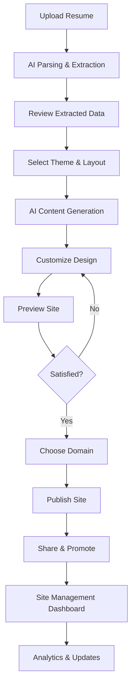

# AI Personal Site Generator - Product Requirements Document

## 1. Product Overview

The AI Personal Site Generator is an innovative feature that transforms uploaded resumes into professional personal websites automatically. Users can upload their resume in PDF or DOC format, and our AI system will parse the content, extract relevant information, and generate a fully functional personal website with modern design and responsive layout.

This feature addresses the growing need for professionals to have an online presence while eliminating the technical barriers and time investment typically required to create a personal website. It seamlessly integrates with our existing resume builder and job application platform to provide a comprehensive career toolkit.

The target market includes job seekers, freelancers, and professionals who want to establish a strong online presence to enhance their career prospects and personal branding.

## 2. Core Features

### 2.1 User Roles

| Role | Registration Method | Core Permissions |
|------|---------------------|------------------|
| Free User | Email registration | Can generate 1 personal site, basic themes, subdomain hosting |
| Premium User | Subscription upgrade | Unlimited sites, premium themes, custom domain support, advanced customization |
| Enterprise User | Corporate account | Multiple team sites, white-label options, analytics dashboard |

### 2.2 Feature Module

Our AI Personal Site Generator consists of the following main pages:

1. **Upload & Parse Page**: Resume upload interface, AI parsing progress, extracted data preview
2. **Site Generation Page**: Theme selection, AI content generation, layout customization
3. **Preview & Edit Page**: Live site preview, content editing tools, design adjustments
4. **Publish & Share Page**: Domain setup, hosting options, sharing tools, analytics setup
5. **Site Management Dashboard**: Manage multiple sites, view analytics, update content

### 2.3 Page Details

| Page Name | Module Name | Feature description |
|-----------|-------------|---------------------|
| Upload & Parse Page | File Upload | Support PDF/DOC resume upload with drag-and-drop interface, file validation, progress tracking |
| Upload & Parse Page | AI Parser | Extract personal info, work experience, education, skills, projects using advanced NLP |
| Upload & Parse Page | Data Preview | Display parsed information in structured format, allow manual corrections and additions |
| Site Generation Page | Theme Selector | Choose from professional templates (minimalist, creative, corporate, portfolio styles) |
| Site Generation Page | AI Content Generator | Generate compelling bio, project descriptions, skill summaries using extracted data |
| Site Generation Page | Layout Customizer | Adjust sections, colors, fonts, spacing with real-time preview |
| Preview & Edit Page | Live Preview | Full-screen website preview with responsive design testing |
| Preview & Edit Page | Content Editor | Rich text editing for bio, descriptions, add custom sections, upload additional media |
| Preview & Edit Page | Design Tools | Color picker, font selector, layout adjustments, mobile optimization |
| Publish & Share Page | Domain Setup | Subdomain creation, custom domain connection, SSL certificate setup |
| Publish & Share Page | Hosting Options | Free hosting on platform subdomain, premium custom domain hosting |
| Publish & Share Page | Share Tools | Generate shareable links, QR codes, social media integration, email signatures |
| Site Management Dashboard | Site Manager | View all created sites, duplicate sites, archive/delete sites, usage analytics |
| Site Management Dashboard | Analytics | Track site visits, visitor demographics, popular sections, contact form submissions |
| Site Management Dashboard | Content Updates | Bulk update contact info across sites, sync with resume updates, version control |

## 3. Core Process

**Free User Flow:**
Users start by uploading their resume on the Upload & Parse page. The AI system processes the document and extracts key information, displaying it for review and editing. Users then select from available free themes and customize basic elements. After previewing their site, they can publish it on a platform subdomain and share the link.

**Premium User Flow:**
Premium users follow the same initial process but have access to advanced themes, custom domain options, and enhanced customization tools. They can create multiple sites, access detailed analytics, and use advanced editing features.

**Site Management Flow:**
Users can return to their dashboard to manage existing sites, update content, view analytics, and create additional sites based on their subscription level.

## 4. User Interface Design

### 4.1 Design Style

- **Primary Colors**: Deep blue (#1e40af) for trust and professionalism, bright green (#10b981) for success states
- **Secondary Colors**: Light gray (#f8fafc) for backgrounds, dark gray (#374151) for text
- **Button Style**: Rounded corners (8px radius), subtle shadows, hover animations with color transitions
- **Font**: Inter for headings (600 weight), Open Sans for body text (400 weight), 16px base size
- **Layout Style**: Card-based design with clean spacing, top navigation with breadcrumbs, sidebar for tools
- **Icons**: Heroicons outline style for consistency, custom AI-themed icons for unique features

### 4.2 Page Design Overview

| Page Name | Module Name | UI Elements |
|-----------|-------------|-------------|
| Upload & Parse Page | File Upload | Drag-and-drop zone with dotted border, upload progress bar, file type icons, error states with red accents |
| Upload & Parse Page | AI Parser | Loading animation with AI brain icon, progress steps indicator, parsing status messages |
| Upload & Parse Page | Data Preview | Structured cards for each section, edit icons, validation indicators, clean typography |
| Site Generation Page | Theme Selector | Grid layout of theme previews, hover effects, category filters, preview modal |
| Site Generation Page | AI Content Generator | Text generation progress, before/after comparison, regenerate buttons, quality indicators |
| Preview & Edit Page | Live Preview | Full-width iframe, device size toggles, zoom controls, responsive breakpoint indicators |
| Preview & Edit Page | Content Editor | Split-screen layout, rich text toolbar, drag-and-drop sections, auto-save indicators |
| Publish & Share Page | Domain Setup | Step-by-step wizard, domain availability checker, DNS setup instructions, success confirmations |
| Site Management Dashboard | Site Manager | Grid/list view toggle, site thumbnails, status badges, action menus, search and filter options |

### 4.3 Responsiveness

The application is mobile-first with adaptive design for tablets and desktops. Touch interactions are optimized for mobile editing, with larger touch targets and gesture support. The preview mode includes device simulation for testing responsive behavior across different screen sizes.
