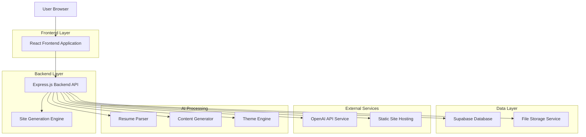
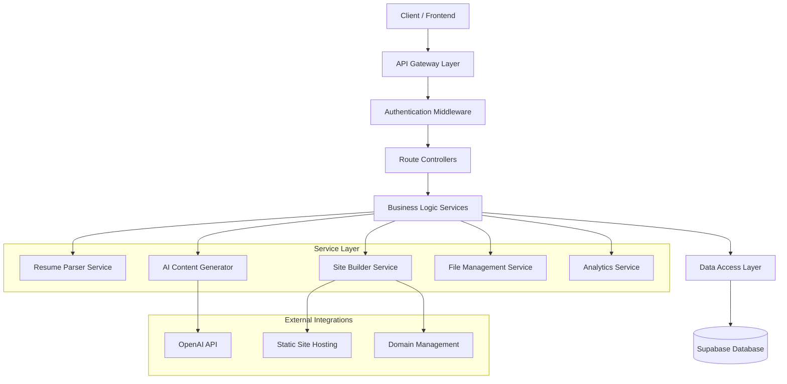
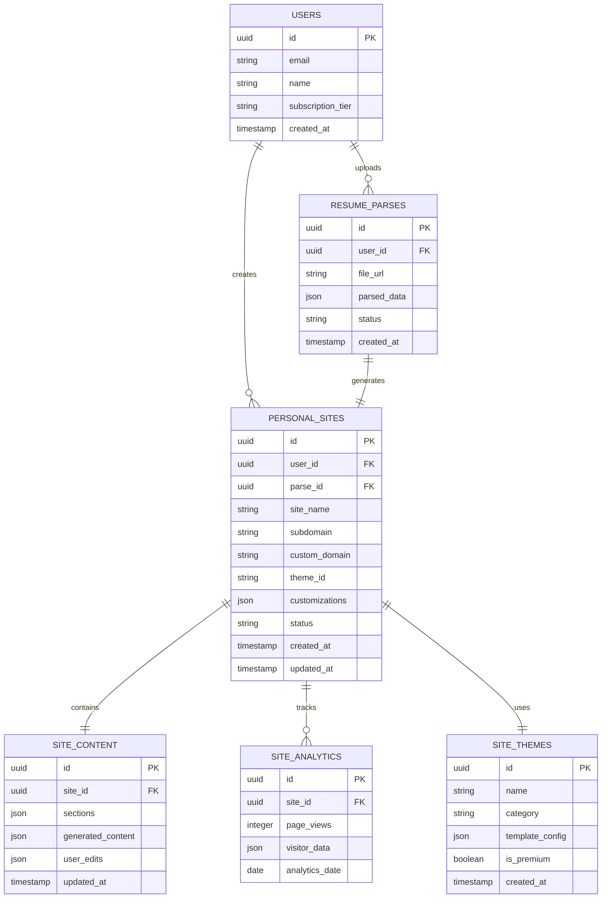

# AI Personal Site Generator - Technical Architecture Document

## 1. Architecture Design



## 2. Technology Description

- **Frontend**: React@18 + TypeScript + Tailwind CSS + Vite
- **Backend**: Express@4 + TypeScript + Node.js
- **Database**: Supabase (PostgreSQL)
- **File Storage**: Supabase Storage
- **AI Services**: OpenAI GPT-4 API
- **PDF Processing**: pdf-parse, mammoth (for DOC files)
- **Site Generation**: React Static Site Generator
- **Hosting**: Vercel/Netlify for static sites

## 3. Route Definitions

| Route | Purpose |
|-------|---------|
| /personal-site-generator | Main landing page for the feature |
| /personal-site-generator/upload | Resume upload and parsing interface |
| /personal-site-generator/generate | Theme selection and site generation |
| /personal-site-generator/edit/:siteId | Site editing and customization |
| /personal-site-generator/preview/:siteId | Live site preview |
| /personal-site-generator/publish/:siteId | Publishing and domain setup |
| /personal-site-generator/dashboard | Site management dashboard |
| /personal-site-generator/analytics/:siteId | Site analytics and insights |

## 4. API Definitions

### 4.1 Core API

**Resume Upload and Parsing**
```
POST /api/personal-sites/upload-resume
```

Request:
| Param Name | Param Type | isRequired | Description |
|------------|------------|------------|-------------|
| file | File | true | Resume file (PDF/DOC format) |
| userId | string | true | User ID from authentication |

Response:
| Param Name | Param Type | Description |
|------------|------------|-------------|
| success | boolean | Upload and parsing status |
| parsedData | object | Extracted resume information |
| parseId | string | Unique identifier for parsed data |

Example Response:
```json
{
  "success": true,
  "parsedData": {
    "personalInfo": {
      "name": "John Doe",
      "email": "john@example.com",
      "phone": "+1234567890",
      "location": "New York, NY"
    },
    "experience": [...],
    "education": [...],
    "skills": [...]
  },
  "parseId": "parse_123456"
}
```

**Site Generation**
```
POST /api/personal-sites/generate
```

Request:
| Param Name | Param Type | isRequired | Description |
|------------|------------|------------|-------------|
| parseId | string | true | Reference to parsed resume data |
| themeId | string | true | Selected theme identifier |
| customizations | object | false | User customization preferences |

Response:
| Param Name | Param Type | Description |
|------------|------------|-------------|
| siteId | string | Generated site identifier |
| previewUrl | string | URL for site preview |
| generatedContent | object | AI-generated content sections |

**Site Publishing**
```
POST /api/personal-sites/:siteId/publish
```

Request:
| Param Name | Param Type | isRequired | Description |
|------------|------------|------------|-------------|
| domain | string | false | Custom domain (premium feature) |
| subdomain | string | true | Platform subdomain |

Response:
| Param Name | Param Type | Description |
|------------|------------|-------------|
| publishedUrl | string | Live site URL |
| status | string | Publishing status |

## 5. Server Architecture Diagram



## 6. Data Model

### 6.1 Data Model Definition



### 6.2 Data Definition Language

**Users Table (extends existing)**
```sql
-- Add columns to existing users table
ALTER TABLE users ADD COLUMN IF NOT EXISTS subscription_tier VARCHAR(20) DEFAULT 'free';
ALTER TABLE users ADD COLUMN IF NOT EXISTS sites_created INTEGER DEFAULT 0;
```

**Resume Parses Table**
```sql
CREATE TABLE resume_parses (
    id UUID PRIMARY KEY DEFAULT gen_random_uuid(),
    user_id UUID REFERENCES users(id) ON DELETE CASCADE,
    file_url TEXT NOT NULL,
    file_name VARCHAR(255) NOT NULL,
    file_size INTEGER NOT NULL,
    parsed_data JSONB NOT NULL,
    status VARCHAR(50) DEFAULT 'processing' CHECK (status IN ('processing', 'completed', 'failed')),
    error_message TEXT,
    created_at TIMESTAMP WITH TIME ZONE DEFAULT NOW(),
    updated_at TIMESTAMP WITH TIME ZONE DEFAULT NOW()
);

CREATE INDEX idx_resume_parses_user_id ON resume_parses(user_id);
CREATE INDEX idx_resume_parses_status ON resume_parses(status);
CREATE INDEX idx_resume_parses_created_at ON resume_parses(created_at DESC);
```

**Personal Sites Table**
```sql
CREATE TABLE personal_sites (
    id UUID PRIMARY KEY DEFAULT gen_random_uuid(),
    user_id UUID REFERENCES users(id) ON DELETE CASCADE,
    parse_id UUID REFERENCES resume_parses(id) ON DELETE SET NULL,
    site_name VARCHAR(255) NOT NULL,
    subdomain VARCHAR(100) UNIQUE NOT NULL,
    custom_domain VARCHAR(255) UNIQUE,
    theme_id UUID REFERENCES site_themes(id),
    customizations JSONB DEFAULT '{}',
    status VARCHAR(50) DEFAULT 'draft' CHECK (status IN ('draft', 'published', 'archived')),
    published_url TEXT,
    created_at TIMESTAMP WITH TIME ZONE DEFAULT NOW(),
    updated_at TIMESTAMP WITH TIME ZONE DEFAULT NOW()
);

CREATE INDEX idx_personal_sites_user_id ON personal_sites(user_id);
CREATE INDEX idx_personal_sites_subdomain ON personal_sites(subdomain);
CREATE INDEX idx_personal_sites_status ON personal_sites(status);
```

**Site Content Table**
```sql
CREATE TABLE site_content (
    id UUID PRIMARY KEY DEFAULT gen_random_uuid(),
    site_id UUID REFERENCES personal_sites(id) ON DELETE CASCADE,
    sections JSONB NOT NULL DEFAULT '{}',
    generated_content JSONB NOT NULL DEFAULT '{}',
    user_edits JSONB DEFAULT '{}',
    version INTEGER DEFAULT 1,
    updated_at TIMESTAMP WITH TIME ZONE DEFAULT NOW()
);

CREATE INDEX idx_site_content_site_id ON site_content(site_id);
```

**Site Themes Table**
```sql
CREATE TABLE site_themes (
    id UUID PRIMARY KEY DEFAULT gen_random_uuid(),
    name VARCHAR(100) NOT NULL,
    category VARCHAR(50) NOT NULL,
    description TEXT,
    template_config JSONB NOT NULL,
    preview_image_url TEXT,
    is_premium BOOLEAN DEFAULT false,
    is_active BOOLEAN DEFAULT true,
    created_at TIMESTAMP WITH TIME ZONE DEFAULT NOW()
);

-- Insert default themes
INSERT INTO site_themes (name, category, template_config, is_premium) VALUES
('Minimalist Pro', 'professional', '{"layout": "single-column", "colors": {"primary": "#1e40af", "secondary": "#64748b"}}', false),
('Creative Portfolio', 'creative', '{"layout": "grid", "colors": {"primary": "#7c3aed", "secondary": "#f59e0b"}}', true),
('Corporate Executive', 'corporate', '{"layout": "sidebar", "colors": {"primary": "#059669", "secondary": "#374151"}}', true);
```

**Site Analytics Table**
```sql
CREATE TABLE site_analytics (
    id UUID PRIMARY KEY DEFAULT gen_random_uuid(),
    site_id UUID REFERENCES personal_sites(id) ON DELETE CASCADE,
    page_views INTEGER DEFAULT 0,
    unique_visitors INTEGER DEFAULT 0,
    visitor_data JSONB DEFAULT '{}',
    referrer_data JSONB DEFAULT '{}',
    analytics_date DATE NOT NULL,
    created_at TIMESTAMP WITH TIME ZONE DEFAULT NOW()
);

CREATE INDEX idx_site_analytics_site_id ON site_analytics(site_id);
CREATE INDEX idx_site_analytics_date ON site_analytics(analytics_date DESC);
```

**Row Level Security Policies**
```sql
-- Enable RLS
ALTER TABLE resume_parses ENABLE ROW LEVEL SECURITY;
ALTER TABLE personal_sites ENABLE ROW LEVEL SECURITY;
ALTER TABLE site_content ENABLE ROW LEVEL SECURITY;
ALTER TABLE site_analytics ENABLE ROW LEVEL SECURITY;

-- Policies for resume_parses
CREATE POLICY "Users can view own resume parses" ON resume_parses FOR SELECT USING (auth.uid() = user_id);
CREATE POLICY "Users can insert own resume parses" ON resume_parses FOR INSERT WITH CHECK (auth.uid() = user_id);
CREATE POLICY "Users can update own resume parses" ON resume_parses FOR UPDATE USING (auth.uid() = user_id);

-- Policies for personal_sites
CREATE POLICY "Users can view own sites" ON personal_sites FOR SELECT USING (auth.uid() = user_id);
CREATE POLICY "Users can insert own sites" ON personal_sites FOR INSERT WITH CHECK (auth.uid() = user_id);
CREATE POLICY "Users can update own sites" ON personal_sites FOR UPDATE USING (auth.uid() = user_id);

-- Policies for site_content
CREATE POLICY "Users can view own site content" ON site_content FOR SELECT USING (
    EXISTS (SELECT 1 FROM personal_sites WHERE id = site_content.site_id AND user_id = auth.uid())
);
CREATE POLICY "Users can modify own site content" ON site_content FOR ALL USING (
    EXISTS (SELECT 1 FROM personal_sites WHERE id = site_content.site_id AND user_id = auth.uid())
);

-- Public access for site_themes
CREATE POLICY "Anyone can view themes" ON site_themes FOR SELECT USING (is_active = true);

-- Grant permissions
GRANT SELECT ON site_themes TO anon;
GRANT ALL PRIVILEGES ON resume_parses TO authenticated;
GRANT ALL PRIVILEGES ON personal_sites TO authenticated;
GRANT ALL PRIVILEGES ON site_content TO authenticated;
GRANT ALL PRIVILEGES ON site_analytics TO authenticated;
```