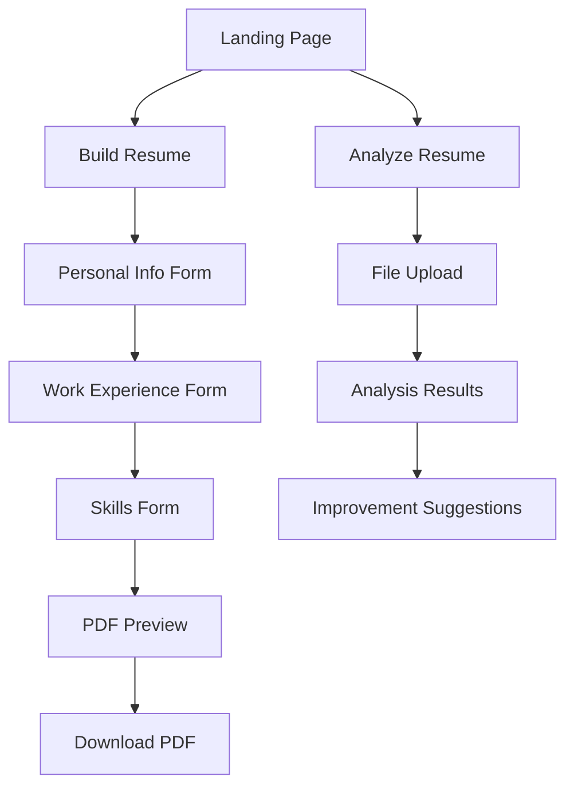

# AI Resume Builder + Analyzer - Product Requirements Document

## 1. Product Overview
An intelligent web application that helps users create ATS-friendly resumes and analyze existing resumes using AI-powered suggestions and feedback.

The platform solves the challenge of creating professional, optimized resumes by providing real-time AI coaching and comprehensive resume analysis. Target users include job seekers, career changers, and professionals looking to improve their resume quality and ATS compatibility.

## 2. Core Features

### 2.1 User Roles
No user registration required - the application operates as a public tool accessible to all users without authentication.

### 2.2 Feature Module
Our AI Resume Builder + Analyzer consists of the following main pages:
1. **Landing Page**: hero section with two primary action buttons, navigation, feature highlights.
2. **Resume Builder**: multi-step form wizard, AI text improvement suggestions, PDF preview and download.
3. **Resume Analyzer**: file upload interface, AI-powered analysis results, visual scoring dashboard.

### 2.3 Page Details

| Page Name | Module Name | Feature description |
|-----------|-------------|---------------------|
| Landing Page | Hero Section | Display main value proposition with "Build Resume" and "Analyze Resume" action buttons |
| Landing Page | Feature Highlights | Showcase key benefits: AI-powered suggestions, ATS optimization, professional formatting |
| Landing Page | Navigation | Simple header with logo and page navigation links |
| Resume Builder | Personal Information Form | Collect name, email, phone, address, LinkedIn profile with real-time validation |
| Resume Builder | Work Experience Form | Multi-entry form for job title, company, dates, achievements with dynamic add/remove functionality |
| Resume Builder | Skills Form | Tag-based skill input with categorization (technical, soft skills, languages) |
| Resume Builder | AI Text Improvement | Real-time suggestions for each section using OpenAI API with professional resume coaching prompts |
| Resume Builder | PDF Preview | Live preview of formatted resume with professional styling |
| Resume Builder | PDF Download | Generate and download styled PDF resume using react-pdf |
| Resume Analyzer | File Upload | Drag-and-drop interface supporting PDF and DOCX files with file validation |
| Resume Analyzer | Text Parsing | Extract text content from uploaded files using pdf-parse and docx libraries |
| Resume Analyzer | AI Analysis | Comprehensive resume evaluation using OpenAI API with recruiter-level analysis prompts |
| Resume Analyzer | Results Dashboard | Visual display of overall score, strengths, weaknesses, missing keywords, and improvement suggestions |
| Resume Analyzer | Score Visualization | Progress bar or circular chart showing overall resume score (0-100) |

## 3. Core Process

**Resume Building Flow:**
Users start from the landing page, click "Build Resume", complete the multi-step form (Personal Info → Work Experience → Skills), receive AI suggestions for each section, preview the formatted resume, and download the PDF.

**Resume Analysis Flow:**
Users start from the landing page, click "Analyze Resume", upload their existing resume file (PDF/DOCX), wait for AI analysis processing, and review comprehensive feedback with actionable improvement suggestions.

## 4. User Interface Design

### 4.1 Design Style
- **Primary Colors**: Blue (#3B82F6) for primary actions, Gray (#6B7280) for secondary elements
- **Secondary Colors**: Green (#10B981) for success states, Red (#EF4444) for errors, Yellow (#F59E0B) for warnings
- **Button Style**: Rounded corners (8px), solid fills for primary actions, outlined for secondary actions
- **Typography**: Inter font family, 16px base size, 24px for headings, 14px for captions
- **Layout Style**: Card-based design with clean spacing, top navigation bar, responsive grid system
- **Icons**: Heroicons for consistency, professional and minimal style

### 4.2 Page Design Overview

| Page Name | Module Name | UI Elements |
|-----------|-------------|-------------|
| Landing Page | Hero Section | Large heading, subtitle, two prominent CTA buttons with hover effects, background gradient |
| Landing Page | Feature Highlights | Three-column grid with icons, feature titles, and descriptions |
| Resume Builder | Form Steps | Progress indicator, step navigation, form fields with labels and validation messages |
| Resume Builder | AI Suggestions | Collapsible panels with before/after text comparison, accept/reject buttons |
| Resume Builder | PDF Preview | Split-screen layout with form on left, live preview on right |
| Resume Analyzer | Upload Interface | Drag-and-drop zone with file type indicators, upload progress bar |
| Resume Analyzer | Results Dashboard | Score circle chart, tabbed sections for strengths/weaknesses, keyword tags |

### 4.3 Responsiveness
Mobile-first responsive design with breakpoints at 640px (mobile), 768px (tablet), and 1024px (desktop). Touch-optimized interactions for mobile devices with larger tap targets and swipe gestures for form navigation.