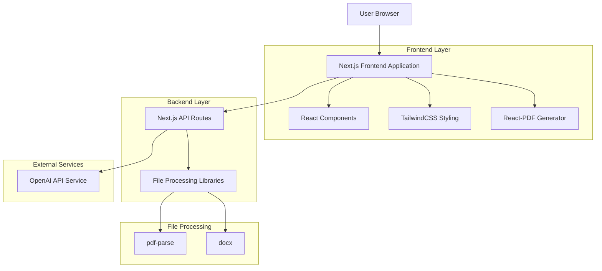
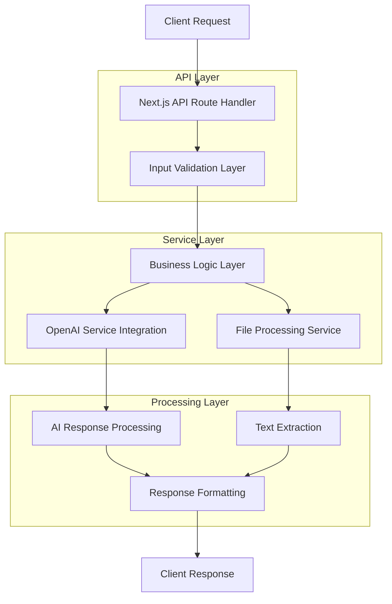
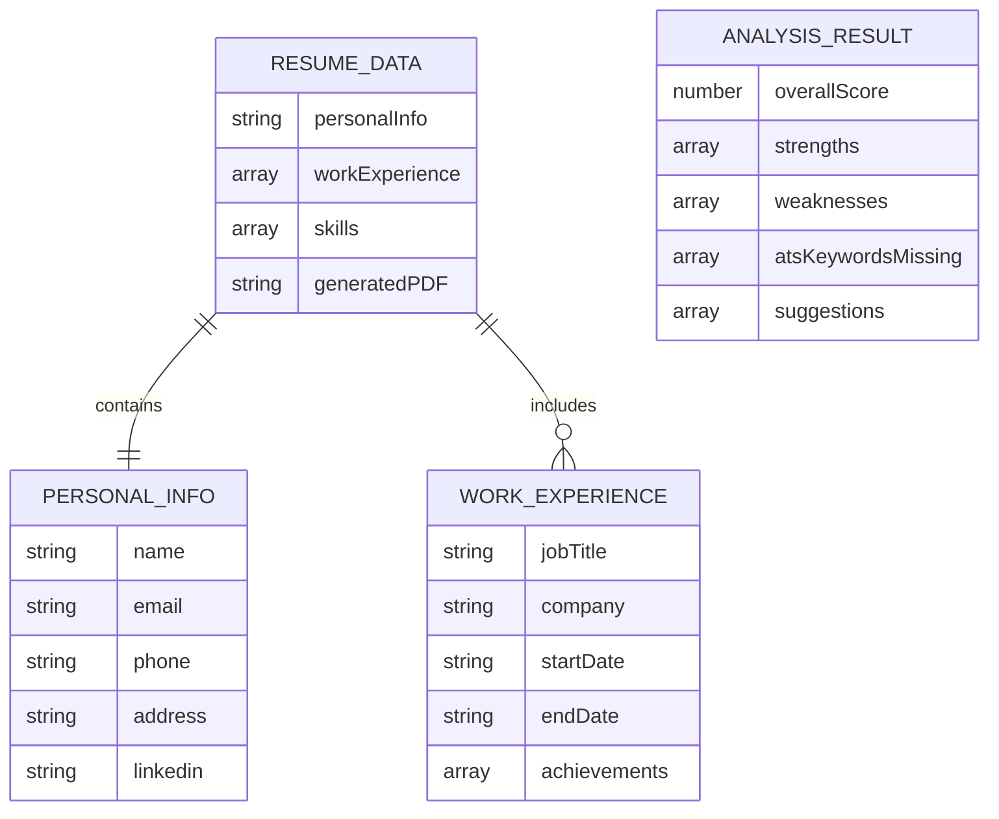

# AI Resume Builder + Analyzer - Technical Architecture Document

## 1. Architecture Design



## 2. Technology Description

* Frontend: Next.js\@14 + React\@18 + TailwindCSS\@3 + TypeScript

* Backend: Next.js API Routes

* AI Service: OpenAI API (GPT-4 or GPT-4o-mini)

* PDF Generation: @react-pdf/renderer

* File Parsing: pdf-parse, docx

* State Management: React hooks (useState, useEffect)

* File Upload: Built-in HTML5 file API

## 3. Route Definitions

| Route    | Purpose                                                |
| -------- | ------------------------------------------------------ |
| /        | Landing page with main navigation and feature overview |
| /build   | Resume builder with multi-step form and AI suggestions |
| /analyze | Resume analyzer with file upload and analysis results  |

## 4. API Definitions

### 4.1 Core API

**Text Improvement API**

```
POST /api/improve-text
```

Request:

| Param Name | Param Type | isRequired | Description                                 |
| ---------- | ---------- | ---------- | ------------------------------------------- |
| text       | string     | true       | Resume section text to be improved          |
| section    | string     | true       | Section type (personal, experience, skills) |

Response:

| Param Name   | Param Type | Description                           |
| ------------ | ---------- | ------------------------------------- |
| improvedText | string     | AI-enhanced version of the input text |
| success      | boolean    | Request success status                |
| error        | string     | Error message if request fails        |

Example Request:

```json
{
  "text": "I worked at ABC Company as a developer",
  "section": "experience"
}
```

Example Response:

```json
{
  "improvedText": "Developed and maintained web applications at ABC Company, contributing to 20% improvement in user engagement",
  "success": true
}
```

**Resume Analysis API**

```
POST /api/analyze-resume
```

Request:

| Param Name | Param Type | isRequired | Description                                 |
| ---------- | ---------- | ---------- | ------------------------------------------- |
| resumeText | string     | true       | Extracted text content from uploaded resume |
| fileName   | string     | true       | Original filename for context               |

Response:

| Param Name             | Param Type | Description                        |
| ---------------------- | ---------- | ---------------------------------- |
| overall\_score         | number     | Resume score from 0-100            |
| strengths              | string\[]  | List of 3-5 strong points          |
| weaknesses             | string\[]  | List of 3-5 weak points            |
| ats\_keywords\_missing | string\[]  | Missing ATS keywords               |
| suggestions            | string\[]  | Actionable improvement suggestions |
| success                | boolean    | Request success status             |
| error                  | string     | Error message if request fails     |

Example Response:

```json
{
  "overall_score": 75,
  "strengths": [
    "Clear work experience progression",
    "Quantified achievements with metrics",
    "Relevant technical skills listed"
  ],
  "weaknesses": [
    "Missing professional summary",
    "Limited use of action verbs",
    "No education section"
  ],
  "ats_keywords_missing": [
    "project management",
    "agile methodology",
    "stakeholder communication"
  ],
  "suggestions": [
    "Add a compelling professional summary at the top",
    "Use stronger action verbs like 'implemented', 'optimized', 'led'",
    "Include education and certifications section"
  ],
  "success": true
}
```

## 5. Server Architecture Diagram



## 6. Data Model

### 6.1 Data Model Definition



### 6.2 TypeScript Interface Definitions

```typescript
// Core data interfaces
interface PersonalInfo {
  name: string;
  email: string;
  phone: string;
  address: string;
  linkedin?: string;
}

interface WorkExperience {
  id: string;
  jobTitle: string;
  company: string;
  startDate: string;
  endDate: string;
  achievements: string[];
}

interface ResumeData {
  personalInfo: PersonalInfo;
  workExperience: WorkExperience[];
  skills: string[];
}

interface AnalysisResult {
  overall_score: number;
  strengths: string[];
  weaknesses: string[];
  ats_keywords_missing: string[];
  suggestions: string[];
}

// API request/response interfaces
interface ImproveTextRequest {
  text: string;
  section: 'personal' | 'experience' | 'skills';
}

interface ImproveTextResponse {
  improvedText: string;
  success: boolean;
  error?: string;
}

interface AnalyzeResumeRequest {
  resumeText: string;
  fileName: string;
}

interface AnalyzeResumeResponse extends AnalysisResult {
  success: boolean;
  error?: string;
}
```

### 6.3 Environment Configuration

```bash
# .env.local
OPENAI_API_KEY=your_openai_api_key_here
NEXT_PUBLIC_APP_NAME=AI Resume Builder
NEXT_PUBLIC_MAX_FILE_SIZE=10485760  # 10MB in bytes
```

### 6.4 File Structure

```
/
├── pages/
│   ├── index.tsx              # Landing page
│   ├── build.tsx              # Resume builder
│   ├── analyze.tsx            # Resume analyzer
│   └── api/
│       ├── improve-text.ts    # Text improvement endpoint
│       └── analyze-resume.ts  # Resume analysis endpoint
├── components/
│   ├── FormStep.tsx           # Multi-step form component
│   ├── FeedbackCard.tsx       # Analysis results display
│   ├── FileUpload.tsx         # File upload component
│   └── PDFPreview.tsx         # PDF preview component
├── lib/
│   ├── pdfGenerator.ts        # PDF generation utilities
│   ├── fileParser.ts          # File parsing utilities
│   └── openai.ts              # OpenAI API integration
├── types/
│   └── index.ts               # TypeScript type definitions
├── styles/
│   └── globals.css            # Global styles with Tailwind
└── public/
    └── assets/                # Static assets
```

