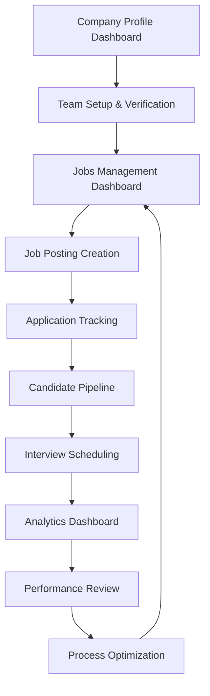

# Company Dashboard Professional Features - Product Requirements Document

## 1. Product Overview

A comprehensive company account dashboard system that provides professional-grade tools for managing company profiles, analyzing recruitment performance, and streamlining job management processes. This solution addresses the critical need for employers to have centralized control over their hiring operations with advanced analytics and management capabilities.

The platform serves as a unified workspace for HR teams and hiring managers to optimize their recruitment strategies, track performance metrics, and manage their employer brand effectively. This system will significantly enhance the hiring efficiency and provide data-driven insights for better decision-making.

## 2. Core Features

### 2.1 User Roles

| Role | Registration Method | Core Permissions |
|------|---------------------|------------------|
| Company Admin | Company registration with verification | Full access to all dashboard features, team management, billing |
| HR Manager | Invitation by Company Admin | Access to analytics, job management, candidate review |
| Recruiter | Invitation by HR Manager/Admin | Job posting, candidate management, basic analytics |
| Hiring Manager | Department-specific invitation | View applications for their department, interview scheduling |

### 2.2 Feature Module

Our company dashboard requirements consist of the following main sections:

1. **Company Profile Dashboard**: comprehensive company information management, branding controls, team management, verification status, social media integration, company culture showcase.

2. **Analytics Dashboard**: advanced recruitment analytics, job performance metrics, candidate sourcing insights, hiring funnel analysis, ROI tracking, competitive benchmarking.

3. **Jobs Management Dashboard**: sophisticated job posting management, application tracking system, candidate pipeline, interview scheduling, team collaboration tools, automated workflows.

### 2.3 Page Details

| Page Name | Module Name | Feature description |
|-----------|-------------|---------------------|
| Company Profile Dashboard | Company Information | Manage company details, logo, description, industry, size, location, contact information with real-time validation |
| Company Profile Dashboard | Branding & Visual Identity | Upload company logo, cover images, brand colors, company photos, office locations with image optimization |
| Company Profile Dashboard | Team Management | Add/remove team members, assign roles, manage permissions, view team activity with invitation system |
| Company Profile Dashboard | Verification Status | Company verification process, document upload, verification badges, trust indicators |
| Company Profile Dashboard | Social Media Integration | Connect LinkedIn, Twitter, Facebook, Instagram accounts with automatic content sync |
| Company Profile Dashboard | Company Culture | Showcase company values, benefits, work environment, employee testimonials, culture videos |
| Analytics Dashboard | Performance Metrics | Track job posting views, application rates, conversion metrics, time-to-hire analytics with interactive charts |
| Analytics Dashboard | Application Analytics | Analyze application trends, candidate quality scores, source effectiveness, demographic insights |
| Analytics Dashboard | Sourcing Insights | Track candidate sources, channel performance, cost-per-acquisition, ROI analysis with detailed breakdowns |
| Analytics Dashboard | Hiring Funnel | Visualize recruitment pipeline, stage conversion rates, bottleneck identification, process optimization |
| Analytics Dashboard | Competitive Analysis | Benchmark against industry standards, salary comparisons, market insights, competitor tracking |
| Analytics Dashboard | Export & Reporting | Generate custom reports, schedule automated reports, export data in multiple formats |
| Jobs Management Dashboard | Job Posting Management | Create, edit, duplicate, archive job postings with advanced templates and AI-powered optimization |
| Jobs Management Dashboard | Application Tracking | Comprehensive ATS with candidate profiles, status tracking, communication history, document management |
| Jobs Management Dashboard | Candidate Pipeline | Visual pipeline management, drag-and-drop status updates, bulk actions, automated notifications |
| Jobs Management Dashboard | Interview Scheduling | Calendar integration, automated scheduling, interview feedback collection, video interview links |
| Jobs Management Dashboard | Team Collaboration | Internal notes, candidate ratings, team discussions, decision tracking, approval workflows |
| Jobs Management Dashboard | Automated Workflows | Set up automatic responses, status updates, reminder notifications, escalation rules |

## 3. Core Process

**Company Admin Flow:**
The company admin starts by setting up the company profile with complete information and branding elements. They then invite team members and assign appropriate roles. The admin monitors overall recruitment performance through the analytics dashboard and manages job postings at a strategic level.

**HR Manager Flow:**
HR managers access the analytics dashboard to review recruitment metrics and identify optimization opportunities. They manage the job posting strategy, oversee the candidate pipeline, and coordinate with hiring managers for interview scheduling and decision-making.

**Recruiter Flow:**
Recruiters focus on job posting management and candidate pipeline activities. They create and optimize job postings, review applications, communicate with candidates, and move them through the hiring process using the application tracking system.

**Hiring Manager Flow:**
Hiring managers review candidates for their specific departments, participate in the interview process, provide feedback, and make hiring decisions within their assigned roles and permissions.

## 4. User Interface Design

### 4.1 Design Style

- **Primary Colors**: Professional blue (#2563EB) for primary actions, dark gray (#1F2937) for text
- **Secondary Colors**: Light gray (#F3F4F6) for backgrounds, green (#10B981) for success states, red (#EF4444) for alerts
- **Button Style**: Rounded corners (8px), subtle shadows, hover animations with color transitions
- **Font**: Inter font family, 14px base size for body text, 16px for headings, 12px for captions
- **Layout Style**: Card-based design with clean spacing, top navigation with breadcrumbs, sidebar navigation for sections
- **Icons**: Lucide React icons for consistency, 20px standard size, 16px for inline elements

### 4.2 Page Design Overview

| Page Name | Module Name | UI Elements |
|-----------|-------------|-------------|
| Company Profile Dashboard | Company Information | Clean form layout with grouped sections, real-time validation indicators, progress completion bar, auto-save functionality |
| Company Profile Dashboard | Branding & Visual Identity | Drag-and-drop image upload areas, color picker components, preview panels, image cropping tools |
| Company Profile Dashboard | Team Management | Data table with search and filters, role badges, invitation status indicators, action dropdowns |
| Analytics Dashboard | Performance Metrics | Interactive charts using Chart.js, date range selectors, metric cards with trend indicators, export buttons |
| Analytics Dashboard | Application Analytics | Funnel visualizations, heatmaps, comparison charts, filter panels with multi-select options |
| Jobs Management Dashboard | Job Posting Management | Rich text editor, template gallery, preview mode, status indicators, bulk action toolbar |
| Jobs Management Dashboard | Application Tracking | Kanban board interface, candidate cards with photos, quick action buttons, search and filter bar |
| Jobs Management Dashboard | Interview Scheduling | Calendar component, time slot selection, automated email templates, video call integration |

### 4.3 Responsiveness

The platform is designed with a mobile-first approach, ensuring full functionality on tablets and smartphones. Touch interactions are optimized for mobile devices with appropriate button sizes and gesture support. The layout adapts seamlessly across desktop (1200px+), tablet (768px-1199px), and mobile (320px-767px) breakpoints.
