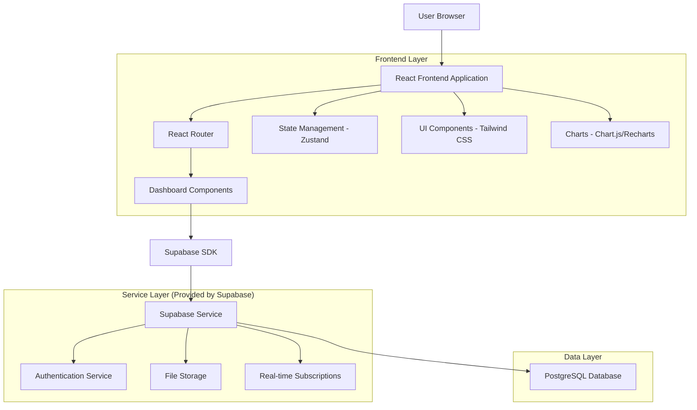
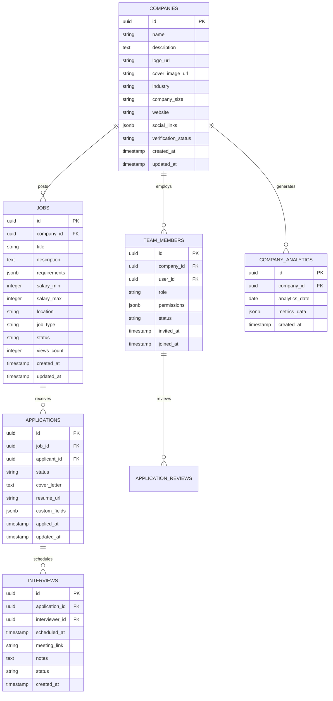

# Company Dashboard Professional Features - Technical Architecture Document

## 1. Architecture Design



## 2. Technology Description

- Frontend: React@18 + TypeScript + Tailwind CSS@3 + Vite
- State Management: Zustand for global state, React Query for server state
- Charts & Analytics: Chart.js + React-Chartjs-2 for interactive visualizations
- UI Components: Headless UI + Lucide React icons
- Backend: Supabase (PostgreSQL + Authentication + Storage + Real-time)
- File Upload: Supabase Storage with image optimization
- Real-time Features: Supabase Realtime for live updates

## 3. Route Definitions

| Route | Purpose |
|-------|---------|
| /dashboard/profile | Company profile management with branding and team settings |
| /dashboard/analytics | Comprehensive recruitment analytics and reporting dashboard |
| /dashboard/jobs | Advanced job posting management and application tracking system |
| /dashboard/profile/team | Team member management and role assignment |
| /dashboard/profile/verification | Company verification process and document upload |
| /dashboard/analytics/reports | Custom report generation and scheduled exports |
| /dashboard/jobs/applications/:jobId | Detailed application tracking for specific job |
| /dashboard/jobs/interviews | Interview scheduling and management interface |

## 4. API Definitions

### 4.1 Core API

**Company Profile Management**
```
GET /api/company/profile
```

Response:
| Param Name | Param Type | Description |
|------------|------------|-------------|
| id | string | Company unique identifier |
| name | string | Company name |
| description | string | Company description |
| logo_url | string | Company logo URL |
| cover_image_url | string | Cover image URL |
| industry | string | Industry category |
| company_size | string | Number of employees |
| website | string | Company website URL |
| social_links | object | Social media links |
| verification_status | string | Verification status (pending/verified/rejected) |

```
PUT /api/company/profile
```

Request:
| Param Name | Param Type | isRequired | Description |
|------------|------------|------------|-------------|
| name | string | true | Company name |
| description | string | false | Company description |
| industry | string | true | Industry category |
| company_size | string | true | Number of employees |
| website | string | false | Company website URL |

**Analytics Data**
```
GET /api/analytics/dashboard
```

Request:
| Param Name | Param Type | isRequired | Description |
|------------|------------|------------|-------------|
| date_from | string | true | Start date (ISO format) |
| date_to | string | true | End date (ISO format) |
| metrics | array | false | Specific metrics to fetch |

Response:
| Param Name | Param Type | Description |
|------------|------------|-------------|
| job_views | number | Total job posting views |
| applications_received | number | Total applications received |
| conversion_rate | number | Application to hire conversion rate |
| time_to_hire | number | Average time to hire in days |
| cost_per_hire | number | Average cost per hire |
| source_breakdown | array | Application sources with counts |

**Job Management**
```
GET /api/jobs/management
```

Response:
| Param Name | Param Type | Description |
|------------|------------|-------------|
| jobs | array | List of job postings with full details |
| total_count | number | Total number of jobs |
| active_count | number | Number of active jobs |
| draft_count | number | Number of draft jobs |

```
POST /api/jobs/create
```

Request:
| Param Name | Param Type | isRequired | Description |
|------------|------------|------------|-------------|
| title | string | true | Job title |
| description | string | true | Job description |
| requirements | array | true | Job requirements |
| salary_min | number | false | Minimum salary |
| salary_max | number | false | Maximum salary |
| location | string | true | Job location |
| job_type | string | true | Employment type |
| status | string | true | Job status (draft/active/paused) |

**Application Tracking**
```
GET /api/applications/:jobId
```

Response:
| Param Name | Param Type | Description |
|------------|------------|-------------|
| applications | array | List of applications for the job |
| pipeline_stages | array | Available pipeline stages |
| total_count | number | Total applications count |

```
PUT /api/applications/:applicationId/status
```

Request:
| Param Name | Param Type | isRequired | Description |
|------------|------------|------------|-------------|
| status | string | true | New application status |
| notes | string | false | Internal notes |
| scheduled_interview | object | false | Interview scheduling details |

## 5. Data Model

### 5.1 Data Model Definition



### 5.2 Data Definition Language

**Companies Table**
```sql
-- Create companies table
CREATE TABLE companies (
    id UUID PRIMARY KEY DEFAULT gen_random_uuid(),
    name VARCHAR(255) NOT NULL,
    description TEXT,
    logo_url VARCHAR(500),
    cover_image_url VARCHAR(500),
    industry VARCHAR(100) NOT NULL,
    company_size VARCHAR(50) NOT NULL,
    website VARCHAR(255),
    social_links JSONB DEFAULT '{}',
    verification_status VARCHAR(20) DEFAULT 'pending' CHECK (verification_status IN ('pending', 'verified', 'rejected')),
    created_at TIMESTAMP WITH TIME ZONE DEFAULT NOW(),
    updated_at TIMESTAMP WITH TIME ZONE DEFAULT NOW()
);

-- Create indexes
CREATE INDEX idx_companies_industry ON companies(industry);
CREATE INDEX idx_companies_verification_status ON companies(verification_status);
CREATE INDEX idx_companies_created_at ON companies(created_at DESC);

-- Grant permissions
GRANT SELECT ON companies TO anon;
GRANT ALL PRIVILEGES ON companies TO authenticated;
```

**Jobs Table**
```sql
-- Create jobs table
CREATE TABLE jobs (
    id UUID PRIMARY KEY DEFAULT gen_random_uuid(),
    company_id UUID NOT NULL REFERENCES companies(id) ON DELETE CASCADE,
    title VARCHAR(255) NOT NULL,
    description TEXT NOT NULL,
    requirements JSONB DEFAULT '[]',
    salary_min INTEGER,
    salary_max INTEGER,
    location VARCHAR(255) NOT NULL,
    job_type VARCHAR(50) NOT NULL CHECK (job_type IN ('full-time', 'part-time', 'contract', 'internship')),
    status VARCHAR(20) DEFAULT 'draft' CHECK (status IN ('draft', 'active', 'paused', 'closed')),
    views_count INTEGER DEFAULT 0,
    created_at TIMESTAMP WITH TIME ZONE DEFAULT NOW(),
    updated_at TIMESTAMP WITH TIME ZONE DEFAULT NOW()
);

-- Create indexes
CREATE INDEX idx_jobs_company_id ON jobs(company_id);
CREATE INDEX idx_jobs_status ON jobs(status);
CREATE INDEX idx_jobs_created_at ON jobs(created_at DESC);
CREATE INDEX idx_jobs_location ON jobs(location);

-- Grant permissions
GRANT SELECT ON jobs TO anon;
GRANT ALL PRIVILEGES ON jobs TO authenticated;
```

**Applications Table**
```sql
-- Create applications table
CREATE TABLE applications (
    id UUID PRIMARY KEY DEFAULT gen_random_uuid(),
    job_id UUID NOT NULL REFERENCES jobs(id) ON DELETE CASCADE,
    applicant_id UUID NOT NULL REFERENCES auth.users(id) ON DELETE CASCADE,
    status VARCHAR(20) DEFAULT 'pending' CHECK (status IN ('pending', 'reviewed', 'shortlisted', 'interviewed', 'offered', 'hired', 'rejected')),
    cover_letter TEXT,
    resume_url VARCHAR(500),
    custom_fields JSONB DEFAULT '{}',
    applied_at TIMESTAMP WITH TIME ZONE DEFAULT NOW(),
    updated_at TIMESTAMP WITH TIME ZONE DEFAULT NOW()
);

-- Create indexes
CREATE INDEX idx_applications_job_id ON applications(job_id);
CREATE INDEX idx_applications_applicant_id ON applications(applicant_id);
CREATE INDEX idx_applications_status ON applications(status);
CREATE INDEX idx_applications_applied_at ON applications(applied_at DESC);

-- Grant permissions
GRANT SELECT ON applications TO anon;
GRANT ALL PRIVILEGES ON applications TO authenticated;
```

**Team Members Table**
```sql
-- Create team_members table
CREATE TABLE team_members (
    id UUID PRIMARY KEY DEFAULT gen_random_uuid(),
    company_id UUID NOT NULL REFERENCES companies(id) ON DELETE CASCADE,
    user_id UUID NOT NULL REFERENCES auth.users(id) ON DELETE CASCADE,
    role VARCHAR(50) NOT NULL CHECK (role IN ('admin', 'hr_manager', 'recruiter', 'hiring_manager')),
    permissions JSONB DEFAULT '{}',
    status VARCHAR(20) DEFAULT 'pending' CHECK (status IN ('pending', 'active', 'inactive')),
    invited_at TIMESTAMP WITH TIME ZONE DEFAULT NOW(),
    joined_at TIMESTAMP WITH TIME ZONE,
    UNIQUE(company_id, user_id)
);

-- Create indexes
CREATE INDEX idx_team_members_company_id ON team_members(company_id);
CREATE INDEX idx_team_members_user_id ON team_members(user_id);
CREATE INDEX idx_team_members_role ON team_members(role);

-- Grant permissions
GRANT SELECT ON team_members TO anon;
GRANT ALL PRIVILEGES ON team_members TO authenticated;
```

**Company Analytics Table**
```sql
-- Create company_analytics table
CREATE TABLE company_analytics (
    id UUID PRIMARY KEY DEFAULT gen_random_uuid(),
    company_id UUID NOT NULL REFERENCES companies(id) ON DELETE CASCADE,
    analytics_date DATE NOT NULL,
    metrics_data JSONB NOT NULL DEFAULT '{}',
    created_at TIMESTAMP WITH TIME ZONE DEFAULT NOW(),
    UNIQUE(company_id, analytics_date)
);

-- Create indexes
CREATE INDEX idx_company_analytics_company_id ON company_analytics(company_id);
CREATE INDEX idx_company_analytics_date ON company_analytics(analytics_date DESC);

-- Grant permissions
GRANT SELECT ON company_analytics TO anon;
GRANT ALL PRIVILEGES ON company_analytics TO authenticated;
```

**Initial Data**
```sql
-- Insert sample company data
INSERT INTO companies (name, description, industry, company_size, website, verification_status)
VALUES 
('TechCorp Solutions', 'Leading technology solutions provider', 'Technology', '100-500', 'https://techcorp.com', 'verified'),
('InnovateLabs', 'Innovation-driven software development', 'Software', '50-100', 'https://innovatelabs.com', 'pending');

-- Insert sample job data
INSERT INTO jobs (company_id, title, description, location, job_type, status)
SELECT 
    c.id,
    'Senior Software Engineer',
    'We are looking for an experienced software engineer to join our team.',
    'San Francisco, CA',
    'full-time',
    'active'
FROM companies c WHERE c.name = 'TechCorp Solutions';
```