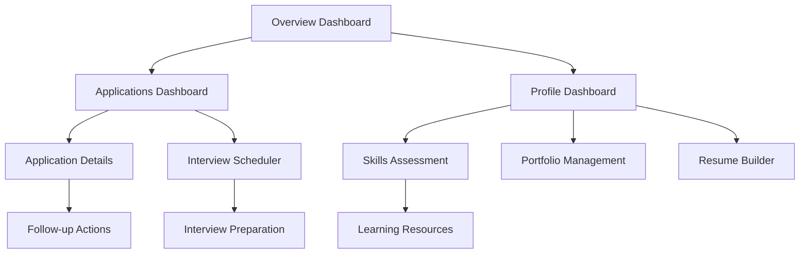

# Job Seeker Dashboard Professional Features - Product Requirements Document

## 1. Product Overview

A comprehensive, professional job seeker dashboard system that empowers users to effectively manage their career journey, track applications, optimize their profile, and discover opportunities through intelligent insights and analytics.

The dashboard addresses key challenges job seekers face: scattered application tracking, lack of career progression visibility, limited profile optimization guidance, and insufficient market insights for strategic job searching.

Target: Transform the job search experience into a data-driven, strategic career management platform that increases application success rates and accelerates career growth.

## 2. Core Features

### 2.1 User Roles

| Role | Registration Method | Core Permissions |
|------|---------------------|------------------|
| Job Seeker | Email registration with profile setup | Full access to all job seeker features, application management, profile optimization |
| Premium Job Seeker | Subscription upgrade | Enhanced analytics, priority support, advanced AI insights, unlimited exports |

### 2.2 Feature Module

Our job seeker dashboard requirements consist of the following main pages:

1. **Overview Dashboard**: career metrics, application insights, job recommendations, recent activities, progress tracking
2. **Applications Dashboard**: comprehensive application management, status tracking, analytics, bulk operations, interview scheduling
3. **Profile Dashboard**: profile optimization, skills assessment, portfolio management, resume builder integration, career development tools

### 2.3 Page Details

| Page Name | Module Name | Feature Description |
|-----------|-------------|---------------------|
| Overview Dashboard | Career Metrics | Display key statistics: total applications, response rate, interview conversion, average response time |
| Overview Dashboard | Application Insights | Visual analytics showing application trends, success patterns, industry performance |
| Overview Dashboard | Job Recommendations | AI-powered job matching based on profile, skills, and preferences with match scores |
| Overview Dashboard | Recent Activities | Timeline of recent applications, profile updates, job views, and system notifications |
| Overview Dashboard | Progress Tracking | Career progression indicators, skill development progress, goal achievement metrics |
| Overview Dashboard | Quick Actions | Fast access to apply to jobs, update profile, schedule interviews, export reports |
| Applications Dashboard | Application Management | Comprehensive list with advanced filtering by status, date, company, position, salary range |
| Applications Dashboard | Status Tracking | Real-time application status updates with detailed timeline and next steps |
| Applications Dashboard | Bulk Operations | Select multiple applications for bulk status updates, notes addition, or export |
| Applications Dashboard | Interview Scheduler | Integrated calendar for interview scheduling with reminders and preparation notes |
| Applications Dashboard | Application Analytics | Success rate analysis, response time tracking, industry performance comparison |
| Applications Dashboard | Follow-up Manager | Automated follow-up reminders and templates for different application stages |
| Profile Dashboard | Profile Optimization | AI-powered profile completeness score with specific improvement suggestions |
| Profile Dashboard | Skills Assessment | Interactive skills evaluation with proficiency levels and market demand indicators |
| Profile Dashboard | Portfolio Showcase | Visual portfolio with project galleries, achievements, and work samples |
| Profile Dashboard | Resume Integration | Direct integration with resume builder, multiple resume versions, ATS optimization |
| Profile Dashboard | Career Development | Skill gap analysis, learning recommendations, certification tracking |
| Profile Dashboard | Professional Branding | Social media integration, personal website setup, professional photo guidelines |

## 3. Core Process

**Job Seeker Main Flow:**
1. User logs in and lands on Overview Dashboard with personalized career insights
2. Reviews application metrics, job recommendations, and recent activities
3. Navigates to Applications Dashboard to manage active applications and track progress
4. Uses advanced filters to organize applications by status, company, or timeline
5. Accesses Profile Dashboard to optimize professional presentation and skills
6. Receives AI-powered suggestions for profile improvements and career development
7. Exports application reports and analytics for external tracking or interviews

**Application Management Flow:**
1. User views all applications with status indicators and progress tracking
2. Filters applications by various criteria (status, date, company, position)
3. Updates application status, adds notes, and schedules follow-ups
4. Tracks interview schedules and preparation materials
5. Analyzes application performance and success patterns

**Profile Optimization Flow:**
1. User accesses profile dashboard with completeness score
2. Reviews AI-generated optimization suggestions
3. Updates skills, experience, and portfolio content
4. Completes skills assessments and tracks proficiency growth
5. Integrates with resume builder for consistent professional branding

## 4. User Interface Design

### 4.1 Design Style

- **Primary Colors**: Blue (#3B82F6) for primary actions, Green (#10B981) for success states
- **Secondary Colors**: Gray (#6B7280) for text, Light Blue (#EFF6FF) for backgrounds
- **Button Style**: Rounded corners (8px), subtle shadows, hover animations with color transitions
- **Typography**: Inter font family, 16px base size, clear hierarchy with 24px/32px/48px headings
- **Layout Style**: Card-based design with clean spacing, left sidebar navigation, responsive grid layouts
- **Icons**: Lucide React icons with consistent 20px/24px sizing, professional and minimal style

### 4.2 Page Design Overview

| Page Name | Module Name | UI Elements |
|-----------|-------------|-------------|
| Overview Dashboard | Career Metrics | Grid of metric cards with large numbers, trend indicators, color-coded status badges |
| Overview Dashboard | Application Insights | Interactive charts using Chart.js, donut charts for status distribution, line charts for trends |
| Overview Dashboard | Job Recommendations | Card-based layout with company logos, match percentage badges, quick apply buttons |
| Applications Dashboard | Application List | Data table with sortable columns, status badges, action dropdowns, bulk selection checkboxes |
| Applications Dashboard | Filter Panel | Collapsible sidebar with date pickers, multi-select dropdowns, search input with autocomplete |
| Applications Dashboard | Analytics Section | Dashboard widgets with KPI cards, progress bars, comparison charts |
| Profile Dashboard | Optimization Score | Circular progress indicator with percentage, color-coded sections, improvement checklist |
| Profile Dashboard | Skills Matrix | Interactive skill tags with proficiency levels, drag-and-drop organization, market demand indicators |
| Profile Dashboard | Portfolio Gallery | Masonry layout for projects, modal overlays for details, image optimization and lazy loading |

### 4.3 Responsiveness

Desktop-first design with mobile-adaptive breakpoints at 768px and 1024px. Touch-optimized interactions for mobile devices including swipe gestures for application cards, collapsible navigation, and optimized form inputs. Tablet layout maintains sidebar navigation with adjusted spacing and component sizing.

## 5. Advanced Features

### 5.1 AI-Powered Insights
- Job matching algorithm based on skills, experience, and preferences
- Profile optimization suggestions using natural language processing
- Application success prediction based on historical data
- Personalized career development recommendations

### 5.2 Analytics and Reporting
- Application performance tracking with success rate calculations
- Industry benchmarking and salary insights
- Skill demand analysis and market trends
- Exportable reports in PDF and Excel formats

### 5.3 Integration Capabilities
- Resume builder synchronization for consistent branding
- Calendar integration for interview scheduling
- Email templates for follow-up communications
- Social media profile optimization suggestions

### 5.4 Notification System
- Real-time application status updates
- Interview reminders and preparation alerts
- Job recommendation notifications based on preferences
- Weekly progress reports and achievement celebrations

### 5.5 Career Development Tools
- Skill gap analysis with learning resource recommendations
- Career progression tracking with milestone achievements
- Professional networking suggestions and connection tracking
- Industry insights and market trend analysis