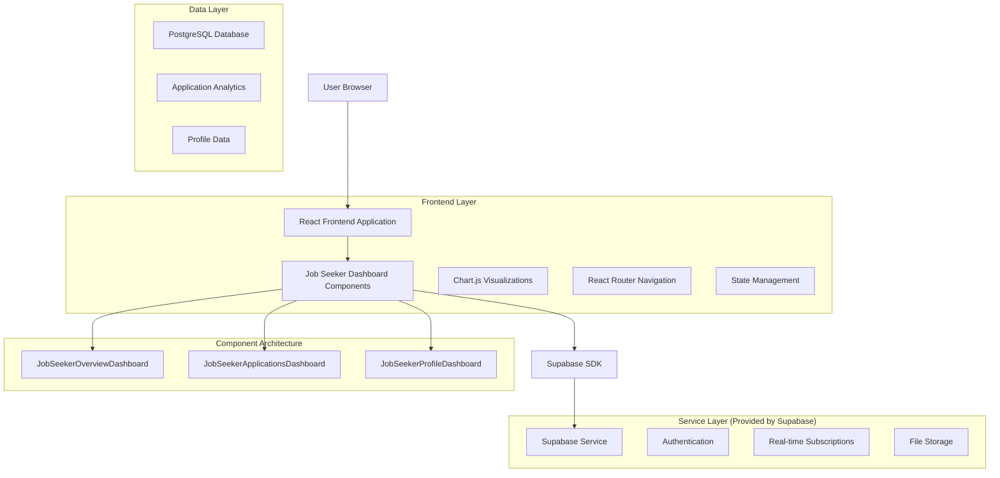
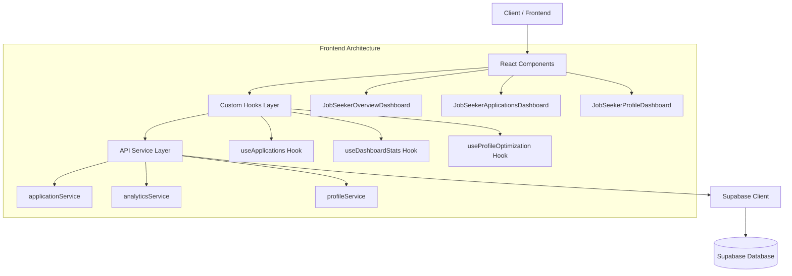
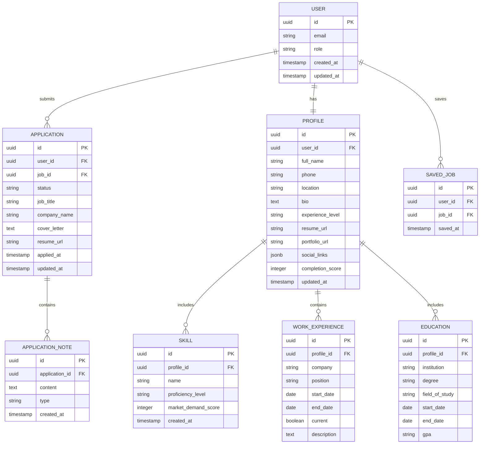

# Job Seeker Dashboard Technical Architecture

## 1. Architecture Design



## 2. Technology Description

- Frontend: React@18 + TypeScript@5 + Tailwind CSS@3 + Vite@5
- Charts: Chart.js@4 + react-chartjs-2@5
- Icons: Lucide React@0.263
- Routing: React Router DOM@6
- Backend: Supabase (Authentication, Database, Real-time, Storage)
- Database: PostgreSQL (via Supabase)
- Notifications: Sonner@1.4

## 3. Route Definitions

| Route | Purpose |
|-------|---------|
| /dashboard/overview | Job seeker overview with metrics, insights, and recommendations |
| /dashboard/applications | Comprehensive application management and tracking |
| /dashboard/profile | Profile optimization, skills assessment, and career development |
| /dashboard | Smart dashboard redirect based on user role and preferences |

## 4. API Definitions

### 4.1 Core API Endpoints

**Application Management**
```
GET /api/applications
```
Request:
| Param Name | Param Type | isRequired | Description |
|------------|------------|------------|-------------|
| user_id | string | true | Authenticated user ID |
| status | string | false | Filter by application status |
| limit | number | false | Number of results to return |
| offset | number | false | Pagination offset |

Response:
| Param Name | Param Type | Description |
|------------|------------|-------------|
| applications | Application[] | Array of user applications |
| total_count | number | Total number of applications |
| success | boolean | Request success status |

**Dashboard Statistics**
```
GET /api/dashboard/stats
```
Request:
| Param Name | Param Type | isRequired | Description |
|------------|------------|------------|-------------|
| user_id | string | true | Authenticated user ID |
| period | string | false | Time period for stats (week, month, year) |

Response:
| Param Name | Param Type | Description |
|------------|------------|-------------|
| total_applications | number | Total applications submitted |
| response_rate | number | Percentage of applications with responses |
| interview_rate | number | Percentage of applications leading to interviews |
| avg_response_time | number | Average response time in days |

**Job Recommendations**
```
GET /api/recommendations
```
Request:
| Param Name | Param Type | isRequired | Description |
|------------|------------|------------|-------------|
| user_id | string | true | Authenticated user ID |
| limit | number | false | Number of recommendations |

Response:
| Param Name | Param Type | Description |
|------------|------------|-------------|
| recommendations | JobRecommendation[] | Array of recommended jobs |
| match_scores | number[] | Match percentage for each recommendation |

**Profile Optimization**
```
GET /api/profile/optimization
```
Request:
| Param Name | Param Type | isRequired | Description |
|------------|------------|------------|-------------|
| user_id | string | true | Authenticated user ID |

Response:
| Param Name | Param Type | Description |
|------------|------------|-------------|
| completion_score | number | Profile completion percentage |
| suggestions | OptimizationSuggestion[] | Array of improvement suggestions |
| missing_sections | string[] | List of incomplete profile sections |

## 5. Server Architecture Diagram



## 6. Data Model

### 6.1 Data Model Definition



### 6.2 Data Definition Language

**Applications Table**
```sql
-- Create applications table
CREATE TABLE applications (
  id UUID PRIMARY KEY DEFAULT gen_random_uuid(),
  user_id UUID REFERENCES auth.users(id) ON DELETE CASCADE,
  job_id UUID,
  status VARCHAR(20) DEFAULT 'pending' CHECK (status IN ('pending', 'reviewed', 'shortlisted', 'rejected', 'hired')),
  job_title VARCHAR(255) NOT NULL,
  company_name VARCHAR(255) NOT NULL,
  job_location VARCHAR(255),
  job_type VARCHAR(50),
  salary_range VARCHAR(100),
  cover_letter TEXT,
  resume_url TEXT,
  applied_at TIMESTAMP WITH TIME ZONE DEFAULT NOW(),
  updated_at TIMESTAMP WITH TIME ZONE DEFAULT NOW()
);

-- Create indexes
CREATE INDEX idx_applications_user_id ON applications(user_id);
CREATE INDEX idx_applications_status ON applications(status);
CREATE INDEX idx_applications_applied_at ON applications(applied_at DESC);

-- Row Level Security
ALTER TABLE applications ENABLE ROW LEVEL SECURITY;

CREATE POLICY "Users can view own applications" ON applications
  FOR SELECT USING (auth.uid() = user_id);

CREATE POLICY "Users can insert own applications" ON applications
  FOR INSERT WITH CHECK (auth.uid() = user_id);

CREATE POLICY "Users can update own applications" ON applications
  FOR UPDATE USING (auth.uid() = user_id);
```

**User Profiles Table**
```sql
-- Create user_profiles table
CREATE TABLE user_profiles (
  id UUID PRIMARY KEY DEFAULT gen_random_uuid(),
  user_id UUID REFERENCES auth.users(id) ON DELETE CASCADE UNIQUE,
  full_name VARCHAR(255),
  phone VARCHAR(20),
  location VARCHAR(255),
  bio TEXT,
  experience_level VARCHAR(50) CHECK (experience_level IN ('entry', 'junior', 'mid', 'senior', 'executive')),
  resume_url TEXT,
  portfolio_url TEXT,
  linkedin_url TEXT,
  github_url TEXT,
  website_url TEXT,
  completion_score INTEGER DEFAULT 0 CHECK (completion_score >= 0 AND completion_score <= 100),
  profile_visibility VARCHAR(20) DEFAULT 'public' CHECK (profile_visibility IN ('public', 'private')),
  created_at TIMESTAMP WITH TIME ZONE DEFAULT NOW(),
  updated_at TIMESTAMP WITH TIME ZONE DEFAULT NOW()
);

-- Create indexes
CREATE INDEX idx_user_profiles_user_id ON user_profiles(user_id);
CREATE INDEX idx_user_profiles_completion_score ON user_profiles(completion_score DESC);

-- Row Level Security
ALTER TABLE user_profiles ENABLE ROW LEVEL SECURITY;

CREATE POLICY "Users can view own profile" ON user_profiles
  FOR SELECT USING (auth.uid() = user_id);

CREATE POLICY "Users can insert own profile" ON user_profiles
  FOR INSERT WITH CHECK (auth.uid() = user_id);

CREATE POLICY "Users can update own profile" ON user_profiles
  FOR UPDATE USING (auth.uid() = user_id);
```

**Skills Table**
```sql
-- Create skills table
CREATE TABLE skills (
  id UUID PRIMARY KEY DEFAULT gen_random_uuid(),
  profile_id UUID REFERENCES user_profiles(id) ON DELETE CASCADE,
  name VARCHAR(100) NOT NULL,
  proficiency_level VARCHAR(20) DEFAULT 'beginner' CHECK (proficiency_level IN ('beginner', 'intermediate', 'advanced', 'expert')),
  market_demand_score INTEGER DEFAULT 0 CHECK (market_demand_score >= 0 AND market_demand_score <= 100),
  created_at TIMESTAMP WITH TIME ZONE DEFAULT NOW()
);

-- Create indexes
CREATE INDEX idx_skills_profile_id ON skills(profile_id);
CREATE INDEX idx_skills_name ON skills(name);

-- Row Level Security
ALTER TABLE skills ENABLE ROW LEVEL SECURITY;

CREATE POLICY "Users can manage own skills" ON skills
  FOR ALL USING (
    profile_id IN (
      SELECT id FROM user_profiles WHERE user_id = auth.uid()
    )
  );
```

**Application Analytics View**
```sql
-- Create view for application analytics
CREATE VIEW application_analytics AS
SELECT 
  user_id,
  COUNT(*) as total_applications,
  COUNT(CASE WHEN status = 'pending' THEN 1 END) as pending_applications,
  COUNT(CASE WHEN status = 'shortlisted' THEN 1 END) as shortlisted_applications,
  COUNT(CASE WHEN status = 'hired' THEN 1 END) as hired_applications,
  ROUND(
    COUNT(CASE WHEN status IN ('shortlisted', 'hired') THEN 1 END) * 100.0 / 
    NULLIF(COUNT(*), 0), 2
  ) as success_rate,
  AVG(
    CASE WHEN updated_at > applied_at 
    THEN EXTRACT(EPOCH FROM (updated_at - applied_at)) / 86400 
    END
  ) as avg_response_time_days
FROM applications 
GROUP BY user_id;

-- Grant access to authenticated users
GRANT SELECT ON application_analytics TO authenticated;
```

**Initial Data**
```sql
-- Insert sample application statuses for testing
INSERT INTO applications (user_id, job_title, company_name, status, applied_at) VALUES
  ('user-uuid-1', 'Frontend Developer', 'Tech Corp', 'pending', NOW() - INTERVAL '2 days'),
  ('user-uuid-1', 'React Developer', 'StartupXYZ', 'shortlisted', NOW() - INTERVAL '5 days'),
  ('user-uuid-1', 'UI/UX Developer', 'Design Studio', 'reviewed', NOW() - INTERVAL '1 week');

-- Insert sample skills for testing
INSERT INTO skills (profile_id, name, proficiency_level, market_demand_score) VALUES
  ('profile-uuid-1', 'React', 'advanced', 95),
  ('profile-uuid-1', 'TypeScript', 'intermediate', 88),
  ('profile-uuid-1', 'Node.js', 'intermediate', 82);
```