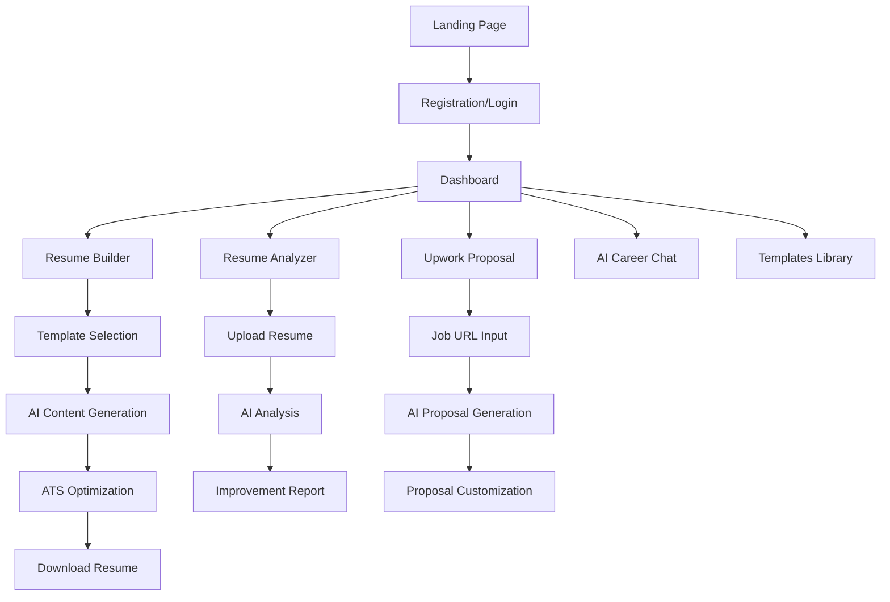

# Job Seeker Platform - Product Requirements Document

## 1. Product Overview

**JobSeeker Pro** is an AI-powered job seeker platform that provides essential tools for career advancement and job application success. Our platform focuses on five core features that directly impact job seekers' success rates: Resume Builder, Resume Analyzer, Upwork Proposal Generator, AI Career Chat, and Professional Templates.

- **Target Market**: Job seekers, freelancers, career changers, and recent graduates seeking to optimize their job applications and increase hiring success rates.
- **Market Value**: The global online recruitment market is projected to reach $63.8 billion by 2033, with AI-powered job seeker tools representing a rapidly growing segment valued at $2.8 billion in 2024.

## 2. Core Features

### 2.1 User Roles

| Role | Registration Method | Core Permissions |
|------|---------------------|------------------|
| Free User | Email registration | Limited resume builds (3/month), basic templates, limited AI chat |
| Pro User | Monthly subscription ($19/month) | Unlimited resumes, full analyzer, unlimited proposals, premium templates |
| Premium User | Annual subscription ($149/year) | All Pro features + priority support, advanced analytics, custom branding |

### 2.2 Feature Module

Our job seeker platform consists of the following main pages:
1. **Dashboard**: User overview, recent activities, quick access to tools, usage statistics
2. **Resume Builder**: AI-powered resume creation, ATS optimization, real-time suggestions
3. **Resume Analyzer**: AI scoring, improvement recommendations, ATS compatibility check
4. **Upwork Proposal Generator**: AI proposal writing, job matching, success rate tracking
5. **AI Career Chat**: Interview prep, career advice, job search strategies, salary negotiation
6. **Templates Library**: Professional resume templates, proposal templates, cover letter templates
7. **Account Settings**: Subscription management, profile settings, billing information

### 2.3 Page Details

| Page Name | Module Name | Feature description |
|-----------|-------------|---------------------|
| Dashboard | Overview Panel | Display usage statistics, recent documents, quick action buttons, success metrics |
| Dashboard | Quick Actions | One-click access to create resume, analyze existing resume, generate proposal |
| Resume Builder | AI Content Generator | Generate job-specific bullet points, optimize keywords, suggest improvements |
| Resume Builder | Template Selection | Choose from 40+ ATS-friendly templates, customize colors and fonts |
| Resume Builder | ATS Optimization | Real-time ATS compatibility scoring, keyword optimization suggestions |
| Resume Analyzer | AI Scoring Engine | Comprehensive resume analysis with 0-100 score, detailed feedback |
| Resume Analyzer | Improvement Recommendations | Specific suggestions for content, formatting, keywords, and structure |
| Resume Analyzer | ATS Compatibility Check | Scan for ATS issues, provide fixes, ensure proper formatting |
| Upwork Proposal | Job Analysis | Analyze Upwork job posts, extract key requirements, suggest approach |
| Upwork Proposal | AI Proposal Writer | Generate personalized proposals, optimize for client preferences |
| Upwork Proposal | Success Tracking | Track proposal performance, win rates, client responses |
| AI Career Chat | Interview Preparation | Mock interviews, common questions, personalized feedback |
| AI Career Chat | Career Guidance | Job search strategies, career path recommendations, skill development |
| AI Career Chat | Salary Negotiation | Negotiation scripts, market rate analysis, confidence building |
| Templates Library | Resume Templates | 40+ professional templates, industry-specific designs, ATS-friendly |
| Templates Library | Proposal Templates | Upwork proposal templates, freelance project templates |
| Account Settings | Subscription Management | Upgrade/downgrade plans, billing history, usage tracking |

## 3. Core Process

**Free User Flow:**
1. User registers with email → Dashboard overview → Select tool (Resume Builder/Analyzer/Proposal) → Use limited features → Upgrade prompt for premium features

**Pro User Flow:**
1. User logs in → Dashboard with full access → Create/analyze resumes unlimited → Generate proposals → Use AI chat for career advice → Download professional templates

**Resume Creation Process:**
1. Choose template → Input basic information → AI generates content suggestions → User customizes → ATS optimization check → Download in multiple formats

**Proposal Generation Process:**
1. Paste Upwork job URL → AI analyzes requirements → Generate tailored proposal → User reviews and edits → Save and track performance

## 4. User Interface Design

### 4.1 Design Style

- **Primary Colors**: Professional blue (#2563EB), success green (#10B981), warning orange (#F59E0B)
- **Secondary Colors**: Light gray (#F8FAFC), dark gray (#1F2937), white (#FFFFFF)
- **Button Style**: Rounded corners (8px), gradient backgrounds, hover animations
- **Font**: Inter for headings (16-24px), Open Sans for body text (14-16px)
- **Layout Style**: Clean card-based design, left sidebar navigation, responsive grid system
- **Icons**: Heroicons for consistency, professional and modern style

### 4.2 Page Design Overview

| Page Name | Module Name | UI Elements |
|-----------|-------------|-------------|
| Dashboard | Overview Panel | Cards with statistics, progress bars, recent activity feed, quick action buttons |
| Resume Builder | Template Gallery | Grid layout with template previews, filter options, search functionality |
| Resume Builder | Editor Interface | Split-screen design, live preview, floating toolbar, AI suggestions panel |
| Resume Analyzer | Upload Area | Drag-and-drop zone, file type indicators, progress bar, instant feedback |
| Resume Analyzer | Results Display | Score visualization, categorized feedback, action items, before/after comparison |
| Upwork Proposal | Job Input | Clean form design, URL validation, job details extraction preview |
| Upwork Proposal | Generated Proposal | Rich text editor, AI suggestions sidebar, character count, save/export options |
| AI Career Chat | Chat Interface | Modern chat bubbles, typing indicators, quick action buttons, conversation history |
| Templates Library | Template Grid | Filterable gallery, preview on hover, category tabs, download buttons |

### 4.3 Responsiveness

Desktop-first design with mobile-adaptive layouts. Touch-optimized interactions for mobile users, collapsible sidebar navigation, and responsive typography scaling.

## 5. Revenue Model & Competitive Analysis

### 5.1 Pricing Strategy

**Free Tier (Lead Generation):**
- 3 resume builds per month
- Basic templates (5 options)
- Limited AI chat (10 messages/month)
- Basic resume analysis

**Pro Plan - $19/month:**
- Unlimited resume builds
- 40+ premium templates
- Unlimited AI chat
- Full resume analyzer
- Upwork proposal generator (20/month)
- Priority support

**Premium Plan - $149/year (Save 36%):**
- All Pro features
- Unlimited proposals
- Advanced analytics
- Custom branding
- 1-on-1 career coaching session

### 5.2 Revenue Projections

**Year 1 Targets:**
- Month 1-3: 500 free users, 25 paid users ($475/month)
- Month 4-6: 2,000 free users, 150 paid users ($2,850/month)
- Month 7-12: 5,000 free users, 400 paid users ($7,600/month)
- **Year 1 Total Revenue: ~$65,000**

**Year 2 Projections:**
- 15,000 free users, 1,200 paid users
- **Monthly Recurring Revenue: $22,800**
- **Annual Revenue: ~$275,000**

### 5.3 Competitive Analysis

| Competitor | Pricing | Strengths | Our Advantage |
|------------|---------|-----------|---------------|
| Resume.com | $2.95-$7.95/month | Established brand | Better AI, Upwork focus |
| Zety | $5.95-$17.95/month | Template variety | More affordable, integrated tools |
| ProposalGenie | $36/month | Upwork specialization | Broader platform, better pricing |
| Rezi | $29/month | ATS optimization | More features, lower cost |
| Kickresume | $19/month | Design quality | AI chat addition, proposal tools |

### 5.4 Competitive Advantages

1. **Integrated Platform**: Unlike competitors who focus on single tools, we provide a complete job seeker ecosystem
2. **AI-First Approach**: Advanced AI across all features, not just content generation
3. **Upwork Specialization**: Dedicated proposal tools that competitors lack
4. **Affordable Pricing**: 30-50% lower than premium competitors
5. **Real-time Optimization**: Live ATS scoring and suggestions during creation

## 6. Go-to-Market Strategy

### 6.1 Launch Strategy (Months 1-3)

**Phase 1: Soft Launch**
- Beta testing with 100 users
- Product Hunt launch
- Content marketing (resume tips, job search guides)
- SEO optimization for "resume builder," "ATS optimization"

**Phase 2: Paid Acquisition**
- Google Ads targeting job seekers
- Facebook/LinkedIn ads for career changers
- Influencer partnerships with career coaches
- Affiliate program with career websites

### 6.2 Rapid Sales Tactics

1. **Free Trial Strategy**: 7-day free trial of Pro features
2. **Limited-Time Offers**: 50% off first month for early adopters
3. **Referral Program**: Free month for successful referrals
4. **Content Marketing**: Daily job search tips, resume examples
5. **Social Proof**: Success stories, before/after resume examples
6. **Email Sequences**: 5-part job search success email course

### 6.3 Customer Acquisition Channels

- **Organic Search**: Target "resume builder free," "ATS resume checker"
- **Social Media**: LinkedIn job seeker groups, Reddit r/jobs
- **Partnerships**: Career centers, bootcamps, universities
- **Content Marketing**: YouTube tutorials, blog posts
- **Paid Advertising**: Google Ads, Facebook targeting job seekers

## 7. Success Metrics & KPIs

### 7.1 Key Performance Indicators

- **User Acquisition**: 500 new users/month by Month 6
- **Conversion Rate**: 8% free-to-paid conversion
- **Churn Rate**: <5% monthly churn for paid users
- **Customer Lifetime Value**: $180 (10-month average retention)
- **User Engagement**: 3+ tool uses per session

### 7.2 Revenue Milestones

- **Month 3**: $1,000 MRR
- **Month 6**: $5,000 MRR
- **Month 12**: $15,000 MRR
- **Year 2**: $25,000 MRR

This focused approach positions us to capture market share quickly while building a sustainable, profitable business in the growing job seeker tools market.