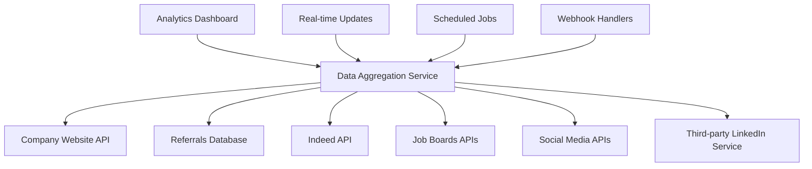

# Platform API Integration Analysis for Analytics Dashboard

## Executive Summary

This document provides a comprehensive analysis of integrating job posting platform APIs into your analytics dashboard. Currently, your dashboard displays mock data for LinkedIn, Indeed, Company Website, Referrals, Job Boards, and Social Media platforms. This analysis covers the technical feasibility, costs, challenges, and implementation strategies for each platform.

## Current Implementation Status

Your analytics dashboard currently shows:
- **LinkedIn**: 35% of job applications
- **Indeed**: 25% of job applications  
- **Company Website**: 20% of job applications
- **Referrals**: 12% of job applications
- **Job Boards**: 5% of job applications
- **Social Media**: 3% of job applications

*Note: These are currently mock data values that need real API integration.*

## Platform-by-Platform Integration Analysis

### 1. LinkedIn API Integration

#### **Availability & Access**
- **Status**: ❌ **HIGHLY RESTRICTED** <mcreference link="https://learn.microsoft.com/en-us/linkedin/talent/job-postings/api/overview?view=li-lts-2025-07" index="2">2</mcreference>
- **Current Policy**: LinkedIn is NOT accepting new partnerships for Job Posting API
- **Alternative**: Apply Connect API (limited access)

#### **Technical Requirements**
- **Authentication**: OAuth 2.0 with approved partnership
- **Partnership Requirements**: 
  - Must be approved LinkedIn Talent Solutions Partner
  - Requires signed API agreement with data restrictions
  - Need to meet specific criteria and business requirements

#### **Data Access**
```json
{
  "job_postings": "Create/manage job postings",
  "analytics_data": "Job performance metrics",
  "application_data": "Limited applicant information",
  "company_data": "Basic company information"
}
```

#### **Implementation Complexity**
- **Difficulty**: 🔴 **EXTREMELY HIGH**
- **Timeline**: 6-12 months (if approved)
- **Cost**: Enterprise-level partnership fees

#### **Recommendation**
❌ **NOT RECOMMENDED** - Use third-party services like Lix API for job data scraping <mcreference link="https://lix-it.com/blog/job-posts-and-description-from-linkedin-via-api/" index="1">1</mcreference>

---

### 2. Indeed API Integration

#### **Availability & Access**
- **Status**: ✅ **AVAILABLE** (Job Sync API) <mcreference link="https://docs.indeed.com/job-sync-api/job-sync-api-guide" index="1">1</mcreference>
- **Access**: Requires Indeed Partner approval
- **Cost**: Free for basic job posting operations

#### **Technical Requirements**
- **Authentication**: OAuth 2.0
- **Partnership**: Must become Indeed Partner
- **API Type**: GraphQL-based Job Sync API

#### **Available Operations**
```javascript
// Key API Operations
{
  "createSourcedJobPostings": "Create job postings",
  "node/nodes": "View job postings by criteria", 
  "expireSourcedJobsBySourcedPostingId": "Expire job postings",
  "analytics": "Basic performance metrics"
}
```

#### **Data Access**
- ✅ Job posting creation/management
- ✅ Basic analytics (applications, views)
- ✅ Job performance metrics
- ❌ Detailed candidate information (privacy protected)

#### **Implementation Complexity**
- **Difficulty**: 🟡 **MEDIUM**
- **Timeline**: 2-4 months
- **Cost**: Free API calls + partnership approval process

#### **Recommendation**
✅ **RECOMMENDED** - Good balance of features and accessibility

---

### 3. Company Website Integration

#### **Availability & Access**
- **Status**: ✅ **FULLY CONTROLLABLE**
- **Access**: Direct integration with your own systems
- **Cost**: Development time only

#### **Technical Implementation**
```javascript
// Website Analytics Integration
{
  "google_analytics": "Track job page visits",
  "application_tracking": "Monitor form submissions",
  "utm_parameters": "Track traffic sources",
  "conversion_tracking": "Measure application rates"
}
```

#### **Data Sources**
- **Google Analytics 4**: Page views, user behavior
- **Application Forms**: Direct submission tracking
- **UTM Tracking**: Source attribution
- **Heat Maps**: User interaction data

#### **Implementation Complexity**
- **Difficulty**: 🟢 **LOW**
- **Timeline**: 1-2 weeks
- **Cost**: Minimal (existing infrastructure)

#### **Recommendation**
✅ **HIGHLY RECOMMENDED** - Easy to implement and provides valuable insights

---

### 4. Referrals System Integration

#### **Availability & Access**
- **Status**: ✅ **INTERNAL SYSTEM**
- **Access**: Full control through your database
- **Cost**: Development time only

#### **Technical Implementation**
```sql
-- Referral Tracking Schema
CREATE TABLE referrals (
  id UUID PRIMARY KEY,
  referrer_user_id UUID REFERENCES users(id),
  referred_candidate_email VARCHAR(255),
  job_posting_id UUID REFERENCES job_postings(id),
  status VARCHAR(50), -- 'pending', 'applied', 'hired'
  created_at TIMESTAMP,
  conversion_date TIMESTAMP
);
```

#### **Analytics Capabilities**
- **Referral Sources**: Track which employees refer most
- **Conversion Rates**: Measure referral success rates
- **Time to Hire**: Compare referral vs other sources
- **Quality Metrics**: Track referral candidate performance

#### **Implementation Complexity**
- **Difficulty**: 🟢 **LOW**
- **Timeline**: 1-2 weeks
- **Cost**: Database modifications only

#### **Recommendation**
✅ **HIGHLY RECOMMENDED** - High-value data with easy implementation

---

### 5. Job Boards Integration

#### **Availability & Access**
- **Status**: 🟡 **VARIES BY PLATFORM**
- **Major Platforms**: ZipRecruiter, Monster, CareerBuilder, Glassdoor
- **Access**: Most require partnership agreements

#### **Platform-Specific Analysis**

##### **ZipRecruiter**
- **API**: Partner API available
- **Cost**: Performance-based pricing
- **Data**: Application tracking, candidate quality metrics

##### **Monster**
- **API**: Limited partner access
- **Cost**: Subscription-based
- **Data**: Job posting performance, basic analytics

##### **Glassdoor**
- **API**: Employer API (limited)
- **Cost**: Premium employer account required
- **Data**: Company reviews, salary data, job views

#### **Implementation Strategy**
```javascript
// Multi-platform aggregation
const jobBoardIntegration = {
  ziprecruiter: {
    endpoint: "https://api.ziprecruiter.com/v1/",
    auth: "API_KEY",
    features: ["job_posting", "analytics", "applications"]
  },
  monster: {
    endpoint: "https://api.monster.com/v1/",
    auth: "OAuth2",
    features: ["job_management", "candidate_search"]
  }
};
```

#### **Implementation Complexity**
- **Difficulty**: 🟡 **MEDIUM-HIGH**
- **Timeline**: 3-6 months (multiple integrations)
- **Cost**: $500-2000/month per platform

#### **Recommendation**
🟡 **SELECTIVE IMPLEMENTATION** - Focus on 1-2 major platforms initially

---

### 6. Social Media Integration

#### **Availability & Access**
- **Status**: 🟡 **LIMITED BUT AVAILABLE**
- **Platforms**: Facebook, Twitter/X, Instagram, TikTok
- **Challenge**: Most don't have dedicated job posting APIs

#### **Platform Analysis**

##### **Facebook/Meta**
- **API**: Facebook Graph API
- **Job Features**: Facebook Jobs (limited API access)
- **Analytics**: Page insights, post engagement
- **Cost**: Free with rate limits

##### **Twitter/X**
- **API**: Twitter API v2
- **Job Features**: No dedicated job API
- **Analytics**: Tweet engagement, impressions
- **Cost**: $100-5000/month depending on usage <mcreference link="https://blog.gaggleamp.com/social-media-recruitment-statistics" index="3">3</mcreference>

##### **LinkedIn (Organic Posts)**
- **API**: LinkedIn Marketing API
- **Job Features**: Company page posts only
- **Analytics**: Post performance, engagement
- **Cost**: Free with limitations

#### **Implementation Strategy**
```javascript
// Social Media Tracking Implementation
const socialMediaTracking = {
  facebook: {
    api: "Graph API",
    metrics: ["post_reach", "engagement", "clicks"],
    job_tracking: "UTM parameters + landing page analytics"
  },
  twitter: {
    api: "Twitter API v2", 
    metrics: ["impressions", "engagements", "clicks"],
    job_tracking: "Link tracking + conversion pixels"
  },
  linkedin: {
    api: "Marketing API",
    metrics: ["post_views", "clicks", "shares"],
    job_tracking: "Company page analytics"
  }
};
```

#### **Implementation Complexity**
- **Difficulty**: 🟡 **MEDIUM**
- **Timeline**: 2-3 months
- **Cost**: $200-1000/month (API costs + development)

#### **Recommendation**
🟡 **MODERATE PRIORITY** - Focus on platforms where you actively post jobs

---

## Implementation Priority Matrix

| Platform | Difficulty | Cost | Value | Priority | Timeline |
|----------|------------|------|-------|----------|----------|
| Company Website | 🟢 Low | 💰 Low | ⭐⭐⭐⭐⭐ | 🔥 HIGH | 1-2 weeks |
| Referrals | 🟢 Low | 💰 Low | ⭐⭐⭐⭐⭐ | 🔥 HIGH | 1-2 weeks |
| Indeed | 🟡 Medium | 💰💰 Medium | ⭐⭐⭐⭐ | 🔥 HIGH | 2-4 months |
| Job Boards | 🟡 Medium-High | 💰💰💰 High | ⭐⭐⭐ | 🟡 MEDIUM | 3-6 months |
| Social Media | 🟡 Medium | 💰💰 Medium | ⭐⭐ | 🟡 MEDIUM | 2-3 months |
| LinkedIn | 🔴 Extremely High | 💰💰💰💰 Very High | ⭐⭐⭐⭐ | ❌ LOW | 6-12 months |

## Recommended Implementation Roadmap

### **Phase 1: Quick Wins (Month 1)**
1. **Company Website Analytics**
   - Implement Google Analytics 4 integration
   - Add UTM tracking to job postings
   - Create conversion funnels for applications

2. **Referrals System**
   - Build referral tracking database
   - Implement referral analytics dashboard
   - Add referral source attribution

### **Phase 2: Major Platforms (Months 2-4)**
3. **Indeed Integration**
   - Apply for Indeed Partner status
   - Implement Job Sync API
   - Build analytics data pipeline

### **Phase 3: Extended Reach (Months 5-8)**
4. **Job Boards Integration**
   - Start with ZipRecruiter (easiest API access)
   - Add Monster integration
   - Implement unified analytics dashboard

5. **Social Media Tracking**
   - Implement Facebook/Meta tracking
   - Add Twitter/X analytics
   - Create social media ROI metrics

### **Phase 4: Advanced Features (Months 9-12)**
6. **LinkedIn Alternative**
   - Evaluate third-party LinkedIn data services
   - Implement Lix API or similar service
   - Add competitive intelligence features

## Technical Architecture Recommendations

### **Data Pipeline Architecture**


### **Database Schema**
```sql
-- Analytics aggregation table
CREATE TABLE platform_analytics (
  id UUID PRIMARY KEY,
  platform VARCHAR(50), -- 'linkedin', 'indeed', 'company_website', etc.
  metric_type VARCHAR(50), -- 'applications', 'views', 'clicks'
  metric_value INTEGER,
  date_recorded DATE,
  job_posting_id UUID,
  created_at TIMESTAMP
);

-- Platform configurations
CREATE TABLE platform_configs (
  id UUID PRIMARY KEY,
  platform_name VARCHAR(50),
  api_endpoint VARCHAR(255),
  api_key_encrypted TEXT,
  is_active BOOLEAN,
  last_sync TIMESTAMP
);
```

## Cost Analysis

### **Development Costs**
- **Phase 1**: $5,000 - $8,000 (internal development)
- **Phase 2**: $15,000 - $25,000 (Indeed integration)
- **Phase 3**: $20,000 - $35,000 (Job boards + social media)
- **Phase 4**: $10,000 - $15,000 (LinkedIn alternatives)

### **Ongoing Operational Costs**
- **API Costs**: $300 - $1,500/month
- **Third-party Services**: $200 - $800/month
- **Maintenance**: $2,000 - $5,000/month

## Risk Assessment

### **High Risk**
- **LinkedIn**: Partnership rejection, high costs, limited access
- **Job Boards**: Multiple integration complexity, varying API quality

### **Medium Risk**
- **Indeed**: Partnership approval process, API limitations
- **Social Media**: Rate limiting, changing API policies

### **Low Risk**
- **Company Website**: Full control, established analytics tools
- **Referrals**: Internal system, predictable implementation

## Conclusion

The most practical approach is to start with **Company Website** and **Referrals** integration (Phase 1) as these provide immediate value with minimal risk. **Indeed** integration (Phase 2) offers the best balance of effort vs. value for external platforms.

**LinkedIn** integration should be avoided due to extremely restrictive access policies. Instead, consider third-party services for LinkedIn data when budget allows.

Focus on building a robust, scalable analytics infrastructure that can accommodate additional platforms as they become available or as business needs evolve.