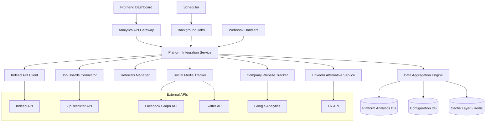

# Platform API Integration System - Technical Implementation Guide

## 1. System Architecture

### 1.1 High-Level Architecture



### 1.2 Core Components

#### **Platform Integration Service**
- Central orchestrator for all platform integrations
- Handles authentication, rate limiting, and error recovery
- Provides unified interface for data collection

#### **Data Aggregation Engine**
- Processes raw data from multiple platforms
- Normalizes data formats and metrics
- Calculates derived analytics and trends

#### **Analytics API Gateway**
- Serves aggregated data to frontend
- Handles caching and performance optimization
- Provides real-time and historical data endpoints

## 2. Database Schema

### 2.1 Core Tables

```sql
-- Platform configurations and credentials
CREATE TABLE platform_configs (
    id UUID PRIMARY KEY DEFAULT gen_random_uuid(),
    platform_name VARCHAR(50) NOT NULL, -- 'linkedin', 'indeed', 'company_website', etc.
    company_id UUID REFERENCES companies(id),
    api_endpoint VARCHAR(255),
    api_key_encrypted TEXT,
    api_secret_encrypted TEXT,
    oauth_token_encrypted TEXT,
    oauth_refresh_token_encrypted TEXT,
    is_active BOOLEAN DEFAULT true,
    rate_limit_per_hour INTEGER DEFAULT 1000,
    last_sync_at TIMESTAMP WITH TIME ZONE,
    sync_status VARCHAR(20) DEFAULT 'pending', -- 'pending', 'syncing', 'completed', 'error'
    error_message TEXT,
    created_at TIMESTAMP WITH TIME ZONE DEFAULT NOW(),
    updated_at TIMESTAMP WITH TIME ZONE DEFAULT NOW()
);

-- Raw analytics data from platforms
CREATE TABLE platform_analytics_raw (
    id UUID PRIMARY KEY DEFAULT gen_random_uuid(),
    platform_config_id UUID REFERENCES platform_configs(id),
    platform_name VARCHAR(50) NOT NULL,
    job_posting_id UUID REFERENCES job_postings(id),
    metric_type VARCHAR(50) NOT NULL, -- 'views', 'applications', 'clicks', 'impressions'
    metric_value INTEGER NOT NULL,
    metric_metadata JSONB, -- Additional platform-specific data
    date_recorded DATE NOT NULL,
    hour_recorded INTEGER, -- 0-23 for hourly data
    created_at TIMESTAMP WITH TIME ZONE DEFAULT NOW()
);

-- Aggregated analytics for dashboard consumption
CREATE TABLE platform_analytics_aggregated (
    id UUID PRIMARY KEY DEFAULT gen_random_uuid(),
    company_id UUID REFERENCES companies(id),
    platform_name VARCHAR(50) NOT NULL,
    metric_type VARCHAR(50) NOT NULL,
    metric_value INTEGER NOT NULL,
    percentage_of_total DECIMAL(5,2),
    date_period DATE NOT NULL,
    period_type VARCHAR(20) NOT NULL, -- 'daily', 'weekly', 'monthly'
    created_at TIMESTAMP WITH TIME ZONE DEFAULT NOW()
);

-- Referrals tracking
CREATE TABLE referrals (
    id UUID PRIMARY KEY DEFAULT gen_random_uuid(),
    referrer_user_id UUID REFERENCES users(id),
    referred_candidate_email VARCHAR(255) NOT NULL,
    referred_candidate_name VARCHAR(255),
    job_posting_id UUID REFERENCES job_postings(id),
    referral_code VARCHAR(50) UNIQUE,
    status VARCHAR(50) DEFAULT 'pending', -- 'pending', 'applied', 'interviewed', 'hired', 'rejected'
    application_id UUID REFERENCES applications(id),
    conversion_date TIMESTAMP WITH TIME ZONE,
    reward_amount DECIMAL(10,2),
    reward_status VARCHAR(20) DEFAULT 'pending', -- 'pending', 'approved', 'paid'
    created_at TIMESTAMP WITH TIME ZONE DEFAULT NOW(),
    updated_at TIMESTAMP WITH TIME ZONE DEFAULT NOW()
);

-- Platform sync jobs tracking
CREATE TABLE platform_sync_jobs (
    id UUID PRIMARY KEY DEFAULT gen_random_uuid(),
    platform_config_id UUID REFERENCES platform_configs(id),
    job_type VARCHAR(50) NOT NULL, -- 'full_sync', 'incremental_sync', 'webhook_process'
    status VARCHAR(20) DEFAULT 'pending', -- 'pending', 'running', 'completed', 'failed'
    started_at TIMESTAMP WITH TIME ZONE,
    completed_at TIMESTAMP WITH TIME ZONE,
    records_processed INTEGER DEFAULT 0,
    error_message TEXT,
    retry_count INTEGER DEFAULT 0,
    max_retries INTEGER DEFAULT 3,
    created_at TIMESTAMP WITH TIME ZONE DEFAULT NOW()
);

-- Website analytics tracking
CREATE TABLE website_analytics (
    id UUID PRIMARY KEY DEFAULT gen_random_uuid(),
    company_id UUID REFERENCES companies(id),
    job_posting_id UUID REFERENCES job_postings(id),
    page_path VARCHAR(255) NOT NULL,
    utm_source VARCHAR(100),
    utm_medium VARCHAR(100),
    utm_campaign VARCHAR(100),
    session_id VARCHAR(255),
    user_id VARCHAR(255),
    event_type VARCHAR(50) NOT NULL, -- 'page_view', 'application_start', 'application_complete'
    event_value INTEGER DEFAULT 1,
    user_agent TEXT,
    ip_address INET,
    country VARCHAR(2),
    city VARCHAR(100),
    created_at TIMESTAMP WITH TIME ZONE DEFAULT NOW()
);
```

### 2.2 Indexes and Performance

```sql
-- Performance indexes
CREATE INDEX idx_platform_analytics_raw_platform_date ON platform_analytics_raw(platform_name, date_recorded);
CREATE INDEX idx_platform_analytics_raw_job_posting ON platform_analytics_raw(job_posting_id, date_recorded);
CREATE INDEX idx_platform_analytics_aggregated_company_period ON platform_analytics_aggregated(company_id, date_period, period_type);
CREATE INDEX idx_referrals_referrer_status ON referrals(referrer_user_id, status);
CREATE INDEX idx_website_analytics_company_date ON website_analytics(company_id, created_at);
CREATE INDEX idx_platform_configs_company_active ON platform_configs(company_id, is_active);

-- Partitioning for large tables (optional)
-- Partition platform_analytics_raw by date for better performance
```

## 3. API Service Layer

### 3.1 Base Platform Service Interface

```typescript
// src/services/platforms/BasePlatformService.ts
export interface PlatformMetrics {
  views: number;
  applications: number;
  clicks: number;
  impressions?: number;
  conversions?: number;
}

export interface PlatformJobData {
  platformJobId: string;
  jobPostingId: string;
  metrics: PlatformMetrics;
  dateRecorded: Date;
  metadata?: Record<string, any>;
}

export abstract class BasePlatformService {
  protected config: PlatformConfig;
  protected rateLimiter: RateLimiter;

  constructor(config: PlatformConfig) {
    this.config = config;
    this.rateLimiter = new RateLimiter(config.rateLimitPerHour);
  }

  abstract authenticate(): Promise<boolean>;
  abstract fetchJobMetrics(jobId: string, dateRange: DateRange): Promise<PlatformJobData[]>;
  abstract validateConnection(): Promise<boolean>;
  abstract getAvailableMetrics(): string[];

  protected async makeRequest(endpoint: string, options: RequestOptions): Promise<any> {
    await this.rateLimiter.waitForSlot();
    
    try {
      const response = await fetch(endpoint, {
        ...options,
        headers: {
          ...options.headers,
          'Authorization': await this.getAuthHeader(),
        },
      });

      if (!response.ok) {
        throw new PlatformAPIError(`HTTP ${response.status}: ${response.statusText}`);
      }

      return await response.json();
    } catch (error) {
      this.handleError(error);
      throw error;
    }
  }

  protected abstract getAuthHeader(): Promise<string>;
  protected abstract handleError(error: any): void;
}
```

### 3.2 Platform-Specific Services

#### **Company Website Service**

```typescript
// src/services/platforms/CompanyWebsiteService.ts
export class CompanyWebsiteService extends BasePlatformService {
  private googleAnalytics: GoogleAnalyticsService;

  constructor(config: PlatformConfig) {
    super(config);
    this.googleAnalytics = new GoogleAnalyticsService(config.apiKey);
  }

  async authenticate(): Promise<boolean> {
    return await this.googleAnalytics.authenticate();
  }

  async fetchJobMetrics(jobId: string, dateRange: DateRange): Promise<PlatformJobData[]> {
    const jobPosting = await this.getJobPosting(jobId);
    const jobPagePath = `/jobs/${jobPosting.slug}`;

    // Fetch page views
    const pageViews = await this.googleAnalytics.getPageViews(jobPagePath, dateRange);
    
    // Fetch application events
    const applications = await this.googleAnalytics.getEvents('application_complete', {
      page_path: jobPagePath,
      dateRange
    });

    // Fetch UTM source data
    const utmData = await this.googleAnalytics.getUTMSourceData(jobPagePath, dateRange);

    return [{
      platformJobId: jobPagePath,
      jobPostingId: jobId,
      metrics: {
        views: pageViews.total,
        applications: applications.total,
        clicks: pageViews.total, // Page views = clicks for website
      },
      dateRecorded: new Date(),
      metadata: {
        utmSources: utmData,
        bounceRate: pageViews.bounceRate,
        avgTimeOnPage: pageViews.avgTimeOnPage
      }
    }];
  }

  async trackApplicationSource(applicationId: string, utmParams: UTMParams): Promise<void> {
    await this.saveWebsiteAnalytics({
      applicationId,
      eventType: 'application_complete',
      utmSource: utmParams.source,
      utmMedium: utmParams.medium,
      utmCampaign: utmParams.campaign
    });
  }

  validateConnection(): Promise<boolean> {
    return this.googleAnalytics.testConnection();
  }

  getAvailableMetrics(): string[] {
    return ['views', 'applications', 'clicks', 'bounce_rate', 'time_on_page'];
  }

  protected async getAuthHeader(): Promise<string> {
    return `Bearer ${await this.googleAnalytics.getAccessToken()}`;
  }

  protected handleError(error: any): void {
    console.error('Company Website Service Error:', error);
    // Log to monitoring service
  }
}
```

#### **Referrals Service**

```typescript
// src/services/platforms/ReferralsService.ts
export class ReferralsService extends BasePlatformService {
  async authenticate(): Promise<boolean> {
    return true; // Internal service, always authenticated
  }

  async fetchJobMetrics(jobId: string, dateRange: DateRange): Promise<PlatformJobData[]> {
    const referralStats = await this.getReferralStats(jobId, dateRange);

    return [{
      platformJobId: `referral_${jobId}`,
      jobPostingId: jobId,
      metrics: {
        views: referralStats.referralsSent,
        applications: referralStats.applicationsFromReferrals,
        clicks: referralStats.referralsSent,
        conversions: referralStats.hiredFromReferrals
      },
      dateRecorded: new Date(),
      metadata: {
        topReferrers: referralStats.topReferrers,
        conversionRate: referralStats.conversionRate,
        avgTimeToApply: referralStats.avgTimeToApply
      }
    }];
  }

  async createReferral(referralData: CreateReferralData): Promise<Referral> {
    const referralCode = this.generateReferralCode();
    
    const referral = await this.database.referrals.create({
      referrerUserId: referralData.referrerUserId,
      referredCandidateEmail: referralData.candidateEmail,
      referredCandidateName: referralData.candidateName,
      jobPostingId: referralData.jobPostingId,
      referralCode,
      status: 'pending'
    });

    // Send referral email to candidate
    await this.emailService.sendReferralInvitation(referral);

    return referral;
  }

  async trackReferralConversion(referralCode: string, applicationId: string): Promise<void> {
    await this.database.referrals.update({
      where: { referralCode },
      data: {
        status: 'applied',
        applicationId,
        conversionDate: new Date()
      }
    });
  }

  private async getReferralStats(jobId: string, dateRange: DateRange) {
    const stats = await this.database.referrals.aggregate({
      where: {
        jobPostingId: jobId,
        createdAt: {
          gte: dateRange.start,
          lte: dateRange.end
        }
      },
      _count: {
        id: true,
        applicationId: true
      },
      _avg: {
        // Calculate average time to apply
      }
    });

    return {
      referralsSent: stats._count.id,
      applicationsFromReferrals: stats._count.applicationId,
      hiredFromReferrals: await this.getHiredFromReferrals(jobId, dateRange),
      topReferrers: await this.getTopReferrers(jobId, dateRange),
      conversionRate: (stats._count.applicationId / stats._count.id) * 100,
      avgTimeToApply: stats._avg.timeToApply
    };
  }

  validateConnection(): Promise<boolean> {
    return Promise.resolve(true);
  }

  getAvailableMetrics(): string[] {
    return ['referrals_sent', 'applications', 'conversions', 'conversion_rate'];
  }

  protected async getAuthHeader(): Promise<string> {
    return 'Internal';
  }

  protected handleError(error: any): void {
    console.error('Referrals Service Error:', error);
  }
}
```

#### **Indeed Service**

```typescript
// src/services/platforms/IndeedService.ts
export class IndeedService extends BasePlatformService {
  private graphqlClient: GraphQLClient;

  constructor(config: PlatformConfig) {
    super(config);
    this.graphqlClient = new GraphQLClient('https://api.indeed.com/graphql', {
      headers: {
        'Authorization': `Bearer ${config.oauthToken}`,
        'Content-Type': 'application/json'
      }
    });
  }

  async authenticate(): Promise<boolean> {
    try {
      const query = `
        query {
          viewer {
            id
            email
          }
        }
      `;
      
      await this.graphqlClient.request(query);
      return true;
    } catch (error) {
      console.error('Indeed authentication failed:', error);
      return false;
    }
  }

  async fetchJobMetrics(jobId: string, dateRange: DateRange): Promise<PlatformJobData[]> {
    const indeedJobId = await this.getIndeedJobId(jobId);
    
    const query = `
      query GetJobMetrics($jobId: ID!, $startDate: Date!, $endDate: Date!) {
        node(id: $jobId) {
          ... on SourcedJobPosting {
            id
            analytics(startDate: $startDate, endDate: $endDate) {
              views
              applications
              clicks
              impressions
            }
          }
        }
      }
    `;

    const variables = {
      jobId: indeedJobId,
      startDate: dateRange.start.toISOString().split('T')[0],
      endDate: dateRange.end.toISOString().split('T')[0]
    };

    const response = await this.graphqlClient.request(query, variables);
    const analytics = response.node.analytics;

    return [{
      platformJobId: indeedJobId,
      jobPostingId: jobId,
      metrics: {
        views: analytics.views,
        applications: analytics.applications,
        clicks: analytics.clicks,
        impressions: analytics.impressions
      },
      dateRecorded: new Date(),
      metadata: {
        platform: 'indeed',
        jobUrl: `https://indeed.com/viewjob?jk=${indeedJobId}`
      }
    }];
  }

  async createJobPosting(jobData: JobPostingData): Promise<string> {
    const mutation = `
      mutation CreateJobPosting($input: CreateSourcedJobPostingInput!) {
        createSourcedJobPosting(input: $input) {
          sourcedJobPosting {
            id
            status
          }
        }
      }
    `;

    const input = {
      title: jobData.title,
      description: jobData.description,
      location: jobData.location,
      salary: jobData.salary,
      jobType: jobData.jobType
    };

    const response = await this.graphqlClient.request(mutation, { input });
    return response.createSourcedJobPosting.sourcedJobPosting.id;
  }

  validateConnection(): Promise<boolean> {
    return this.authenticate();
  }

  getAvailableMetrics(): string[] {
    return ['views', 'applications', 'clicks', 'impressions'];
  }

  protected async getAuthHeader(): Promise<string> {
    return `Bearer ${this.config.oauthToken}`;
  }

  protected handleError(error: any): void {
    if (error.response?.status === 401) {
      // Token expired, refresh it
      this.refreshOAuthToken();
    }
    console.error('Indeed Service Error:', error);
  }
}
```

## 4. Data Pipeline

### 4.1 Data Synchronization Engine

```typescript
// src/services/DataSyncEngine.ts
export class DataSyncEngine {
  private platformServices: Map<string, BasePlatformService>;
  private scheduler: JobScheduler;
  private aggregator: DataAggregator;

  constructor() {
    this.platformServices = new Map();
    this.scheduler = new JobScheduler();
    this.aggregator = new DataAggregator();
    this.initializePlatformServices();
  }

  async startSyncJob(companyId: string, platformName: string, syncType: 'full' | 'incremental'): Promise<string> {
    const jobId = uuidv4();
    
    const syncJob = await this.database.platformSyncJobs.create({
      data: {
        id: jobId,
        platformConfigId: await this.getPlatformConfigId(companyId, platformName),
        jobType: `${syncType}_sync`,
        status: 'pending'
      }
    });

    // Queue the job
    await this.scheduler.schedule('platform-sync', {
      jobId,
      companyId,
      platformName,
      syncType
    });

    return jobId;
  }

  async processSyncJob(jobData: SyncJobData): Promise<void> {
    const { jobId, companyId, platformName, syncType } = jobData;
    
    try {
      await this.updateJobStatus(jobId, 'running');
      
      const platformService = this.platformServices.get(platformName);
      if (!platformService) {
        throw new Error(`Platform service not found: ${platformName}`);
      }

      const dateRange = this.getSyncDateRange(syncType);
      const jobPostings = await this.getCompanyJobPostings(companyId);
      
      let totalRecords = 0;
      
      for (const jobPosting of jobPostings) {
        const metrics = await platformService.fetchJobMetrics(jobPosting.id, dateRange);
        
        for (const metric of metrics) {
          await this.saveRawAnalytics(metric);
          totalRecords++;
        }
      }

      // Trigger aggregation
      await this.aggregator.aggregateData(companyId, platformName, dateRange);

      await this.updateJobStatus(jobId, 'completed', totalRecords);
      
    } catch (error) {
      await this.updateJobStatus(jobId, 'failed', 0, error.message);
      await this.handleSyncError(jobId, error);
    }
  }

  async setupWebhooks(companyId: string, platformName: string): Promise<void> {
    const platformService = this.platformServices.get(platformName);
    if (!platformService || !platformService.supportsWebhooks) {
      return;
    }

    const webhookUrl = `${process.env.API_BASE_URL}/webhooks/${platformName}`;
    await platformService.registerWebhook(webhookUrl, ['job.application', 'job.view']);
  }

  private getSyncDateRange(syncType: 'full' | 'incremental'): DateRange {
    const endDate = new Date();
    const startDate = new Date();
    
    if (syncType === 'full') {
      startDate.setMonth(startDate.getMonth() - 12); // Last 12 months
    } else {
      startDate.setDate(startDate.getDate() - 7); // Last 7 days
    }
    
    return { start: startDate, end: endDate };
  }

  private async saveRawAnalytics(data: PlatformJobData): Promise<void> {
    await this.database.platformAnalyticsRaw.create({
      data: {
        platformName: data.platformName,
        jobPostingId: data.jobPostingId,
        metricType: 'views',
        metricValue: data.metrics.views,
        dateRecorded: data.dateRecorded,
        metricMetadata: data.metadata
      }
    });

    // Save other metrics...
  }
}
```

### 4.2 Real-time Webhook Handlers

```typescript
// src/controllers/WebhookController.ts
export class WebhookController {
  async handleIndeedWebhook(req: Request, res: Response): Promise<void> {
    const { event, data } = req.body;
    
    try {
      switch (event) {
        case 'job.application':
          await this.processJobApplication(data);
          break;
        case 'job.view':
          await this.processJobView(data);
          break;
        default:
          console.warn(`Unknown Indeed webhook event: ${event}`);
      }
      
      res.status(200).json({ status: 'processed' });
    } catch (error) {
      console.error('Indeed webhook error:', error);
      res.status(500).json({ error: 'Processing failed' });
    }
  }

  async handleWebsiteAnalytics(req: Request, res: Response): Promise<void> {
    const { eventType, jobId, sessionId, utmParams } = req.body;
    
    try {
      await this.database.websiteAnalytics.create({
        data: {
          jobPostingId: jobId,
          eventType,
          sessionId,
          utmSource: utmParams?.source,
          utmMedium: utmParams?.medium,
          utmCampaign: utmParams?.campaign,
          userAgent: req.headers['user-agent'],
          ipAddress: req.ip
        }
      });
      
      // Real-time aggregation for website events
      await this.aggregateWebsiteMetrics(jobId);
      
      res.status(200).json({ status: 'tracked' });
    } catch (error) {
      console.error('Website analytics error:', error);
      res.status(500).json({ error: 'Tracking failed' });
    }
  }

  private async processJobApplication(data: any): Promise<void> {
    await this.database.platformAnalyticsRaw.create({
      data: {
        platformName: 'indeed',
        jobPostingId: data.jobId,
        metricType: 'applications',
        metricValue: 1,
        dateRecorded: new Date(),
        metricMetadata: {
          candidateId: data.candidateId,
          applicationId: data.applicationId
        }
      }
    });
  }
}
```

## 5. Analytics Aggregation

### 5.1 Data Aggregation Service

```typescript
// src/services/DataAggregator.ts
export class DataAggregator {
  async aggregateData(companyId: string, platformName?: string, dateRange?: DateRange): Promise<void> {
    const platforms = platformName ? [platformName] : this.getAllPlatforms();
    
    for (const platform of platforms) {
      await this.aggregatePlatformData(companyId, platform, dateRange);
    }
    
    await this.calculateTotalMetrics(companyId, dateRange);
  }

  private async aggregatePlatformData(companyId: string, platformName: string, dateRange?: DateRange): Promise<void> {
    const range = dateRange || this.getDefaultDateRange();
    
    // Daily aggregation
    const dailyMetrics = await this.database.platformAnalyticsRaw.groupBy({
      by: ['platformName', 'metricType', 'dateRecorded'],
      where: {
        platformName,
        dateRecorded: {
          gte: range.start,
          lte: range.end
        },
        jobPosting: {
          companyId
        }
      },
      _sum: {
        metricValue: true
      }
    });

    for (const metric of dailyMetrics) {
      await this.upsertAggregatedMetric({
        companyId,
        platformName: metric.platformName,
        metricType: metric.metricType,
        metricValue: metric._sum.metricValue,
        datePeriod: metric.dateRecorded,
        periodType: 'daily'
      });
    }

    // Weekly and monthly aggregation
    await this.aggregateByPeriod(companyId, platformName, 'weekly', range);
    await this.aggregateByPeriod(companyId, platformName, 'monthly', range);
  }

  private async calculateTotalMetrics(companyId: string, dateRange?: DateRange): Promise<void> {
    const range = dateRange || this.getDefaultDateRange();
    
    // Calculate percentage breakdown by platform
    const totalApplications = await this.getTotalApplications(companyId, range);
    
    const platformTotals = await this.database.platformAnalyticsAggregated.groupBy({
      by: ['platformName'],
      where: {
        companyId,
        metricType: 'applications',
        datePeriod: {
          gte: range.start,
          lte: range.end
        },
        periodType: 'daily'
      },
      _sum: {
        metricValue: true
      }
    });

    for (const platform of platformTotals) {
      const percentage = (platform._sum.metricValue / totalApplications) * 100;
      
      await this.database.platformAnalyticsAggregated.updateMany({
        where: {
          companyId,
          platformName: platform.platformName,
          metricType: 'applications',
          datePeriod: {
            gte: range.start,
            lte: range.end
          }
        },
        data: {
          percentageOfTotal: percentage
        }
      });
    }
  }

  async getAggregatedMetrics(companyId: string, dateRange: DateRange, periodType: 'daily' | 'weekly' | 'monthly' = 'daily'): Promise<AggregatedMetrics> {
    const metrics = await this.database.platformAnalyticsAggregated.findMany({
      where: {
        companyId,
        datePeriod: {
          gte: dateRange.start,
          lte: dateRange.end
        },
        periodType
      },
      orderBy: {
        datePeriod: 'asc'
      }
    });

    return this.formatMetricsForDashboard(metrics);
  }

  private formatMetricsForDashboard(metrics: any[]): AggregatedMetrics {
    const platformBreakdown = metrics
      .filter(m => m.metricType === 'applications')
      .reduce((acc, metric) => {
        acc[metric.platformName] = (acc[metric.platformName] || 0) + metric.metricValue;
        return acc;
      }, {});

    const timeSeriesData = metrics
      .filter(m => m.metricType === 'applications')
      .reduce((acc, metric) => {
        const date = metric.datePeriod.toISOString().split('T')[0];
        if (!acc[date]) acc[date] = {};
        acc[date][metric.platformName] = metric.metricValue;
        return acc;
      }, {});

    return {
      platformBreakdown,
      timeSeriesData,
      totalApplications: Object.values(platformBreakdown).reduce((sum: number, val: number) => sum + val, 0)
    };
  }
}
```

## 6. Implementation Phases

### 6.1 Phase 1: Company Website + Referrals (Week 1-2)

#### **Database Setup**
```sql
-- Run migration for Phase 1 tables
CREATE TABLE IF NOT EXISTS website_analytics (...);
CREATE TABLE IF NOT EXISTS referrals (...);
CREATE TABLE IF NOT EXISTS platform_configs (...);
CREATE TABLE IF NOT EXISTS platform_analytics_raw (...);
```

#### **Service Implementation**
1. **CompanyWebsiteService**: Google Analytics integration
2. **ReferralsService**: Internal referral tracking
3. **Basic DataAggregator**: Simple aggregation logic

#### **Frontend Integration**
```typescript
// Update CompanyAnalyticsDashboard.tsx
const fetchRealAnalyticsData = async () => {
  try {
    const response = await apiCall('/api/analytics/platform-breakdown', {
      headers: { 'Authorization': `Bearer ${token}` }
    });
    
    const data = await response.json();
    
    // Replace mock data with real data
    const realSourceBreakdown = {
      labels: Object.keys(data.platformBreakdown),
      datasets: [{
        data: Object.values(data.platformBreakdown),
        backgroundColor: ['#3B82F6', '#10B981', '#F59E0B', '#EF4444', '#8B5CF6', '#06B6D4']
      }]
    };
    
    setSourceBreakdown(realSourceBreakdown);
  } catch (error) {
    console.error('Failed to fetch analytics:', error);
    // Fallback to mock data
  }
};
```

### 6.2 Phase 2: Indeed Integration (Month 2-4)

#### **Prerequisites**
1. Apply for Indeed Partner status
2. Obtain OAuth credentials
3. Set up GraphQL client

#### **Implementation Steps**
1. **IndeedService**: Complete GraphQL integration
2. **OAuth Flow**: Implement Indeed authentication
3. **Job Sync**: Bidirectional job posting sync
4. **Webhook Setup**: Real-time application tracking

#### **Configuration**
```typescript
// Add to platform_configs
{
  platformName: 'indeed',
  apiEndpoint: 'https://api.indeed.com/graphql',
  oauthToken: 'encrypted_token',
  oauthRefreshToken: 'encrypted_refresh_token',
  rateLimitPerHour: 1000
}
```

### 6.3 Phase 3: Job Boards + Social Media (Month 5-8)

#### **Job Boards Integration**
1. **ZipRecruiter**: REST API integration
2. **Monster**: Partner API setup
3. **Glassdoor**: Employer API integration

#### **Social Media Integration**
1. **Facebook**: Graph API for job posts
2. **Twitter**: API v2 for tweet analytics
3. **LinkedIn**: Marketing API for organic posts

#### **Multi-platform Aggregation**
```typescript
// Enhanced DataAggregator for multiple platforms
class EnhancedDataAggregator extends DataAggregator {
  async aggregateMultiplePlatforms(companyId: string): Promise<void> {
    const platforms = ['indeed', 'ziprecruiter', 'facebook', 'twitter'];
    
    await Promise.all(
      platforms.map(platform => this.aggregatePlatformData(companyId, platform))
    );
    
    await this.calculateCrossplatformMetrics(companyId);
  }
}
```

### 6.4 Phase 4: LinkedIn Alternatives (Month 9-12)

#### **Third-party Services**
1. **Lix API**: LinkedIn job data scraping
2. **Proxycurl**: LinkedIn company data
3. **ScrapingBee**: Custom LinkedIn scraping

#### **Implementation**
```typescript
// src/services/platforms/LinkedInAlternativeService.ts
export class LinkedInAlternativeService extends BasePlatformService {
  private lixClient: LixAPIClient;

  async fetchLinkedInJobData(jobTitle: string, company: string): Promise<LinkedInJobData[]> {
    const response = await this.lixClient.searchJobs({
      title: jobTitle,
      company: company,
      location: 'United States'
    });

    return response.jobs.map(job => ({
      jobId: job.id,
      views: job.views || 0,
      applications: job.applications || 0,
      postedDate: job.postedDate,
      url: job.url
    }));
  }
}
```

## 7. Security & Configuration

### 7.1 API Key Management

```typescript
// src/services/EncryptionService.ts
export class EncryptionService {
  private readonly algorithm = 'aes-256-gcm';
  private readonly secretKey = process.env.ENCRYPTION_KEY;

  encrypt(text: string): string {
    const iv = crypto.randomBytes(16);
    const cipher = crypto.createCipher(this.algorithm, this.secretKey);
    cipher.setAAD(Buffer.from('platform-api-keys'));
    
    let encrypted = cipher.update(text, 'utf8', 'hex');
    encrypted += cipher.final('hex');
    
    const authTag = cipher.getAuthTag();
    
    return `${iv.toString('hex')}:${authTag.toString('hex')}:${encrypted}`;
  }

  decrypt(encryptedText: string): string {
    const [ivHex, authTagHex, encrypted] = encryptedText.split(':');
    
    const iv = Buffer.from(ivHex, 'hex');
    const authTag = Buffer.from(authTagHex, 'hex');
    
    const decipher = crypto.createDecipher(this.algorithm, this.secretKey);
    decipher.setAAD(Buffer.from('platform-api-keys'));
    decipher.setAuthTag(authTag);
    
    let decrypted = decipher.update(encrypted, 'hex', 'utf8');
    decrypted += decipher.final('utf8');
    
    return decrypted;
  }
}
```

### 7.2 Rate Limiting

```typescript
// src/services/RateLimiter.ts
export class RateLimiter {
  private requests: Map<string, number[]> = new Map();
  private readonly maxRequests: number;
  private readonly windowMs: number;

  constructor(maxRequestsPerHour: number) {
    this.maxRequests = maxRequestsPerHour;
    this.windowMs = 60 * 60 * 1000; // 1 hour
  }

  async waitForSlot(platformName: string): Promise<void> {
    const now = Date.now();
    const requests = this.requests.get(platformName) || [];
    
    // Remove old requests outside the window
    const validRequests = requests.filter(time => now - time < this.windowMs);
    
    if (validRequests.length >= this.maxRequests) {
      const oldestRequest = Math.min(...validRequests);
      const waitTime = this.windowMs - (now - oldestRequest);
      
      await new Promise(resolve => setTimeout(resolve, waitTime));
      return this.waitForSlot(platformName);
    }
    
    validRequests.push(now);
    this.requests.set(platformName, validRequests);
  }
}
```

### 7.3 Error Handling & Monitoring

```typescript
// src/services/MonitoringService.ts
export class MonitoringService {
  async logPlatformError(platform: string, error: Error, context: any): Promise<void> {
    const errorLog = {
      platform,
      error: error.message,
      stack: error.stack,
      context,
      timestamp: new Date(),
      severity: this.determineSeverity(error)
    };

    // Log to database
    await this.database.errorLogs.create({ data: errorLog });

    // Send to monitoring service (e.g., Sentry, DataDog)
    if (errorLog.severity === 'critical') {
      await this.sendAlert(errorLog);
    }
  }

  async trackPlatformMetrics(platform: string, metrics: PlatformMetrics): Promise<void> {
    // Track API response times, success rates, etc.
    await this.metricsCollector.record(`platform.${platform}.response_time`, metrics.responseTime);
    await this.metricsCollector.record(`platform.${platform}.success_rate`, metrics.successRate);
  }

  private determineSeverity(error: Error): 'low' | 'medium' | 'high' | 'critical' {
    if (error.message.includes('authentication')) return 'critical';
    if (error.message.includes('rate limit')) return 'medium';
    if (error.message.includes('network')) return 'low';
    return 'medium';
  }
}
```

## 8. Frontend Integration

### 8.1 Updated Analytics Dashboard

```typescript
// src/pages/CompanyAnalyticsDashboard.tsx - Updated sections
const CompanyAnalyticsDashboard: React.FC = () => {
  const [realTimeMode, setRealTimeMode] = useState(false);
  const [platformConfigs, setPlatformConfigs] = useState<PlatformConfig[]>([]);

  useEffect(() => {
    fetchAnalyticsData();
    fetchPlatformConfigs();
    
    if (realTimeMode) {
      const interval = setInterval(fetchAnalyticsData, 30000); // 30 seconds
      return () => clearInterval(interval);
    }
  }, [dateRange, realTimeMode]);

  const fetchAnalyticsData = async () => {
    try {
      setLoading(true);
      
      // Fetch real analytics data
      const response = await apiCall(`/api/analytics/dashboard?dateRange=${dateRange}`, {
        headers: { 'Authorization': `Bearer ${token}` }
      });
      
      if (!response.ok) {
        throw new Error('Failed to fetch analytics');
      }
      
      const data = await response.json();
      
      // Update state with real data
      setMetrics(data.metrics);
      setApplicationTrends(data.applicationTrends);
      setSourceBreakdown(data.sourceBreakdown);
      setHiringFunnel(data.hiringFunnel);
      setPerformanceMetrics(data.performanceMetrics);
      
    } catch (error) {
      console.error('Error fetching analytics data:', error);
      toast.error('Failed to load analytics data');
      
      // Fallback to mock data
      loadMockData();
    } finally {
      setLoading(false);
    }
  };

  const fetchPlatformConfigs = async () => {
    try {
      const response = await apiCall('/api/platform-configs', {
        headers: { 'Authorization': `Bearer ${token}` }
      });
      
      if (response.ok) {
        const configs = await response.json();
        setPlatformConfigs(configs);
      }
    } catch (error) {
      console.error('Error fetching platform configs:', error);
    }
  };

  const triggerManualSync = async (platformName: string) => {
    try {
      const response = await apiCall('/api/analytics/sync', {
        method: 'POST',
        headers: {
          'Content-Type': 'application/json',
          'Authorization': `Bearer ${token}`
        },
        body: JSON.stringify({
          platform: platformName,
          syncType: 'incremental'
        })
      });

      if (response.ok) {
        toast.success(`${platformName} sync started`);
        // Refresh data after a delay
        setTimeout(fetchAnalyticsData, 5000);
      }
    } catch (error) {
      toast.error(`Failed to sync ${platformName}`);
    }
  };

  return (
    <div className="min-h-screen bg-gray-50">
      {/* Enhanced Header with Platform Status */}
      <div className="bg-white shadow-sm border-b">
        <div className="max-w-7xl mx-auto px-4 sm:px-6 lg:px-8">
          <div className="flex justify-between items-center py-6">
            <div>
              <h1 className="text-3xl font-bold text-gray-900">Analytics Dashboard</h1>
              <div className="mt-2 flex items-center gap-4">
                <p className="text-sm text-gray-500">
                  Track your hiring performance across all platforms
                </p>
                <div className="flex items-center gap-2">
                  <span className="text-xs text-gray-400">Real-time:</span>
                  <button
                    onClick={() => setRealTimeMode(!realTimeMode)}
                    className={`relative inline-flex h-6 w-11 items-center rounded-full transition-colors ${
                      realTimeMode ? 'bg-blue-600' : 'bg-gray-200'
                    }`}
                  >
                    <span
                      className={`inline-block h-4 w-4 transform rounded-full bg-white transition-transform ${
                        realTimeMode ? 'translate-x-6' : 'translate-x-1'
                      }`}
                    />
                  </button>
                </div>
              </div>
            </div>
            
            <div className="flex items-center gap-4">
              {/* Platform Status Indicators */}
              <div className="flex items-center gap-2">
                {platformConfigs.map(config => (
                  <div
                    key={config.platformName}
                    className={`flex items-center gap-1 px-2 py-1 rounded-full text-xs ${
                      config.isActive && config.syncStatus === 'completed'
                        ? 'bg-green-100 text-green-800'
                        : config.syncStatus === 'syncing'
                        ? 'bg-yellow-100 text-yellow-800'
                        : 'bg-red-100 text-red-800'
                    }`}
                  >
                    <div className={`w-2 h-2 rounded-full ${
                      config.isActive && config.syncStatus === 'completed'
                        ? 'bg-green-500'
                        : config.syncStatus === 'syncing'
                        ? 'bg-yellow-500'
                        : 'bg-red-500'
                    }`} />
                    {config.platformName}
                  </div>
                ))}
              </div>
              
              {/* Existing controls */}
              <select
                value={dateRange}
                onChange={(e) => setDateRange(e.target.value)}
                className="border border-gray-300 rounded-md px-3 py-2 text-sm focus:ring-2 focus:ring-blue-500 focus:border-transparent"
              >
                <option value="7d">Last 7 days</option>
                <option value="30d">Last 30 days</option>
                <option value="90d">Last 90 days</option>
                <option value="1y">Last year</option>
              </select>
              
              <button
                onClick={() => triggerManualSync('all')}
                className="inline-flex items-center px-4 py-2 border border-gray-300 text-sm font-medium rounded-md text-gray-700 bg-white hover:bg-gray-50"
              >
                <ArrowPathIcon className="h-4 w-4 mr-2" />
                Sync All
              </button>
            </div>
          </div>
        </div>
      </div>

      {/* Rest of the dashboard remains the same but uses real data */}
      <div className="max-w-7xl mx-auto px-4 sm:px-6 lg:px-8 py-8">
        {/* Key Metrics - now using real data */}
        <div className="grid grid-cols-1 md:grid-cols-2 lg:grid-cols-3 xl:grid-cols-6 gap-6 mb-8">
          {metrics.map((metric) => (
            <div key={metric.id} className="bg-white rounded-lg shadow-sm p-6">
              <div className="flex items-center justify-between mb-4">
                {getMetricIcon(metric)}
                {getChangeIndicator(metric)}
              </div>
              <div>
                <p className="text-2xl font-bold text-gray-900">{metric.value}</p>
                <p className="text-sm text-gray-500">{metric.title}</p>
              </div>
            </div>
          ))}
        </div>

        {/* Enhanced Source Breakdown with Platform Details */}
        <div className="grid grid-cols-1 lg:grid-cols-2 gap-8 mb-8">
          <div className="bg-white rounded-lg shadow-sm p-6">
            <div className="flex justify-between items-center mb-6">
              <h3 className="text-lg font-semibold text-gray-900">Application Sources</h3>
              <div className="flex items-center gap-2">
                <button
                  onClick={() => triggerManualSync('all')}
                  className="text-blue-600 hover:text-blue-800 text-sm font-medium"
                >
                  Refresh Data
                </button>
              </div>
            </div>
            <div className="h-80">
              {sourceBreakdown && (
                <Doughnut data={sourceBreakdown} options={doughnutOptions} />
              )}
            </div>
            
            {/* Platform Details Table */}
            <div className="mt-6">
              <div className="space-y-2">
                {sourceBreakdown?.labels?.map((platform, index) => (
                  <div key={platform} className="flex items-center justify-between py-2 border-b border-gray-100">
                    <div className="flex items-center gap-3">
                      <div
                        className="w-3 h-3 rounded-full"
                        style={{ backgroundColor: sourceBreakdown.datasets[0].backgroundColor[index] }}
                      />
                      <span className="text-sm font-medium text-gray-900">{platform}</span>
                    </div>
                    <div className="flex items-center gap-4">
                      <span className="text-sm text-gray-600">
                        {sourceBreakdown.datasets[0].data[index]}%
                      </span>
                      <button
                        onClick={() => triggerManualSync(platform.toLowerCase())}
                        className="text-xs text-blue-600 hover:text-blue-800"
                      >
                        Sync
                      </button>
                    </div>
                  </div>
                ))}
              </div>
            </div>
          </div>
          
          {/* Application Trends - now with real-time updates */}
          <div className="bg-white rounded-lg shadow-sm p-6">
            <div className="flex justify-between items-center mb-6">
              <h3 className="text-lg font-semibold text-gray-900">Application Trends</h3>
              <div className="flex items-center gap-2">
                {realTimeMode && (
                  <div className="flex items-center gap-1 text-green-600">
                    <div className="w-2 h-2 bg-green-500 rounded-full animate-pulse" />
                    <span className="text-xs">Live</span>
                  </div>
                )}
                <button className="text-blue-600 hover:text-blue-800 text-sm font-medium">
                  View Details
                </button>
              </div>
            </div>
            <div className="h-80">
              {applicationTrends && (
                <Line data={applicationTrends} options={chartOptions} />
              )}
            </div>
          </div>
        </div>

        {/* Rest of the dashboard components... */}
      </div>
    </div>
  );
};
```

### 8.2 Platform Configuration UI

```typescript
// src/components/PlatformConfigModal.tsx
export const PlatformConfigModal: React.FC<PlatformConfigModalProps> = ({ 
  isOpen, 
  onClose, 
  platform 
}) => {
  const [config, setConfig] = useState<PlatformConfig>({
    platformName: platform,
    apiKey: '',
    apiSecret: '',
    isActive: true
  });

  const handleSave = async () => {
    try {
      const response = await apiCall('/api/platform-configs', {
        method: 'POST',
        headers: {
          'Content-Type': 'application/json',
          'Authorization': `Bearer ${token}`
        },
        body: JSON.stringify(config)
      });

      if (response.ok) {
        toast.success(`${platform} configuration saved`);
        onClose();
      }
    } catch (error) {
      toast.error('Failed to save configuration');
    }
  };

  return (
    <Dialog open={isOpen} onClose={onClose}>
      <div className="fixed inset-0 bg-black bg-opacity-25" />
      <div className="fixed inset-0 overflow-y-auto">
        <div className="flex min-h-full items-center justify-center p-4">
          <Dialog.Panel className="w-full max-w-md transform overflow-hidden rounded-2xl bg-white p-6 text-left align-middle shadow-xl transition-all">
            <Dialog.Title className="text-lg font-medium leading-6 text-gray-900">
              Configure {platform} Integration
            </Dialog.Title>
            
            <div className="mt-4 space-y-4">
              <div>
                <label className="block text-sm font-medium text-gray-700">
                  API Key
                </label>
                <input
                  type="password"
                  value={config.apiKey}
                  onChange={(e) => setConfig({ ...config, apiKey: e.target.value })}
                  className="mt-1 block w-full rounded-md border-gray-300 shadow-sm focus:border-blue-500 focus:ring-blue-500"
                />
              </div>
              
              {platform === 'indeed' && (
                <div>
                  <label className="block text-sm font-medium text-gray-700">
                    OAuth Token
                  </label>
                  <input
                    type="password"
                    value={config.oauthToken}
                    onChange={(e) => setConfig({ ...config, oauthToken: e.target.value })}
                    className="mt-1 block w-full rounded-md border-gray-300 shadow-sm focus:border-blue-500 focus:ring-blue-500"
                  />
                </div>
              )}
              
              <div className="flex items-center">
                <input
                  type="checkbox"
                  checked={config.isActive}
                  onChange={(e) => setConfig({ ...config, isActive: e.target.checked })}
                  className="h-4 w-4 text-blue-600 focus:ring-blue-500 border-gray-300 rounded"
                />
                <label className="ml-2 block text-sm text-gray-900">
                  Enable this integration
                </label>
              </div>
            </div>

            <div className="mt-6 flex justify-end gap-3">
              <button
                onClick={onClose}
                className="inline-flex justify-center rounded-md border border-gray-300 bg-white px-4 py-2 text-sm font-medium text-gray-700 hover:bg-gray-50"
              >
                Cancel
              </button>
              <button
                onClick={handleSave}
                className="inline-flex justify-center rounded-md border border-transparent bg-blue-600 px-4 py-2 text-sm font-medium text-white hover:bg-blue-700"
              >
                Save Configuration
              </button>
            </div>
          </Dialog.Panel>
        </div>
      </div>
    </Dialog>
  );
};
```

## 9. API Endpoints

### 9.1 Analytics Endpoints

```typescript
// api/routes/analytics.ts
router.get('/dashboard', authenticateToken, async (req: Request, res: Response) => {
  try {
    const { dateRange = '30d' } = req.query;
    const companyId = req.user.companyId;
    
    const aggregator = new DataAggregator();
    const range = parseDateRange(dateRange as string);
    
    const metrics = await aggregator.getAggregatedMetrics(companyId, range);
    
    res.json({
      metrics: formatMetricsForDashboard(metrics),
      applicationTrends: formatTrendsData(metrics.timeSeriesData),
      sourceBreakdown: formatSourceBreakdown(metrics.platformBreakdown),
      lastUpdated: new Date()
    });
  } catch (error) {
    console.error('Analytics dashboard error:', error);
    res.status(500).json({ error: 'Failed to fetch analytics data' });
  }
});

router.post('/sync', authenticateToken, async (req: Request, res: Response) => {
  try {
    const { platform, syncType = 'incremental' } = req.body;
    const companyId = req.user.companyId;
    
    const syncEngine = new DataSyncEngine();
    const jobId = await syncEngine.startSyncJob(companyId, platform, syncType);
    
    res.json({ jobId, status: 'started' });
  } catch (error) {
    console.error('Sync error:', error);
    res.status(500).json({ error: 'Failed to start sync' });
  }
});

router.get('/platform-breakdown', authenticateToken, async (req: Request, res: Response) => {
  try {
    const { dateRange = '30d' } = req.query;
    const companyId = req.user.companyId;
    
    const breakdown = await getPlatformBreakdown(companyId, parseDateRange(dateRange as string));
    
    res.json({ platformBreakdown: breakdown });
  } catch (error) {
    console.error('Platform breakdown error:', error);
    res.status(500).json({ error: 'Failed to fetch platform breakdown' });
  }
});
```

### 9.2 Platform Configuration Endpoints

```typescript
// api/routes/platform-configs.ts
router.get('/', authenticateToken, async (req: Request, res: Response) => {
  try {
    const companyId = req.user.companyId;
    
    const configs = await database.platformConfigs.findMany({
      where: { companyId },
      select: {
        id: true,
        platformName: true,
        isActive: true,
        lastSyncAt: true,
        syncStatus: true,
        errorMessage: true
      }
    });
    
    res.json(configs);
  } catch (error) {
    res.status(500).json({ error: 'Failed to fetch platform configurations' });
  }
});

router.post('/', authenticateToken, async (req: Request, res: Response) => {
  try {
    const companyId = req.user.companyId;
    const { platformName, apiKey, apiSecret, oauthToken, isActive } = req.body;
    
    const encryptionService = new EncryptionService();
    
    const config = await database.platformConfigs.upsert({
      where: {
        companyId_platformName: {
          companyId,
          platformName
        }
      },
      update: {
        apiKeyEncrypted: apiKey ? encryptionService.encrypt(apiKey) : undefined,
        apiSecretEncrypted: apiSecret ? encryptionService.encrypt(apiSecret) : undefined,
        oauthTokenEncrypted: oauthToken ? encryptionService.encrypt(oauthToken) : undefined,
        isActive,
        updatedAt: new Date()
      },
      create: {
        companyId,
        platformName,
        apiKeyEncrypted: encryptionService.encrypt(apiKey),
        apiSecretEncrypted: apiSecret ? encryptionService.encrypt(apiSecret) : null,
        oauthTokenEncrypted: oauthToken ? encryptionService.encrypt(oauthToken) : null,
        isActive
      }
    });
    
    // Test the connection
    const platformService = PlatformServiceFactory.create(platformName, config);
    const isValid = await platformService.validateConnection();
    
    if (!isValid) {
      return res.status(400).json({ error: 'Invalid platform credentials' });
    }
    
    res.json({ id: config.id, status: 'configured' });
  } catch (error) {
    console.error('Platform config error:', error);
    res.status(500).json({ error: 'Failed to save platform configuration' });
  }
});
```

## 10. Deployment & Monitoring

### 10.1 Environment Configuration

```bash
# .env additions for platform integrations
ENCRYPTION_KEY=your-32-character-encryption-key
GOOGLE_ANALYTICS_CLIENT_ID=your-ga-client-id
GOOGLE_ANALYTICS_CLIENT_SECRET=your-ga-client-secret
INDEED_CLIENT_ID=your-indeed-client-id
INDEED_CLIENT_SECRET=your-indeed-client-secret
ZIPRECRUITER_API_KEY=your-ziprecruiter-api-key
FACEBOOK_APP_ID=your-facebook-app-id
FACEBOOK_APP_SECRET=your-facebook-app-secret
TWITTER_API_KEY=your-twitter-api-key
TWITTER_API_SECRET=your-twitter-api-secret
LIX_API_KEY=your-lix-api-key
REDIS_URL=redis://localhost:6379
```

### 10.2 Background Jobs Setup

```typescript
// src/jobs/platformSyncJobs.ts
import { Queue, Worker } from 'bullmq';

const platformSyncQueue = new Queue('platform-sync', {
  connection: {
    host: process.env.REDIS_HOST,
    port: parseInt(process.env.REDIS_PORT || '6379')
  }
});

const worker = new Worker('platform-sync', async (job) => {
  const { jobId, companyId, platformName, syncType } = job.data;
  
  const syncEngine = new DataSyncEngine();
  await syncEngine.processSyncJob({ jobId, companyId, platformName, syncType });
}, {
  connection: {
    host: process.env.REDIS_HOST,
    port: parseInt(process.env.REDIS_PORT || '6379')
  }
});

// Schedule regular syncs
export const scheduleRegularSyncs = () => {
  // Daily sync for all active platforms
  platformSyncQueue.add('daily-sync', {}, {
    repeat: { cron: '0 2 * * *' } // 2 AM daily
  });
  
  // Hourly sync for real-time platforms
  platformSyncQueue.add('hourly-sync', {}, {
    repeat: { cron: '0 * * * *' } // Every hour
  });
};
```

This comprehensive technical implementation guide provides the foundation for replacing your mock analytics data with real platform integrations. The modular architecture allows for incremental implementation following the recommended phases, starting with the easiest integrations (Company Website + Referrals) and gradually adding more complex platforms.