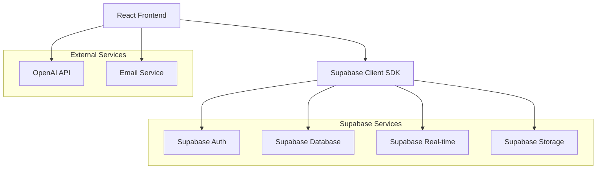

# Complete Supabase Migration Plan
## Job Seeker Platform Architecture Transformation

### 📋 Executive Summary

This document outlines the complete migration strategy for transforming the current hybrid job seeker platform (JSON files + partial Supabase) into a fully Supabase-powered application. This migration will eliminate architectural complexity, improve scalability, and provide real-time capabilities.

---

## 🔍 1. Current Architecture Analysis

### Current System Overview
- **Authentication**: Supabase Auth (✅ Already implemented)
- **Database**: Hybrid system with JSON files + partial Supabase tables
- **API Layer**: Express.js backend with custom database abstraction
- **Frontend**: React with Supabase Auth context

### Current Data Storage
```
Local JSON Files:
├── data/users.json (User data)
├── data/analytics.json (Analytics events)
└── Custom database.ts abstraction layer

Supabase Tables (Partial):
├── auth.users (Authentication)
├── public.users (User profiles)
├── public.job_postings
├── public.applications
└── Various analytics tables
```

### Current Issues
- **Complexity**: Dual data storage systems
- **Scalability**: JSON file limitations
- **Real-time**: No real-time capabilities
- **Backup**: Manual backup for JSON files
- **Security**: File-based storage vulnerabilities

---

## 🎯 2. Target Supabase Architecture

### Complete Supabase Stack


### Benefits of Full Migration
- ✅ **Simplified Architecture**: Single data source
- ✅ **Auto-scaling**: Supabase handles scaling
- ✅ **Real-time Features**: Live updates and notifications
- ✅ **Built-in Security**: Row Level Security (RLS)
- ✅ **Automatic Backups**: Built-in backup system
- ✅ **Better Performance**: Optimized PostgreSQL queries
- ✅ **Cost Efficiency**: Eliminate server hosting costs

---

## 🗄️ 3. Complete Database Schema Design

### Core Tables Structure

#### Users & Authentication
```sql
-- auth.users (Supabase managed)
-- public.users (Extended user data)
CREATE TABLE public.users (
    id UUID PRIMARY KEY REFERENCES auth.users(id),
    email VARCHAR(255) UNIQUE NOT NULL,
    name VARCHAR(255) NOT NULL,
    role VARCHAR(50) DEFAULT 'job_seeker' CHECK (role IN ('job_seeker', 'job_poster', 'admin')),
    plan VARCHAR(20) DEFAULT 'free' CHECK (plan IN ('free', 'pro', 'premium')),
    usage_count INTEGER DEFAULT 0,
    email_verified BOOLEAN DEFAULT false,
    is_active BOOLEAN DEFAULT true,
    created_at TIMESTAMP WITH TIME ZONE DEFAULT NOW(),
    updated_at TIMESTAMP WITH TIME ZONE DEFAULT NOW()
);
```

#### User Profiles
```sql
CREATE TABLE public.user_profiles (
    id UUID PRIMARY KEY DEFAULT gen_random_uuid(),
    user_id UUID NOT NULL REFERENCES public.users(id) ON DELETE CASCADE,
    full_name VARCHAR(255),
    phone VARCHAR(20),
    location VARCHAR(255),
    bio TEXT,
    skills JSONB DEFAULT '[]',
    experience_level VARCHAR(50),
    portfolio_url VARCHAR(500),
    linkedin_url VARCHAR(500),
    github_url VARCHAR(500),
    avatar_url VARCHAR(500),
    created_at TIMESTAMP WITH TIME ZONE DEFAULT NOW(),
    updated_at TIMESTAMP WITH TIME ZONE DEFAULT NOW()
);
```

#### Resume Data
```sql
CREATE TABLE public.resumes (
    id UUID PRIMARY KEY DEFAULT gen_random_uuid(),
    user_id UUID NOT NULL REFERENCES public.users(id) ON DELETE CASCADE,
    title VARCHAR(255) NOT NULL,
    template_id VARCHAR(100),
    content JSONB NOT NULL,
    pdf_url VARCHAR(500),
    is_primary BOOLEAN DEFAULT false,
    created_at TIMESTAMP WITH TIME ZONE DEFAULT NOW(),
    updated_at TIMESTAMP WITH TIME ZONE DEFAULT NOW()
);
```

#### Templates
```sql
CREATE TABLE public.resume_templates (
    id VARCHAR(100) PRIMARY KEY,
    name VARCHAR(255) NOT NULL,
    category VARCHAR(100),
    description TEXT,
    template_data JSONB NOT NULL,
    preview_image VARCHAR(500),
    is_premium BOOLEAN DEFAULT false,
    created_at TIMESTAMP WITH TIME ZONE DEFAULT NOW()
);
```

#### Analytics & Usage
```sql
CREATE TABLE public.analytics_events (
    id UUID PRIMARY KEY DEFAULT gen_random_uuid(),
    user_id UUID REFERENCES public.users(id) ON DELETE SET NULL,
    event_type VARCHAR(100) NOT NULL,
    feature_name VARCHAR(100),
    action VARCHAR(100),
    metadata JSONB DEFAULT '{}',
    session_id VARCHAR(255),
    ip_address INET,
    user_agent TEXT,
    created_at TIMESTAMP WITH TIME ZONE DEFAULT NOW()
);
```

#### Upwork Proposals
```sql
CREATE TABLE public.upwork_proposals (
    id UUID PRIMARY KEY DEFAULT gen_random_uuid(),
    user_id UUID NOT NULL REFERENCES public.users(id) ON DELETE CASCADE,
    job_title VARCHAR(500) NOT NULL,
    job_description TEXT,
    proposal_content TEXT NOT NULL,
    settings JSONB DEFAULT '{}',
    created_at TIMESTAMP WITH TIME ZONE DEFAULT NOW()
);
```

#### Saved Jobs
```sql
CREATE TABLE public.saved_jobs (
    id UUID PRIMARY KEY DEFAULT gen_random_uuid(),
    user_id UUID NOT NULL REFERENCES public.users(id) ON DELETE CASCADE,
    job_title VARCHAR(500) NOT NULL,
    company VARCHAR(255),
    job_url VARCHAR(1000),
    description TEXT,
    salary_range VARCHAR(100),
    location VARCHAR(255),
    job_type VARCHAR(100),
    tags JSONB DEFAULT '[]',
    notes TEXT,
    status VARCHAR(50) DEFAULT 'saved' CHECK (status IN ('saved', 'applied', 'interview', 'rejected', 'offer')),
    created_at TIMESTAMP WITH TIME ZONE DEFAULT NOW(),
    updated_at TIMESTAMP WITH TIME ZONE DEFAULT NOW()
);
```

---

## 🚀 4. Migration Strategy & Implementation

### Phase 1: Database Setup (Week 1)

#### Step 1.1: Create New Tables
```sql
-- Execute all table creation scripts
-- Set up Row Level Security (RLS)
-- Create indexes for performance
-- Set up triggers for updated_at fields
```

#### Step 1.2: Row Level Security Setup
```sql
-- Enable RLS on all tables
ALTER TABLE public.users ENABLE ROW LEVEL SECURITY;
ALTER TABLE public.user_profiles ENABLE ROW LEVEL SECURITY;
ALTER TABLE public.resumes ENABLE ROW LEVEL SECURITY;
-- ... (continue for all tables)

-- Create security policies
CREATE POLICY "Users can manage their own data" ON public.users
    FOR ALL USING (auth.uid() = id);

CREATE POLICY "Users can manage their own profile" ON public.user_profiles
    FOR ALL USING (auth.uid() = user_id);
-- ... (continue for all tables)
```

### Phase 2: Data Migration (Week 1-2)

#### Step 2.1: Migrate User Data
```javascript
// Migration script: migrate-users.js
const migrateUsers = async () => {
    const jsonUsers = JSON.parse(fs.readFileSync('data/users.json', 'utf8'));
    
    for (const user of jsonUsers) {
        // Create auth user first (if not exists)
        const { data: authUser, error: authError } = await supabase.auth.admin.createUser({
            email: user.email,
            password: 'temp-password-123', // User will reset
            email_confirm: true,
            user_metadata: {
                name: user.name,
                role: user.role
            }
        });
        
        // Insert into public.users
        const { error: userError } = await supabase
            .from('users')
            .insert({
                id: authUser.user.id,
                email: user.email,
                name: user.name,
                role: user.role,
                created_at: user.created_at
            });
    }
};
```

#### Step 2.2: Migrate Analytics Data
```javascript
// Migration script: migrate-analytics.js
const migrateAnalytics = async () => {
    const jsonAnalytics = JSON.parse(fs.readFileSync('data/analytics.json', 'utf8'));
    
    const batchSize = 100;
    for (let i = 0; i < jsonAnalytics.length; i += batchSize) {
        const batch = jsonAnalytics.slice(i, i + batchSize);
        
        const { error } = await supabase
            .from('analytics_events')
            .insert(batch.map(event => ({
                user_id: event.user_id,
                event_type: 'feature_usage',
                feature_name: event.feature_name,
                action: event.action,
                metadata: event.metadata,
                created_at: event.created_at
            })));
    }
};
```

### Phase 3: API Refactoring (Week 2-3)

#### Step 3.1: Replace Database Layer
```typescript
// Before: api/database/database.ts (JSON files)
// After: api/database/supabase.ts (Supabase client)

import { createClient } from '@supabase/supabase-js';

export const supabaseAdmin = createClient(
    process.env.SUPABASE_URL!,
    process.env.SUPABASE_SERVICE_ROLE_KEY!
);

// New database operations
export const db = {
    users: {
        create: async (userData) => {
            const { data, error } = await supabaseAdmin
                .from('users')
                .insert(userData)
                .select()
                .single();
            return { data, error };
        },
        findByEmail: async (email) => {
            const { data, error } = await supabaseAdmin
                .from('users')
                .select('*')
                .eq('email', email)
                .single();
            return { data, error };
        }
        // ... more operations
    },
    analytics: {
        track: async (eventData) => {
            const { data, error } = await supabaseAdmin
                .from('analytics_events')
                .insert(eventData);
            return { data, error };
        }
        // ... more operations
    }
};
```

#### Step 3.2: Update API Routes
```typescript
// Example: api/routes/user-profiles.ts
import { supabaseAdmin } from '../database/supabase';

// Before: JSON file operations
// After: Supabase operations
router.get('/profile', authenticateSupabaseToken, async (req, res) => {
    const { data: profile, error } = await supabaseAdmin
        .from('user_profiles')
        .select('*')
        .eq('user_id', req.user.id)
        .single();
        
    if (error) {
        return res.status(404).json({ error: 'Profile not found' });
    }
    
    res.json(profile);
});
```

### Phase 4: Frontend Updates (Week 3-4)

#### Step 4.1: Enhanced Supabase Context
```typescript
// src/contexts/SupabaseContext.tsx
export const SupabaseProvider = ({ children }) => {
    const [user, setUser] = useState(null);
    const [profile, setProfile] = useState(null);
    
    // Real-time profile updates
    useEffect(() => {
        if (user) {
            const subscription = supabase
                .channel('user_profile_changes')
                .on('postgres_changes', {
                    event: '*',
                    schema: 'public',
                    table: 'user_profiles',
                    filter: `user_id=eq.${user.id}`
                }, (payload) => {
                    setProfile(payload.new);
                })
                .subscribe();
                
            return () => subscription.unsubscribe();
        }
    }, [user]);
    
    return (
        <SupabaseContext.Provider value={{
            user,
            profile,
            supabase,
            // ... other methods
        }}>
            {children}
        </SupabaseContext.Provider>
    );
};
```

#### Step 4.2: Direct Supabase Queries in Components
```typescript
// Example: Resume Builder with real-time saves
const ResumeBuilder = () => {
    const { user, supabase } = useSupabase();
    const [resume, setResume] = useState(null);
    
    // Auto-save to Supabase
    const saveResume = useCallback(async (resumeData) => {
        const { data, error } = await supabase
            .from('resumes')
            .upsert({
                user_id: user.id,
                content: resumeData,
                updated_at: new Date().toISOString()
            })
            .select()
            .single();
            
        if (!error) {
            setResume(data);
        }
    }, [user, supabase]);
    
    // Real-time resume updates
    useEffect(() => {
        const subscription = supabase
            .channel('resume_changes')
            .on('postgres_changes', {
                event: 'UPDATE',
                schema: 'public',
                table: 'resumes',
                filter: `user_id=eq.${user.id}`
            }, (payload) => {
                setResume(payload.new);
            })
            .subscribe();
            
        return () => subscription.unsubscribe();
    }, [user, supabase]);
};
```

### Phase 5: Testing & Cleanup (Week 4)

#### Step 5.1: Testing Checklist
- [ ] User registration and authentication
- [ ] Resume builder with auto-save
- [ ] Template system
- [ ] Analytics tracking
- [ ] Upwork proposal generator
- [ ] Real-time features
- [ ] Data integrity verification

#### Step 5.2: Cleanup Tasks
- [ ] Remove JSON file database system
- [ ] Remove custom database abstraction layer
- [ ] Update environment variables
- [ ] Remove unused API endpoints
- [ ] Update deployment configuration

---

## 📊 5. Performance & Optimization

### Database Optimization
```sql
-- Create indexes for better performance
CREATE INDEX idx_users_email ON public.users(email);
CREATE INDEX idx_resumes_user_id ON public.resumes(user_id);
CREATE INDEX idx_analytics_user_id ON public.analytics_events(user_id);
CREATE INDEX idx_analytics_created_at ON public.analytics_events(created_at DESC);
```

### Real-time Features
- **Resume Auto-save**: Save resume changes in real-time
- **Usage Analytics**: Track user interactions live
- **Notifications**: Real-time user notifications
- **Collaborative Features**: Future team collaboration

---

## 🔒 6. Security Enhancements

### Row Level Security Policies
```sql
-- Comprehensive RLS setup
CREATE POLICY "Users own their resumes" ON public.resumes
    FOR ALL USING (auth.uid() = user_id);

CREATE POLICY "Users own their proposals" ON public.upwork_proposals
    FOR ALL USING (auth.uid() = user_id);

CREATE POLICY "Analytics privacy" ON public.analytics_events
    FOR SELECT USING (auth.uid() = user_id OR auth.jwt() ->> 'role' = 'admin');
```

### Data Validation
```sql
-- Add constraints and validations
ALTER TABLE public.users ADD CONSTRAINT valid_email 
    CHECK (email ~* '^[A-Za-z0-9._%+-]+@[A-Za-z0-9.-]+\.[A-Za-z]{2,}$');

ALTER TABLE public.resumes ADD CONSTRAINT valid_content 
    CHECK (jsonb_typeof(content) = 'object');
```

---

## 💰 7. Cost Analysis

### Current Costs (Estimated)
- **Server Hosting**: $20-50/month
- **Database Backup**: Manual effort
- **Scaling Issues**: Potential downtime

### Supabase Costs
- **Free Tier**: Up to 50,000 monthly active users
- **Pro Tier**: $25/month for advanced features
- **Included**: Database, Auth, Storage, Real-time

### Cost Savings
- ✅ **Reduced Infrastructure**: No server management
- ✅ **Built-in Scaling**: Automatic scaling
- ✅ **Reduced Development Time**: Less custom code

---

## 📅 8. Implementation Timeline

| Week | Phase | Tasks | Deliverables |
|------|-------|-------|--------------|
| 1 | Database Setup | Create tables, RLS, indexes | Complete schema |
| 1-2 | Data Migration | Migrate users, analytics | Data in Supabase |
| 2-3 | API Refactoring | Update all routes | New API layer |
| 3-4 | Frontend Updates | Real-time features | Enhanced UI |
| 4 | Testing & Cleanup | Testing, cleanup | Production ready |

---

## ✅ 9. Success Metrics

### Technical Metrics
- [ ] 100% data migration success
- [ ] Zero data loss during migration
- [ ] API response time < 200ms
- [ ] Real-time features working
- [ ] All tests passing

### Business Metrics
- [ ] User experience improved
- [ ] Feature development speed increased
- [ ] Infrastructure costs reduced
- [ ] Scalability issues resolved

---

## 🚨 10. Risk Mitigation

### Data Migration Risks
- **Backup Strategy**: Full backup before migration
- **Rollback Plan**: Keep JSON files until verification
- **Testing**: Extensive testing in staging environment

### Downtime Risks
- **Phased Migration**: Gradual feature migration
- **Feature Flags**: Enable/disable features during migration
- **Monitoring**: Real-time monitoring during migration

---

## 📞 11. Support & Maintenance

### Post-Migration Support
- **Documentation**: Complete API documentation
- **Monitoring**: Set up error tracking
- **Backup Strategy**: Automated Supabase backups
- **Performance Monitoring**: Query performance tracking

### Future Enhancements
- **Advanced Analytics**: Real-time dashboards
- **Collaboration Features**: Team workspaces
- **AI Features**: Enhanced AI recommendations
- **Mobile App**: React Native with Supabase

---

## 🎯 Conclusion

This comprehensive migration to Supabase will transform your job seeker platform into a modern, scalable, and maintainable application. The migration eliminates architectural complexity while adding powerful real-time capabilities and built-in security features.

**Next Steps:**
1. Review and approve this migration plan
2. Set up staging environment for testing
3. Begin Phase 1: Database setup
4. Execute migration phases sequentially
5. Monitor and optimize post-migration

The migration will result in a more robust, scalable, and feature-rich platform that can grow with your user base and business needs.