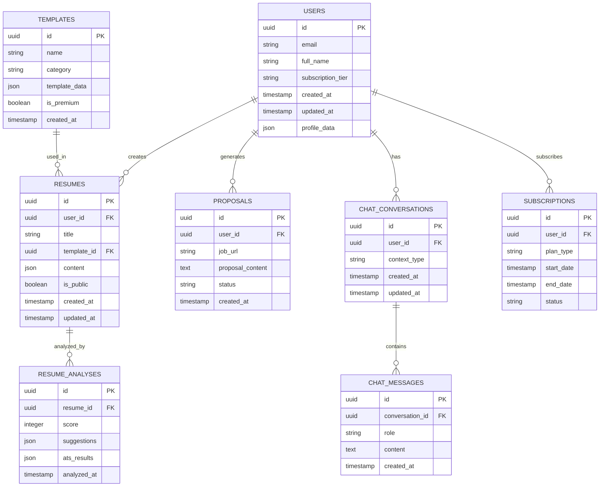

# Job Seeker Platform - Technical Architecture Document

## 1. Architecture Design


## 2. Technology Description

- **Frontend**: React@18 + TypeScript + Tailwind CSS@3 + Vite
- **Backend**: Supabase (Authentication, Database, Storage)
- **AI Services**: OpenAI GPT-4 API for content generation and analysis
- **File Processing**: PDF parsing libraries (pdf-parse, mammoth)
- **State Management**: Zustand for client state
- **UI Components**: Headless UI + custom components
- **Deployment**: Vercel (Frontend) + Supabase (Backend services)

## 3. Route Definitions

| Route | Purpose |
|-------|---------|
| / | Landing page with feature overview and pricing |
| /login | User authentication and registration |
| /dashboard | Main user dashboard with tool overview |
| /resume-builder | AI-powered resume creation interface |
| /resume-analyzer | Resume upload and analysis tool |
| /upwork-proposal | Upwork proposal generator |
| /ai-chat | Career advice and interview prep chat |
| /templates | Template library and downloads |
| /account | Subscription management and settings |
| /pricing | Pricing plans and upgrade options |

## 4. API Definitions

### 4.1 Core API Endpoints

**Authentication (Supabase Auth)**
```
POST /auth/v1/signup
POST /auth/v1/token
POST /auth/v1/logout
```

**Resume Management**
```
POST /api/resumes
GET /api/resumes
PUT /api/resumes/:id
DELETE /api/resumes/:id
```

Request (Create Resume):
| Param Name | Param Type | isRequired | Description |
|------------|------------|------------|-------------|
| title | string | true | Resume title |
| template_id | string | true | Selected template ID |
| content | object | true | Resume content data |
| is_public | boolean | false | Public sharing setting |

Response:
| Param Name | Param Type | Description |
|------------|------------|-------------|
| id | string | Resume unique identifier |
| created_at | timestamp | Creation timestamp |
| updated_at | timestamp | Last update timestamp |

**Resume Analysis**
```
POST /api/analyze-resume
```

Request:
| Param Name | Param Type | isRequired | Description |
|------------|------------|------------|-------------|
| file | File | true | PDF/DOCX resume file |
| job_description | string | false | Target job description |

Response:
| Param Name | Param Type | Description |
|------------|------------|-------------|
| score | number | Overall resume score (0-100) |
| suggestions | array | Improvement recommendations |
| ats_compatibility | object | ATS scanning results |
| keywords | array | Missing/present keywords |

**Upwork Proposal Generation**
```
POST /api/generate-proposal
```

Request:
| Param Name | Param Type | isRequired | Description |
|------------|------------|------------|-------------|
| job_url | string | true | Upwork job posting URL |
| user_profile | object | true | User skills and experience |
| tone | string | false | Proposal tone (professional/casual) |

Response:
| Param Name | Param Type | Description |
|------------|------------|-------------|
| proposal | string | Generated proposal text |
| key_points | array | Highlighted selling points |
| estimated_time | string | Suggested project timeline |

**AI Chat**
```
POST /api/chat
```

Request:
| Param Name | Param Type | isRequired | Description |
|------------|------------|------------|-------------|
| message | string | true | User message |
| context | string | false | Chat context (interview/career/salary) |
| conversation_id | string | false | Existing conversation ID |

Response:
| Param Name | Param Type | Description |
|------------|------------|-------------|
| response | string | AI assistant response |
| suggestions | array | Follow-up question suggestions |
| conversation_id | string | Conversation identifier |

## 5. Data Model

### 5.1 Data Model Definition



### 5.2 Data Definition Language

**Users Table**
```sql
-- Create users table (extends Supabase auth.users)
CREATE TABLE public.user_profiles (
    id UUID REFERENCES auth.users(id) PRIMARY KEY,
    email VARCHAR(255) NOT NULL,
    full_name VARCHAR(255),
    subscription_tier VARCHAR(20) DEFAULT 'free' CHECK (subscription_tier IN ('free', 'pro', 'premium')),
    profile_data JSONB DEFAULT '{}',
    usage_count INTEGER DEFAULT 0,
    created_at TIMESTAMP WITH TIME ZONE DEFAULT NOW(),
    updated_at TIMESTAMP WITH TIME ZONE DEFAULT NOW()
);

-- Create resumes table
CREATE TABLE public.resumes (
    id UUID PRIMARY KEY DEFAULT gen_random_uuid(),
    user_id UUID REFERENCES public.user_profiles(id) ON DELETE CASCADE,
    title VARCHAR(255) NOT NULL,
    template_id UUID REFERENCES public.templates(id),
    content JSONB NOT NULL DEFAULT '{}',
    is_public BOOLEAN DEFAULT false,
    created_at TIMESTAMP WITH TIME ZONE DEFAULT NOW(),
    updated_at TIMESTAMP WITH TIME ZONE DEFAULT NOW()
);

-- Create resume analyses table
CREATE TABLE public.resume_analyses (
    id UUID PRIMARY KEY DEFAULT gen_random_uuid(),
    resume_id UUID REFERENCES public.resumes(id) ON DELETE CASCADE,
    score INTEGER CHECK (score >= 0 AND score <= 100),
    suggestions JSONB DEFAULT '[]',
    ats_results JSONB DEFAULT '{}',
    analyzed_at TIMESTAMP WITH TIME ZONE DEFAULT NOW()
);

-- Create proposals table
CREATE TABLE public.proposals (
    id UUID PRIMARY KEY DEFAULT gen_random_uuid(),
    user_id UUID REFERENCES public.user_profiles(id) ON DELETE CASCADE,
    job_url TEXT NOT NULL,
    proposal_content TEXT NOT NULL,
    status VARCHAR(20) DEFAULT 'draft' CHECK (status IN ('draft', 'sent', 'responded')),
    created_at TIMESTAMP WITH TIME ZONE DEFAULT NOW()
);

-- Create templates table
CREATE TABLE public.templates (
    id UUID PRIMARY KEY DEFAULT gen_random_uuid(),
    name VARCHAR(255) NOT NULL,
    category VARCHAR(100) NOT NULL,
    template_data JSONB NOT NULL,
    is_premium BOOLEAN DEFAULT false,
    created_at TIMESTAMP WITH TIME ZONE DEFAULT NOW()
);

-- Create chat conversations table
CREATE TABLE public.chat_conversations (
    id UUID PRIMARY KEY DEFAULT gen_random_uuid(),
    user_id UUID REFERENCES public.user_profiles(id) ON DELETE CASCADE,
    context_type VARCHAR(50) DEFAULT 'general' CHECK (context_type IN ('general', 'interview', 'career', 'salary')),
    created_at TIMESTAMP WITH TIME ZONE DEFAULT NOW(),
    updated_at TIMESTAMP WITH TIME ZONE DEFAULT NOW()
);

-- Create chat messages table
CREATE TABLE public.chat_messages (
    id UUID PRIMARY KEY DEFAULT gen_random_uuid(),
    conversation_id UUID REFERENCES public.chat_conversations(id) ON DELETE CASCADE,
    role VARCHAR(20) NOT NULL CHECK (role IN ('user', 'assistant')),
    content TEXT NOT NULL,
    created_at TIMESTAMP WITH TIME ZONE DEFAULT NOW()
);

-- Create subscriptions table
CREATE TABLE public.subscriptions (
    id UUID PRIMARY KEY DEFAULT gen_random_uuid(),
    user_id UUID REFERENCES public.user_profiles(id) ON DELETE CASCADE,
    plan_type VARCHAR(20) NOT NULL CHECK (plan_type IN ('free', 'pro', 'premium')),
    start_date TIMESTAMP WITH TIME ZONE DEFAULT NOW(),
    end_date TIMESTAMP WITH TIME ZONE,
    status VARCHAR(20) DEFAULT 'active' CHECK (status IN ('active', 'cancelled', 'expired'))
);

-- Create indexes for performance
CREATE INDEX idx_resumes_user_id ON public.resumes(user_id);
CREATE INDEX idx_resumes_created_at ON public.resumes(created_at DESC);
CREATE INDEX idx_proposals_user_id ON public.proposals(user_id);
CREATE INDEX idx_chat_conversations_user_id ON public.chat_conversations(user_id);
CREATE INDEX idx_chat_messages_conversation_id ON public.chat_messages(conversation_id);
CREATE INDEX idx_subscriptions_user_id ON public.subscriptions(user_id);

-- Row Level Security (RLS) Policies
ALTER TABLE public.user_profiles ENABLE ROW LEVEL SECURITY;
ALTER TABLE public.resumes ENABLE ROW LEVEL SECURITY;
ALTER TABLE public.resume_analyses ENABLE ROW LEVEL SECURITY;
ALTER TABLE public.proposals ENABLE ROW LEVEL SECURITY;
ALTER TABLE public.chat_conversations ENABLE ROW LEVEL SECURITY;
ALTER TABLE public.chat_messages ENABLE ROW LEVEL SECURITY;
ALTER TABLE public.subscriptions ENABLE ROW LEVEL SECURITY;

-- Basic access for anon users (templates only)
GRANT SELECT ON public.templates TO anon;

-- Full access for authenticated users to their own data
CREATE POLICY "Users can view own profile" ON public.user_profiles
    FOR SELECT USING (auth.uid() = id);

CREATE POLICY "Users can update own profile" ON public.user_profiles
    FOR UPDATE USING (auth.uid() = id);

CREATE POLICY "Users can manage own resumes" ON public.resumes
    FOR ALL USING (auth.uid() = user_id);

CREATE POLICY "Users can manage own proposals" ON public.proposals
    FOR ALL USING (auth.uid() = user_id);

CREATE POLICY "Users can manage own chat data" ON public.chat_conversations
    FOR ALL USING (auth.uid() = user_id);

-- Grant permissions
GRANT ALL PRIVILEGES ON ALL TABLES IN SCHEMA public TO authenticated;
GRANT ALL PRIVILEGES ON ALL SEQUENCES IN SCHEMA public TO authenticated;

-- Insert initial template data
INSERT INTO public.templates (name, category, template_data, is_premium) VALUES
('Modern Professional', 'professional', '{"layout": "modern", "colors": ["#2563EB", "#1F2937"]}', false),
('Classic ATS', 'ats-friendly', '{"layout": "classic", "colors": ["#000000", "#FFFFFF"]}', false),
('Creative Designer', 'creative', '{"layout": "creative", "colors": ["#10B981", "#F59E0B"]}', true),
('Executive Premium', 'executive', '{"layout": "executive", "colors": ["#1F2937", "#6B7280"]}', true),
('Tech Specialist', 'technology', '{"layout": "tech", "colors": ["#3B82F6", "#1E40AF"]}', true);
```

## 6. Implementation Priorities

### 6.1 Phase 1 (MVP - Weeks 1-4)
- User authentication and basic dashboard
- Resume builder with 5 templates
- Basic resume analyzer
- Simple AI chat interface
- Subscription management

### 6.2 Phase 2 (Enhanced Features - Weeks 5-8)
- Upwork proposal generator
- Advanced resume analysis
- Template library expansion
- Usage analytics and limits
- Payment integration

### 6.3 Phase 3 (Optimization - Weeks 9-12)
- Performance optimization
- Advanced AI features
- Mobile responsiveness
- SEO optimization
- Analytics and reporting

This architecture provides a scalable foundation for rapid development and deployment while maintaining the flexibility to add advanced features as the platform grows.