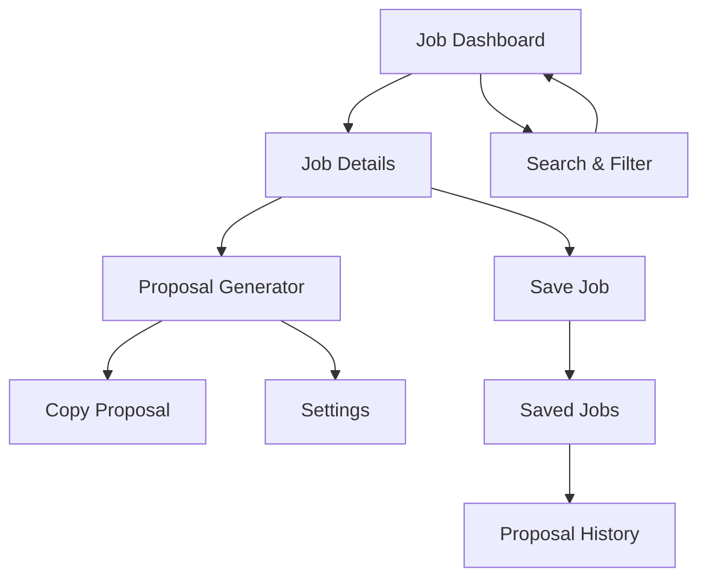

# AI Job Scraper and Instant Proposal Filler - Product Requirements Document

## 1. Product Overview

An intelligent job discovery and proposal generation system that integrates with the existing resume builder to help freelancers find relevant opportunities and create personalized proposals instantly. The feature scrapes jobs from Upwork and Freelancer platforms via RapidAPI and uses AI to generate tailored proposals based on user's resume data, enabling users to apply for jobs efficiently with copy-paste ready proposals.

## 2. Core Features

### 2.1 User Roles

| Role | Registration Method | Core Permissions |
|------|---------------------|------------------|
| Authenticated User | Email registration or existing account | Can access job scraper, generate proposals, save favorites |
| Guest User | No registration | Can view job listings only (limited access) |

### 2.2 Feature Module

Our AI Job Scraper and Proposal Filler consists of the following main pages:
1. **Job Dashboard**: job listings display, search filters, pagination controls
2. **Job Details**: detailed job information, client details, proposal generator
3. **Proposal Generator**: AI-powered proposal creation, customization tools, copy functionality
4. **Saved Jobs**: favorite jobs management, proposal history, application tracking
5. **Settings**: API preferences, proposal templates, notification settings

### 2.3 Page Details

| Page Name | Module Name | Feature description |
|-----------|-------------|---------------------|
| Job Dashboard | Job Listings | Display scraped jobs from Upwork/Freelancer with title, budget, skills, client rating, posted time |
| Job Dashboard | Search & Filters | Filter by budget range, skills, client rating, job type, posted date |
| Job Dashboard | Pagination | Navigate through job results with load more or page-based navigation |
| Job Details | Job Information | Show complete job description, requirements, client history, budget details |
| Job Details | Client Profile | Display client rating, reviews, payment history, location |
| Job Details | Quick Actions | Save job, generate proposal, view similar jobs |
| Proposal Generator | AI Generation | Auto-generate personalized proposals using user's resume data and job requirements |
| Proposal Generator | Customization | Edit generated proposal, add custom sections, adjust tone and length |
| Proposal Generator | Copy & Export | One-click copy to clipboard, export as text file, save as template |
| Saved Jobs | Favorites List | Manage saved jobs with status tracking, notes, application dates |
| Saved Jobs | Proposal History | View previously generated proposals, reuse templates, track success rates |
| Settings | API Configuration | Manage RapidAPI settings, job refresh intervals, notification preferences |
| Settings | Proposal Templates | Create and manage custom proposal templates, set default preferences |

## 3. Core Process

**Authenticated User Flow:**
1. User accesses Job Dashboard from main navigation
2. System fetches latest jobs from Upwork/Freelancer APIs
3. User applies filters and searches for relevant opportunities
4. User clicks on job to view detailed information
5. User clicks "Generate Proposal" to create AI-powered proposal
6. System analyzes user's resume data and job requirements
7. AI generates personalized proposal with relevant experience highlights
8. User reviews, customizes, and copies proposal for application
9. User can save job to favorites and track application status

**Guest User Flow:**
1. Guest user can browse job listings with limited information
2. When attempting to generate proposal or save jobs, prompted to register/login
3. After authentication, gains full access to all features

## 4. User Interface Design

### 4.1 Design Style

- **Primary Colors**: Blue (#3B82F6) for actions, Green (#10B981) for success states
- **Secondary Colors**: Gray (#6B7280) for text, Light gray (#F3F4F6) for backgrounds
- **Button Style**: Rounded corners (8px), gradient backgrounds for primary actions
- **Font**: Inter or system fonts, 14px base size, 16px for headings
- **Layout Style**: Card-based design with clean spacing, top navigation with breadcrumbs
- **Icons**: Feather icons or Heroicons for consistency, job-related emojis for categories

### 4.2 Page Design Overview

| Page Name | Module Name | UI Elements |
|-----------|-------------|-------------|
| Job Dashboard | Job Listings | Grid/list view toggle, job cards with hover effects, skeleton loading states |
| Job Dashboard | Search & Filters | Sidebar filters with checkboxes, range sliders for budget, search bar with autocomplete |
| Job Details | Job Information | Two-column layout, expandable sections, progress indicators for client metrics |
| Proposal Generator | AI Generation | Split-screen view, real-time preview, loading animations during generation |
| Proposal Generator | Customization | Rich text editor, character count, tone selector dropdown |
| Saved Jobs | Management | Table view with sortable columns, bulk actions, status badges |

### 4.3 Responsiveness

Desktop-first design with mobile-adaptive layout. Touch-optimized interactions for mobile devices including swipe gestures for job cards and touch-friendly filter controls.
