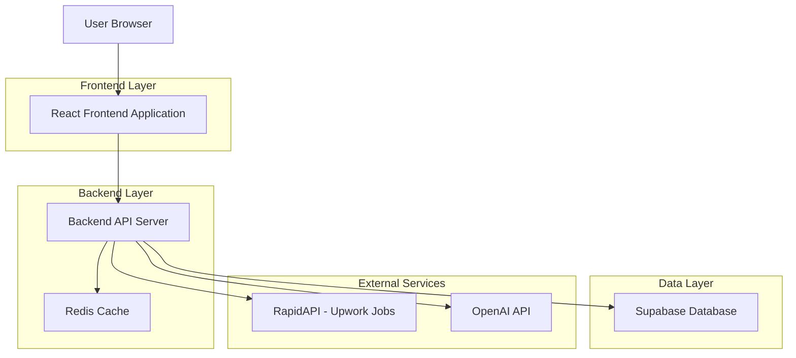
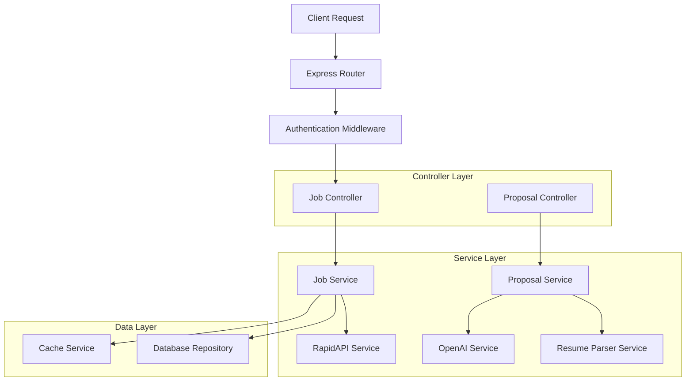
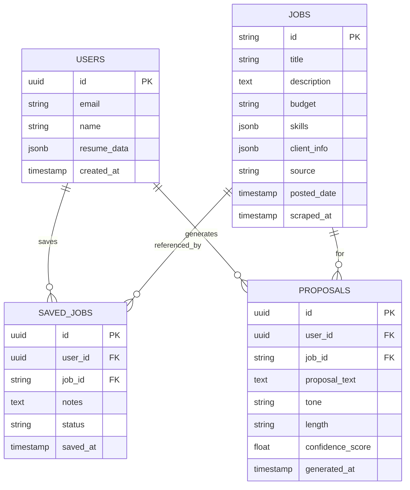

# AI Job Scraper and Instant Proposal Filler - Technical Architecture Document

## 1. Architecture Design



## 2. Technology Description

- Frontend: React@18 + TypeScript + TailwindCSS@3 + Vite
- Backend: Express@4 + TypeScript + Node.js
- Database: Supabase (PostgreSQL)
- Cache: Redis for job data caching
- External APIs: RapidAPI (Upwork Jobs), OpenAI API

## 3. Route Definitions

| Route | Purpose |
|-------|---------|
| /jobs | Job dashboard page with listings and filters |
| /jobs/:id | Individual job details page |
| /jobs/saved | User's saved jobs and favorites |
| /proposal-generator | AI proposal generation interface |
| /proposal-generator/:jobId | Generate proposal for specific job |
| /settings/jobs | Job scraper settings and preferences |

## 4. API Definitions

### 4.1 Core API

**Job Scraping**
```
GET /api/jobs/scrape
```

Request:
| Param Name | Param Type | isRequired | Description |
|------------|------------|------------|-------------|
| limit | number | false | Number of jobs to fetch (default: 10) |
| skills | string | false | Comma-separated skills filter |
| budget_min | number | false | Minimum budget filter |
| budget_max | number | false | Maximum budget filter |

Response:
| Param Name | Param Type | Description |
|------------|------------|-------------|
| jobs | Job[] | Array of scraped job objects |
| total | number | Total number of jobs available |
| cached | boolean | Whether data is from cache |

Example:
```json
{
  "jobs": [
    {
      "id": "upwork_123456",
      "title": "React Developer Needed",
      "description": "Looking for experienced React developer...",
      "budget": "$500-$1000",
      "skills": ["React", "JavaScript", "TypeScript"],
      "client": {
        "name": "Tech Startup",
        "rating": 4.8,
        "reviews": 25
      },
      "posted_date": "2024-01-15T10:30:00Z",
      "source": "upwork"
    }
  ],
  "total": 150,
  "cached": false
}
```

**Proposal Generation**
```
POST /api/proposals/generate
```

Request:
| Param Name | Param Type | isRequired | Description |
|------------|------------|------------|-------------|
| job_id | string | true | Job identifier |
| user_resume | object | true | User's resume data |
| tone | string | false | Proposal tone (professional, friendly, confident) |
| length | string | false | Proposal length (short, medium, long) |

Response:
| Param Name | Param Type | Description |
|------------|------------|-------------|
| proposal | string | Generated proposal text |
| confidence | number | AI confidence score (0-1) |
| suggestions | string[] | Additional suggestions |

Example:
```json
{
  "proposal": "Dear Client,\n\nI am excited to apply for your React Developer position...",
  "confidence": 0.92,
  "suggestions": [
    "Consider mentioning your specific React experience",
    "Add portfolio links for better impact"
  ]
}
```

**Save Job**
```
POST /api/jobs/save
```

Request:
| Param Name | Param Type | isRequired | Description |
|------------|------------|------------|-------------|
| job_id | string | true | Job identifier |
| notes | string | false | User notes about the job |

Response:
| Param Name | Param Type | Description |
|------------|------------|-------------|
| success | boolean | Operation success status |
| saved_job_id | string | Saved job record ID |

## 5. Server Architecture Diagram



## 6. Data Model

### 6.1 Data Model Definition



### 6.2 Data Definition Language

**Jobs Table (jobs)**
```sql
-- Create jobs table
CREATE TABLE jobs (
    id VARCHAR(255) PRIMARY KEY,
    title VARCHAR(500) NOT NULL,
    description TEXT,
    budget VARCHAR(100),
    skills JSONB,
    client_info JSONB,
    source VARCHAR(50) NOT NULL,
    posted_date TIMESTAMP WITH TIME ZONE,
    scraped_at TIMESTAMP WITH TIME ZONE DEFAULT NOW(),
    created_at TIMESTAMP WITH TIME ZONE DEFAULT NOW()
);

-- Create indexes
CREATE INDEX idx_jobs_source ON jobs(source);
CREATE INDEX idx_jobs_posted_date ON jobs(posted_date DESC);
CREATE INDEX idx_jobs_skills ON jobs USING GIN(skills);
```

**Saved Jobs Table (saved_jobs)**
```sql
-- Create saved_jobs table
CREATE TABLE saved_jobs (
    id UUID PRIMARY KEY DEFAULT gen_random_uuid(),
    user_id UUID NOT NULL REFERENCES users(id) ON DELETE CASCADE,
    job_id VARCHAR(255) NOT NULL REFERENCES jobs(id) ON DELETE CASCADE,
    notes TEXT,
    status VARCHAR(50) DEFAULT 'saved' CHECK (status IN ('saved', 'applied', 'rejected', 'interview')),
    saved_at TIMESTAMP WITH TIME ZONE DEFAULT NOW()
);

-- Create indexes
CREATE INDEX idx_saved_jobs_user_id ON saved_jobs(user_id);
CREATE INDEX idx_saved_jobs_status ON saved_jobs(status);
CREATE UNIQUE INDEX idx_saved_jobs_user_job ON saved_jobs(user_id, job_id);
```

**Proposals Table (proposals)**
```sql
-- Create proposals table
CREATE TABLE proposals (
    id UUID PRIMARY KEY DEFAULT gen_random_uuid(),
    user_id UUID NOT NULL REFERENCES users(id) ON DELETE CASCADE,
    job_id VARCHAR(255) NOT NULL REFERENCES jobs(id) ON DELETE CASCADE,
    proposal_text TEXT NOT NULL,
    tone VARCHAR(50) DEFAULT 'professional',
    length VARCHAR(50) DEFAULT 'medium',
    confidence_score FLOAT CHECK (confidence_score >= 0 AND confidence_score <= 1),
    generated_at TIMESTAMP WITH TIME ZONE DEFAULT NOW()
);

-- Create indexes
CREATE INDEX idx_proposals_user_id ON proposals(user_id);
CREATE INDEX idx_proposals_job_id ON proposals(job_id);
CREATE INDEX idx_proposals_generated_at ON proposals(generated_at DESC);
```

**Grant permissions**
```sql
-- Grant basic read access to anon role
GRANT SELECT ON jobs TO anon;

-- Grant full access to authenticated role
GRANT ALL PRIVILEGES ON jobs TO authenticated;
GRANT ALL PRIVILEGES ON saved_jobs TO authenticated;
GRANT ALL PRIVILEGES ON proposals TO authenticated;
```

**Initial data**
```sql
-- Insert sample job data for testing
INSERT INTO jobs (id, title, description, budget, skills, client_info, source, posted_date) VALUES
('upwork_sample_1', 'React Developer for E-commerce Platform', 'We need an experienced React developer to build our e-commerce platform...', '$1000-$3000', '["React", "JavaScript", "Node.js"]', '{"name": "TechCorp", "rating": 4.9, "reviews": 45}', 'upwork', NOW() - INTERVAL '2 hours'),
('freelancer_sample_1', 'Full Stack Developer - MERN Stack', 'Looking for a full stack developer with MERN stack experience...', '$500-$1500', '["MongoDB", "Express", "React", "Node.js"]', '{"name": "StartupXYZ", "rating": 4.5, "reviews": 12}', 'freelancer', NOW() - INTERVAL '4 hours');
```
