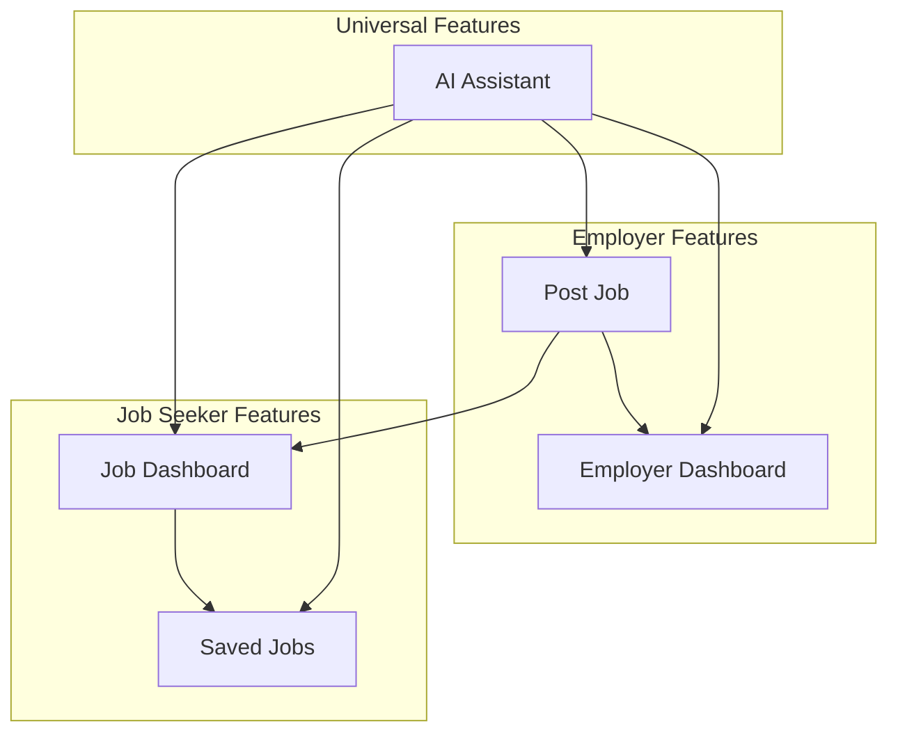
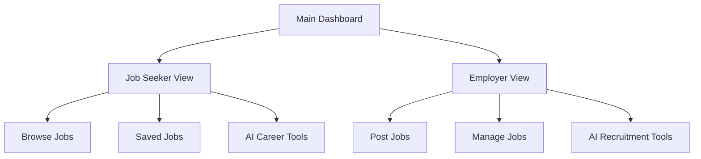

# Job Platform Feature Optimization Analysis

## 1. Current Feature Dependencies & Relationships

### Feature Dependency Map


### Current Feature Analysis

| Feature | Primary Users | Dependencies | Core Function |
|---------|---------------|--------------|---------------|
| **Job Dashboard** | Job Seekers | None (Data source) | Browse & search all job postings |
| **Employer Dashboard** | Employers | Post Job | Manage posted jobs & applications |
| **Saved Jobs** | Job Seekers | Job Dashboard | Save interesting jobs for later |
| **Post Job** | Employers | None (Data creator) | Create & publish job postings |
| **AI Assistant** | Both | Enhances all features | AI-powered career & recruitment tools |

## 2. Identified Issues

### Navigation Complexity
- **5 separate navigation items** creating visual clutter
- **Unclear user role distinction** in navigation
- **Feature overlap** between dashboards
- **Inconsistent user experience** for different roles

### User Experience Problems
- Job seekers see employer-specific features
- Employers navigate through job seeker features
- No clear role-based interface segregation
- AI Assistant scattered across multiple areas

## 3. Optimization Recommendations

### 3.1 Feature Consolidation Strategy

#### **Option A: Role-Based Dashboard Consolidation**


#### **Option B: Unified Platform with Smart Navigation**
- **Single "Jobs" entry point** with role-based sub-navigation
- **Integrated AI Assistant** accessible from all contexts
- **Smart feature visibility** based on user role

### 3.2 Recommended Feature Structure

#### **Consolidated Navigation (Recommended)**
```
1. Jobs Hub
   ├── Browse Jobs (Job Dashboard)
   ├── My Saved Jobs
   └── Post a Job

2. My Dashboard
   ├── Job Seeker Dashboard (Applications, Saved Jobs, Profile)
   └── Employer Dashboard (Posted Jobs, Applications, Analytics)

3. AI Assistant
   ├── Resume Optimization
   ├── Cover Letter Generator
   ├── Job Description Generator
   └── Interview Preparation
```

### 3.3 User Role Management

#### **Smart Role Detection**
- **Automatic role assignment** based on user actions
- **Dual-role support** for users who both seek and post jobs
- **Context-aware navigation** showing relevant features only

#### **Role-Based Feature Access**
| User Type | Visible Features | Hidden Features |
|-----------|------------------|-----------------|
| **Job Seeker Only** | Browse Jobs, Saved Jobs, AI Career Tools | Post Job, Employer Dashboard |
| **Employer Only** | Post Job, Employer Dashboard, AI Recruitment | Saved Jobs (personal) |
| **Dual Role** | All Features | None (smart switching) |

## 4. Implementation Strategy

### 4.1 Phase 1: Navigation Simplification
- **Reduce navigation items** from 5 to 3 main categories
- **Implement role-based visibility** for navigation items
- **Create unified "Jobs Hub"** combining Job Dashboard and Post Job

### 4.2 Phase 2: Dashboard Consolidation
- **Merge similar dashboards** into role-specific views
- **Integrate AI Assistant** into relevant workflows
- **Implement smart feature suggestions** based on user behavior

### 4.3 Phase 3: Enhanced User Experience
- **Add role switching** for dual-role users
- **Implement contextual AI assistance** 
- **Create guided user onboarding** for role selection

## 5. Specific Feature Adjustments

### 5.1 Remove/Consolidate
- **Remove separate "Employer" navigation item** → Integrate into "My Dashboard"
- **Consolidate AI features** → Single "AI Assistant" with context-aware tools
- **Merge job browsing** → Single "Jobs" section with role-based views

### 5.2 Enhance/Integrate
- **Enhance Job Dashboard** with employer posting capabilities
- **Integrate Saved Jobs** into personalized dashboard
- **Expand AI Assistant** to support both job seekers and employers

### 5.3 New Unified Structure
```
Main Navigation:
├── 🏠 Home
├── 💼 Jobs (Browse + Post)
├── 📊 My Dashboard (Role-based)
├── 🤖 AI Assistant
└── 👤 Profile/Settings
```

## 6. Benefits of Optimization

### User Experience Improvements
- **Reduced cognitive load** with fewer navigation options
- **Clearer user journey** with role-based interfaces
- **Integrated AI assistance** throughout the platform
- **Simplified feature discovery** for new users

### Technical Benefits
- **Reduced code duplication** between similar features
- **Improved maintainability** with consolidated components
- **Better performance** with optimized navigation structure
- **Enhanced scalability** for future feature additions

### Business Impact
- **Higher user engagement** with simplified navigation
- **Improved conversion rates** for job postings and applications
- **Better user retention** with personalized experiences
- **Reduced support requests** due to clearer interface

## 7. Migration Plan

### Step 1: Backend Preparation
- Implement role detection logic
- Create unified API endpoints
- Set up feature flag system

### Step 2: Frontend Consolidation
- Merge similar components
- Implement role-based navigation
- Create unified dashboard views

### Step 3: User Migration
- Gradual rollout with feature flags
- User feedback collection
- Performance monitoring and optimization

## 8. Success Metrics

- **Navigation efficiency**: Reduce clicks to key features by 40%
- **User satisfaction**: Improve UX scores by 25%
- **Feature adoption**: Increase AI Assistant usage by 60%
- **Platform engagement**: Improve session duration by 30%

---

**Recommendation**: Implement **Option A (Role-Based Dashboard Consolidation)** for the best balance of functionality and simplicity, reducing navigation complexity while maintaining all core features through intelligent role-based presentation.