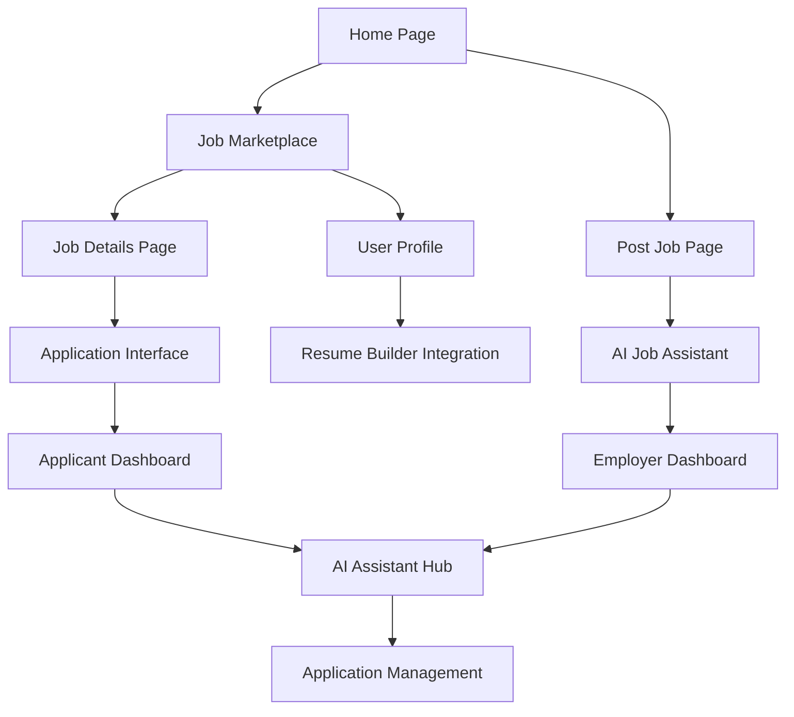

# Job Posting & Application Platform - Product Requirements Document

## 1. Product Overview

A comprehensive AI-powered job marketplace platform that connects job posters (companies and individuals) with job seekers through intelligent matching and assistance features. The platform transforms the traditional job board experience by providing AI-driven support for both posting jobs and applying to them.

The platform solves the problem of inefficient job matching and poor-quality job descriptions/applications by leveraging AI to optimize content creation, candidate matching, and application processes. Target users include companies, freelancers, recruiters, and job seekers across all industries.

Market value: Positioned as a premium job marketplace with AI-enhanced features to compete with traditional job boards while offering superior user experience and matching accuracy.

## 2. Core Features

### 2.1 User Roles

| Role | Registration Method | Core Permissions |
|------|---------------------|------------------|
| Job Poster | Email registration + company verification (optional) | Can post jobs, manage applications, access AI job creation tools, view candidate profiles |
| Job Seeker | Email registration + profile creation | Can browse jobs, apply to positions, access AI application tools, save jobs, track applications |
| Admin | System-assigned | Full platform management, user moderation, analytics access |

### 2.2 Feature Module

Our job posting platform consists of the following main pages:

1. **Job Marketplace**: Browse all job listings, advanced search and filtering, job recommendations.
2. **Post Job Page**: AI-assisted job creation, job description optimization, requirement suggestions.
3. **Job Details Page**: Comprehensive job information, application interface, AI application assistance.
4. **Employer Dashboard**: Manage posted jobs, review applications, candidate matching, analytics.
5. **Applicant Dashboard**: Track applications, saved jobs, AI-powered application tools, profile management.
6. **AI Assistant Hub**: Centralized AI tools for job optimization, application enhancement, interview prep.
7. **Application Management**: Application tracking, communication tools, status updates.

### 2.3 Page Details

| Page Name | Module Name | Feature description |
|-----------|-------------|---------------------|
| Job Marketplace | Job Listings | Display all active jobs with pagination, search by keywords, location, salary, company. Filter by job type, experience level, industry, remote options |
| Job Marketplace | Recommendations | AI-powered job suggestions based on user profile, search history, and preferences |
| Post Job Page | Job Creation Form | Title, description, requirements, salary, location, job type, application deadline fields |
| Post Job Page | AI Job Assistant | Generate job descriptions, suggest skill requirements, recommend salary ranges, optimize posting for visibility |
| Job Details Page | Job Information | Complete job details, company information, application requirements, similar jobs |
| Job Details Page | Application Interface | Apply directly with resume upload, cover letter integration, AI application assistance |
| Employer Dashboard | Job Management | View, edit, delete posted jobs, manage job status (active/paused/closed) |
| Employer Dashboard | Application Review | View applications, filter candidates, AI-powered candidate scoring, communication tools |
| Applicant Dashboard | Application Tracking | View application status, application history, interview schedules, follow-up reminders |
| Applicant Dashboard | Profile Management | Resume builder integration, skill assessment, portfolio showcase, preference settings |
| AI Assistant Hub | Job Posting Tools | Description generator, requirement optimizer, salary analyzer, posting performance insights |
| AI Assistant Hub | Application Tools | Cover letter generator, resume optimizer, interview preparation, application review |
| Application Management | Communication | Messaging system between employers and candidates, interview scheduling, status notifications |
| Application Management | Analytics | Application success rates, job performance metrics, user engagement analytics |

## 3. Core Process

### Job Poster Flow
1. Register/Login → Complete company profile → Access Post Job page → Use AI assistant to create optimized job posting → Publish job → Receive applications → Review candidates with AI assistance → Communicate with candidates → Make hiring decisions

### Job Seeker Flow
1. Register/Login → Complete profile with resume builder → Browse job marketplace → Use AI recommendations → View job details → Use AI application assistant → Submit application → Track application status → Communicate with employers → Interview process

### Admin Flow
1. Monitor platform activity → Moderate job postings → Manage user accounts → Analyze platform metrics → Handle disputes → System maintenance

## 4. User Interface Design

### 4.1 Design Style

- **Primary Colors**: Deep blue (#1e40af) for trust and professionalism, bright green (#10b981) for success actions
- **Secondary Colors**: Light gray (#f8fafc) for backgrounds, dark gray (#374151) for text
- **Button Style**: Rounded corners (8px), gradient effects for primary actions, subtle shadows
- **Font**: Inter or Roboto, 16px base size, 14px for secondary text, 24px+ for headings
- **Layout Style**: Card-based design with clean spacing, top navigation with breadcrumbs, sidebar filters
- **Icons**: Feather icons or Heroicons, consistent 20px size, outlined style
- **Animations**: Smooth transitions (300ms), hover effects, loading spinners

### 4.2 Page Design Overview

| Page Name | Module Name | UI Elements |
|-----------|-------------|-------------|
| Job Marketplace | Job Cards | Clean white cards with company logo, job title, salary range, location, tags for skills, "Apply" and "Save" buttons |
| Job Marketplace | Filters Sidebar | Collapsible sections for location, salary, job type, experience level with checkboxes and range sliders |
| Post Job Page | Form Layout | Multi-step wizard with progress indicator, form validation, AI suggestions panel on the right |
| Post Job Page | AI Assistant | Chat-like interface with suggestions, floating action button, real-time preview |
| Job Details Page | Job Header | Company banner, job title, key details in highlighted boxes, application CTA button |
| Job Details Page | Content Sections | Tabbed interface for description, requirements, company info, similar jobs |
| Employer Dashboard | Analytics Cards | KPI cards with charts, application funnel visualization, candidate pipeline |
| Applicant Dashboard | Application Timeline | Visual timeline showing application progress, status badges, action buttons |
| AI Assistant Hub | Tool Cards | Feature cards with icons, quick access buttons, usage statistics |

### 4.3 Responsiveness

Desktop-first approach with mobile-adaptive design. Touch-optimized interactions for mobile users, collapsible navigation, swipe gestures for job cards, and optimized form layouts for smaller screens.

## 5. AI Integration Features

### 5.1 For Job Posters
- **Smart Job Description Generator**: AI creates compelling job descriptions based on title and basic requirements
- **Skill Requirement Optimizer**: Suggests relevant skills and qualifications based on job role and industry
- **Salary Range Advisor**: Provides market-rate salary recommendations based on location, experience, and role
- **Application Screening Assistant**: AI scores and ranks candidates based on job requirements
- **Candidate Matching Engine**: Intelligent matching algorithm to find best-fit candidates
- **Performance Analytics**: AI-powered insights on job posting performance and optimization suggestions

### 5.2 For Job Applicants
- **Application Optimizer**: AI reviews and improves application materials before submission
- **Cover Letter Integration**: Enhanced version of existing cover letter generator tailored to specific jobs
- **Resume Optimization**: AI suggests resume improvements based on job requirements
- **Interview Preparation**: AI-generated interview questions and preparation materials
- **Job Matching**: Personalized job recommendations based on skills, experience, and preferences
- **Application Tracking Intelligence**: AI predicts application success probability and suggests follow-up actions

## 6. Integration with Existing Features

### 6.1 Resume Builder Integration
- Direct import of resume data for job applications
- AI-powered resume optimization for specific job postings
- Skill gap analysis and improvement suggestions

### 6.2 Cover Letter Generator Enhancement
- Job-specific cover letter generation
- Integration with job posting data for personalized content
- Multiple template options based on industry and role

### 6.3 ATS Optimization
- Ensure job applications are ATS-friendly
- Keyword optimization for better application visibility
- Format compatibility checking

## 7. Advanced Features

### 7.1 Smart Notifications
- Real-time application status updates
- Job recommendation alerts
- Interview reminders and preparation notifications
- Deadline alerts for job applications

### 7.2 Analytics & Insights
- Job posting performance metrics
- Application success rate tracking
- Market trend analysis
- Salary benchmarking

### 7.3 Communication Tools
- In-platform messaging system
- Video interview scheduling
- Automated follow-up sequences
- Feedback collection system

### 7.4 Premium Features
- Priority job listing placement
- Advanced AI features
- Detailed analytics dashboard
- Enhanced candidate matching
- Custom branding for company profiles