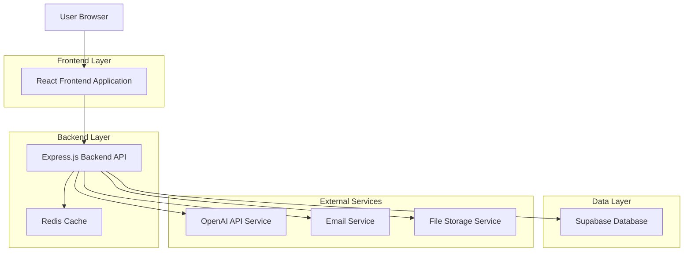
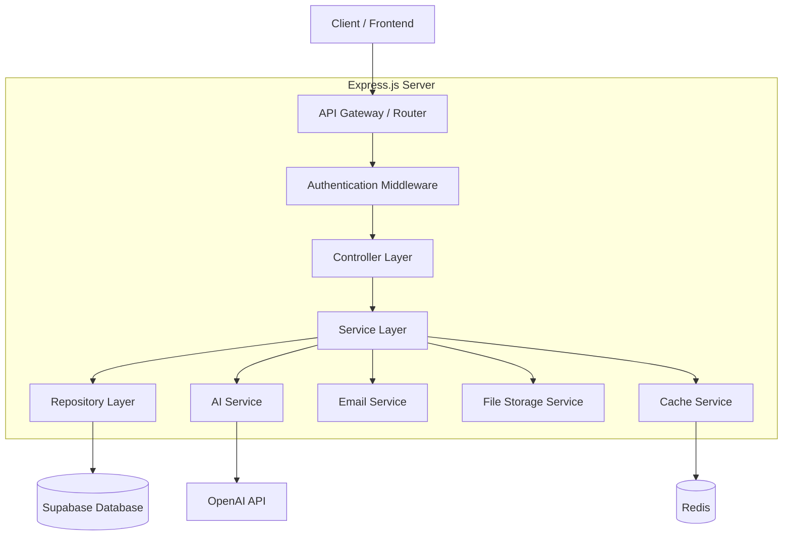
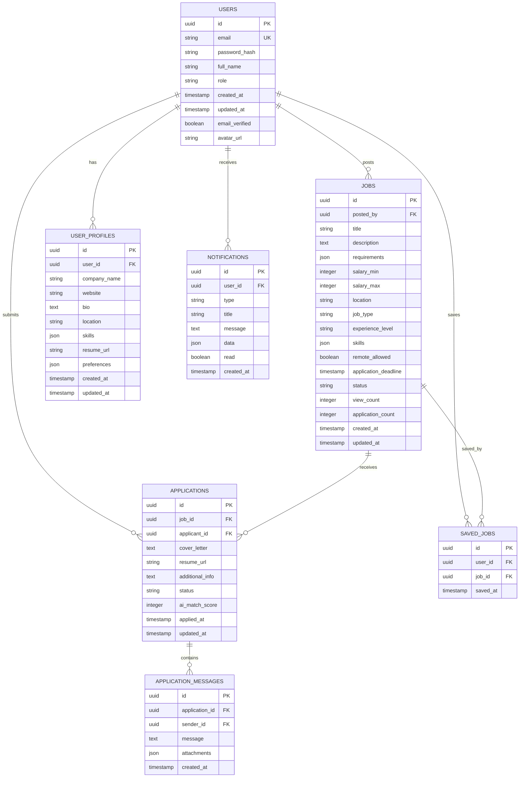

# Job Posting & Application Platform - Technical Architecture Document

## 1. Architecture Design



## 2. Technology Description

- **Frontend**: React@18 + TypeScript + TailwindCSS@3 + Vite + React Router + React Query
- **Backend**: Express@4 + TypeScript + Node.js@18
- **Database**: Supabase (PostgreSQL) with Row Level Security
- **Authentication**: Supabase Auth with JWT tokens
- **AI Services**: OpenAI GPT-4 API for content generation and optimization
- **File Storage**: Supabase Storage for resumes, company logos, and documents
- **Caching**: Redis for session management and API response caching
- **Email**: Supabase Email or SendGrid for notifications
- **Real-time**: Supabase Realtime for live updates

## 3. Route Definitions

| Route | Purpose |
|-------|----------|
| / | Home page with platform overview and quick access to main features |
| /jobs | Job marketplace with search, filters, and job listings |
| /jobs/:id | Individual job details page with application interface |
| /post-job | Job posting form with AI assistance for employers |
| /employer/dashboard | Employer dashboard for managing jobs and applications |
| /applicant/dashboard | Applicant dashboard for tracking applications and profile |
| /ai-assistant | AI tools hub for both job posters and applicants |
| /applications | Application management and communication center |
| /profile | User profile management (employer or applicant) |
| /company/:id | Company profile page with posted jobs |
| /login | Authentication page |
| /register | User registration with role selection |
| /settings | Account settings and preferences |

## 4. API Definitions

### 4.1 Authentication APIs

**User Registration**
```
POST /api/auth/register
```

Request:
| Param Name | Param Type | isRequired | Description |
|------------|------------|------------|-------------|
| email | string | true | User email address |
| password | string | true | User password (min 8 characters) |
| role | string | true | User role: 'job_poster' or 'job_seeker' |
| full_name | string | true | User's full name |
| company_name | string | false | Required if role is 'job_poster' |

Response:
| Param Name | Param Type | Description |
|------------|------------|-------------|
| user | object | User profile data |
| session | object | Authentication session |
| success | boolean | Registration status |

### 4.2 Job Management APIs

**Create Job Posting**
```
POST /api/jobs
```

Request:
| Param Name | Param Type | isRequired | Description |
|------------|------------|------------|-------------|
| title | string | true | Job title |
| description | string | true | Job description |
| requirements | array | true | List of job requirements |
| salary_min | number | false | Minimum salary |
| salary_max | number | false | Maximum salary |
| location | string | true | Job location |
| job_type | string | true | 'full_time', 'part_time', 'contract', 'freelance' |
| experience_level | string | true | 'entry', 'mid', 'senior', 'executive' |
| skills | array | true | Required skills |
| remote_allowed | boolean | false | Remote work option |
| application_deadline | string | false | Application deadline (ISO date) |

Response:
| Param Name | Param Type | Description |
|------------|------------|-------------|
| job_id | string | Created job ID |
| status | string | Job status |
| success | boolean | Creation status |

**Get Job Listings**
```
GET /api/jobs
```

Query Parameters:
| Param Name | Param Type | Description |
|------------|------------|-------------|
| page | number | Page number (default: 1) |
| limit | number | Items per page (default: 20) |
| search | string | Search keywords |
| location | string | Filter by location |
| job_type | string | Filter by job type |
| salary_min | number | Minimum salary filter |
| salary_max | number | Maximum salary filter |
| remote | boolean | Remote jobs only |

### 4.3 Application APIs

**Submit Job Application**
```
POST /api/applications
```

Request:
| Param Name | Param Type | isRequired | Description |
|------------|------------|------------|-------------|
| job_id | string | true | Job ID to apply for |
| cover_letter | string | false | Cover letter content |
| resume_file | file | true | Resume file upload |
| additional_info | string | false | Additional information |

### 4.4 AI Assistant APIs

**Generate Job Description**
```
POST /api/ai/generate-job-description
```

Request:
| Param Name | Param Type | isRequired | Description |
|------------|------------|------------|-------------|
| job_title | string | true | Job title |
| company_type | string | false | Type of company |
| key_requirements | array | false | Key requirements |
| experience_level | string | false | Required experience level |

Response:
| Param Name | Param Type | Description |
|------------|------------|-------------|
| description | string | Generated job description |
| suggested_skills | array | Recommended skills |
| salary_range | object | Suggested salary range |

**Optimize Application**
```
POST /api/ai/optimize-application
```

Request:
| Param Name | Param Type | isRequired | Description |
|------------|------------|------------|-------------|
| job_id | string | true | Target job ID |
| resume_content | string | true | Current resume content |
| cover_letter | string | false | Current cover letter |

Response:
| Param Name | Param Type | Description |
|------------|------------|-------------|
| optimized_resume | string | Improved resume content |
| optimized_cover_letter | string | Improved cover letter |
| suggestions | array | Improvement suggestions |
| match_score | number | Job match percentage |

## 5. Server Architecture Diagram



## 6. Data Model

### 6.1 Data Model Definition



### 6.2 Data Definition Language

**Users Table**
```sql
-- Create users table (extends Supabase auth.users)
CREATE TABLE public.users (
    id UUID PRIMARY KEY DEFAULT gen_random_uuid(),
    email VARCHAR(255) UNIQUE NOT NULL,
    full_name VARCHAR(255) NOT NULL,
    role VARCHAR(20) NOT NULL CHECK (role IN ('job_poster', 'job_seeker', 'admin')),
    avatar_url TEXT,
    created_at TIMESTAMP WITH TIME ZONE DEFAULT NOW(),
    updated_at TIMESTAMP WITH TIME ZONE DEFAULT NOW()
);

-- Enable RLS
ALTER TABLE public.users ENABLE ROW LEVEL SECURITY;

-- Create policies
CREATE POLICY "Users can view their own profile" ON public.users
    FOR SELECT USING (auth.uid() = id);

CREATE POLICY "Users can update their own profile" ON public.users
    FOR UPDATE USING (auth.uid() = id);
```

**User Profiles Table**
```sql
CREATE TABLE public.user_profiles (
    id UUID PRIMARY KEY DEFAULT gen_random_uuid(),
    user_id UUID REFERENCES public.users(id) ON DELETE CASCADE,
    company_name VARCHAR(255),
    website VARCHAR(255),
    bio TEXT,
    location VARCHAR(255),
    skills JSONB DEFAULT '[]'::jsonb,
    resume_url TEXT,
    preferences JSONB DEFAULT '{}'::jsonb,
    created_at TIMESTAMP WITH TIME ZONE DEFAULT NOW(),
    updated_at TIMESTAMP WITH TIME ZONE DEFAULT NOW()
);

ALTER TABLE public.user_profiles ENABLE ROW LEVEL SECURITY;

CREATE POLICY "Users can manage their own profile" ON public.user_profiles
    FOR ALL USING (auth.uid() = user_id);
```

**Jobs Table**
```sql
CREATE TABLE public.jobs (
    id UUID PRIMARY KEY DEFAULT gen_random_uuid(),
    posted_by UUID REFERENCES public.users(id) ON DELETE CASCADE,
    title VARCHAR(255) NOT NULL,
    description TEXT NOT NULL,
    requirements JSONB DEFAULT '[]'::jsonb,
    salary_min INTEGER,
    salary_max INTEGER,
    location VARCHAR(255) NOT NULL,
    job_type VARCHAR(20) NOT NULL CHECK (job_type IN ('full_time', 'part_time', 'contract', 'freelance')),
    experience_level VARCHAR(20) NOT NULL CHECK (experience_level IN ('entry', 'mid', 'senior', 'executive')),
    skills JSONB DEFAULT '[]'::jsonb,
    remote_allowed BOOLEAN DEFAULT false,
    application_deadline TIMESTAMP WITH TIME ZONE,
    status VARCHAR(20) DEFAULT 'active' CHECK (status IN ('active', 'paused', 'closed', 'draft')),
    view_count INTEGER DEFAULT 0,
    application_count INTEGER DEFAULT 0,
    created_at TIMESTAMP WITH TIME ZONE DEFAULT NOW(),
    updated_at TIMESTAMP WITH TIME ZONE DEFAULT NOW()
);

ALTER TABLE public.jobs ENABLE ROW LEVEL SECURITY;

-- Policies for jobs
CREATE POLICY "Anyone can view active jobs" ON public.jobs
    FOR SELECT USING (status = 'active');

CREATE POLICY "Job posters can manage their jobs" ON public.jobs
    FOR ALL USING (auth.uid() = posted_by);

-- Indexes
CREATE INDEX idx_jobs_status ON public.jobs(status);
CREATE INDEX idx_jobs_location ON public.jobs(location);
CREATE INDEX idx_jobs_job_type ON public.jobs(job_type);
CREATE INDEX idx_jobs_created_at ON public.jobs(created_at DESC);
CREATE INDEX idx_jobs_skills ON public.jobs USING GIN(skills);
```

**Applications Table**
```sql
CREATE TABLE public.applications (
    id UUID PRIMARY KEY DEFAULT gen_random_uuid(),
    job_id UUID REFERENCES public.jobs(id) ON DELETE CASCADE,
    applicant_id UUID REFERENCES public.users(id) ON DELETE CASCADE,
    cover_letter TEXT,
    resume_url TEXT NOT NULL,
    additional_info TEXT,
    status VARCHAR(20) DEFAULT 'pending' CHECK (status IN ('pending', 'reviewed', 'shortlisted', 'rejected', 'hired')),
    ai_match_score INTEGER CHECK (ai_match_score >= 0 AND ai_match_score <= 100),
    applied_at TIMESTAMP WITH TIME ZONE DEFAULT NOW(),
    updated_at TIMESTAMP WITH TIME ZONE DEFAULT NOW(),
    UNIQUE(job_id, applicant_id)
);

ALTER TABLE public.applications ENABLE ROW LEVEL SECURITY;

-- Policies for applications
CREATE POLICY "Applicants can view their own applications" ON public.applications
    FOR SELECT USING (auth.uid() = applicant_id);

CREATE POLICY "Job posters can view applications for their jobs" ON public.applications
    FOR SELECT USING (auth.uid() IN (
        SELECT posted_by FROM public.jobs WHERE id = job_id
    ));

CREATE POLICY "Applicants can create applications" ON public.applications
    FOR INSERT WITH CHECK (auth.uid() = applicant_id);

-- Indexes
CREATE INDEX idx_applications_job_id ON public.applications(job_id);
CREATE INDEX idx_applications_applicant_id ON public.applications(applicant_id);
CREATE INDEX idx_applications_status ON public.applications(status);
```

**Saved Jobs Table**
```sql
CREATE TABLE public.saved_jobs (
    id UUID PRIMARY KEY DEFAULT gen_random_uuid(),
    user_id UUID REFERENCES public.users(id) ON DELETE CASCADE,
    job_id UUID REFERENCES public.jobs(id) ON DELETE CASCADE,
    saved_at TIMESTAMP WITH TIME ZONE DEFAULT NOW(),
    UNIQUE(user_id, job_id)
);

ALTER TABLE public.saved_jobs ENABLE ROW LEVEL SECURITY;

CREATE POLICY "Users can manage their saved jobs" ON public.saved_jobs
    FOR ALL USING (auth.uid() = user_id);

CREATE INDEX idx_saved_jobs_user_id ON public.saved_jobs(user_id);
```

**Notifications Table**
```sql
CREATE TABLE public.notifications (
    id UUID PRIMARY KEY DEFAULT gen_random_uuid(),
    user_id UUID REFERENCES public.users(id) ON DELETE CASCADE,
    type VARCHAR(50) NOT NULL,
    title VARCHAR(255) NOT NULL,
    message TEXT NOT NULL,
    data JSONB DEFAULT '{}'::jsonb,
    read BOOLEAN DEFAULT false,
    created_at TIMESTAMP WITH TIME ZONE DEFAULT NOW()
);

ALTER TABLE public.notifications ENABLE ROW LEVEL SECURITY;

CREATE POLICY "Users can view their notifications" ON public.notifications
    FOR SELECT USING (auth.uid() = user_id);

CREATE POLICY "Users can update their notifications" ON public.notifications
    FOR UPDATE USING (auth.uid() = user_id);

CREATE INDEX idx_notifications_user_id ON public.notifications(user_id);
CREATE INDEX idx_notifications_created_at ON public.notifications(created_at DESC);
```

**Initial Data**
```sql
-- Insert sample job categories and skills
INSERT INTO public.jobs (posted_by, title, description, requirements, salary_min, salary_max, location, job_type, experience_level, skills, remote_allowed)
VALUES 
(
    (SELECT id FROM public.users WHERE role = 'job_poster' LIMIT 1),
    'Senior Full Stack Developer',
    'We are seeking an experienced full stack developer to join our growing team...',
    '["5+ years experience", "Strong problem-solving skills", "Team collaboration"]'::jsonb,
    80000,
    120000,
    'San Francisco, CA',
    'full_time',
    'senior',
    '["React", "Node.js", "TypeScript", "PostgreSQL"]'::jsonb,
    true
);
```

## 7. Security Considerations

### 7.1 Authentication & Authorization
- JWT-based authentication via Supabase Auth
- Role-based access control (RBAC)
- Row Level Security (RLS) policies
- API rate limiting

### 7.2 Data Protection
- Encrypted file storage
- Secure resume and document handling
- GDPR compliance for user data
- Data anonymization for analytics

### 7.3 API Security
- Input validation and sanitization
- SQL injection prevention
- XSS protection
- CORS configuration
- API key management for external services

## 8. Performance Optimization

### 8.1 Caching Strategy
- Redis caching for frequently accessed job listings
- Browser caching for static assets
- Database query optimization
- CDN for file storage

### 8.2 Scalability
- Horizontal scaling with load balancers
- Database connection pooling
- Async job processing for AI operations
- Microservices architecture consideration for future growth