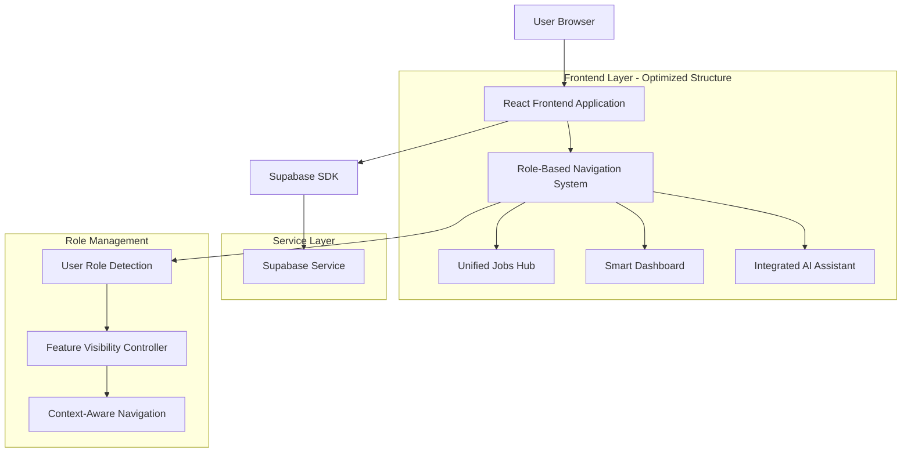

# Optimized Job Platform Architecture

## 1. Architecture Design



## 2. Technology Description

- **Frontend**: React@18 + TypeScript + Tailwind CSS + Vite
- **Backend**: Supabase (Authentication, Database, Storage)
- **State Management**: React Context + Custom Hooks
- **Routing**: React Router v6 with role-based guards
- **AI Integration**: OpenAI API for intelligent features

## 3. Optimized Route Definitions

### 3.1 Simplified Route Structure

| Route | Purpose | Access Level |
|-------|---------|--------------|
| `/` | Landing page with role selection | Public |
| `/jobs` | Unified jobs hub (browse + post) | Authenticated |
| `/dashboard` | Role-based dashboard | Authenticated |
| `/ai-assistant` | Integrated AI tools | Authenticated |
| `/profile` | User profile and settings | Authenticated |

### 3.2 Dynamic Sub-Routes

#### Jobs Hub (`/jobs`)
- `/jobs` - Browse jobs (default view)
- `/jobs/post` - Post new job (employer view)
- `/jobs/saved` - Saved jobs (job seeker view)
- `/jobs/:id` - Job details with role-specific actions

#### Smart Dashboard (`/dashboard`)
- `/dashboard` - Auto-redirects based on user role
- `/dashboard/seeker` - Job seeker dashboard
- `/dashboard/employer` - Employer dashboard
- `/dashboard/applications` - Application management

## 4. API Definitions

### 4.1 User Role Management

**Get User Role**
```
GET /api/users/role
```

Response:
| Param Name | Param Type | Description |
|------------|------------|-------------|
| role | string | 'job_seeker', 'employer', 'dual' |
| permissions | array | Available feature permissions |
| preferences | object | User interface preferences |

**Update User Role**
```
PUT /api/users/role
```

Request:
| Param Name | Param Type | Required | Description |
|------------|------------|----------|-------------|
| role | string | true | New user role |
| preferences | object | false | UI preferences |

### 4.2 Unified Jobs API

**Get Jobs with Role Context**
```
GET /api/jobs?context={role}&user_id={id}
```

Response includes role-specific data:
- Job seekers: saved status, application status
- Employers: edit permissions, application count

**Smart Job Actions**
```
POST /api/jobs/{id}/action
```

Request:
| Param Name | Param Type | Required | Description |
|------------|------------|----------|-------------|
| action | string | true | 'save', 'apply', 'edit', 'delete' |
| context | string | true | User role context |

### 4.3 Integrated AI Assistant

**Context-Aware AI Request**
```
POST /api/ai/assist
```

Request:
| Param Name | Param Type | Required | Description |
|------------|------------|----------|-------------|
| type | string | true | 'resume', 'cover_letter', 'job_description' |
| context | object | true | User role and current page context |
| data | object | true | Input data for AI processing |

## 5. Component Architecture

### 5.1 Smart Navigation Component

```typescript
interface NavigationProps {
  userRole: 'job_seeker' | 'employer' | 'dual';
  currentContext: string;
}

const SmartNavigation: React.FC<NavigationProps> = ({ userRole, currentContext }) => {
  const visibleItems = getVisibleNavigationItems(userRole);
  const contextualActions = getContextualActions(currentContext, userRole);
  
  return (
    <nav>
      {visibleItems.map(item => (
        <NavigationItem key={item.id} {...item} />
      ))}
      <ContextualActions actions={contextualActions} />
    </nav>
  );
};
```

### 5.2 Unified Jobs Hub Component

```typescript
interface JobsHubProps {
  userRole: UserRole;
  defaultView: 'browse' | 'post' | 'saved';
}

const JobsHub: React.FC<JobsHubProps> = ({ userRole, defaultView }) => {
  const [activeView, setActiveView] = useState(defaultView);
  const availableViews = getAvailableViews(userRole);
  
  return (
    <div className="jobs-hub">
      <ViewSelector 
        views={availableViews} 
        active={activeView} 
        onChange={setActiveView} 
      />
      <ViewContent view={activeView} userRole={userRole} />
    </div>
  );
};
```

### 5.3 Role-Based Dashboard

```typescript
const SmartDashboard: React.FC = () => {
  const { user, userRole } = useAuth();
  const dashboardConfig = getDashboardConfig(userRole);
  
  return (
    <Dashboard config={dashboardConfig}>
      {dashboardConfig.widgets.map(widget => (
        <DashboardWidget key={widget.id} {...widget} />
      ))}
    </Dashboard>
  );
};
```

## 6. Data Model Updates

### 6.1 Enhanced User Profile

```sql
-- Enhanced users table
ALTER TABLE users ADD COLUMN IF NOT EXISTS user_role VARCHAR(20) DEFAULT 'job_seeker';
ALTER TABLE users ADD COLUMN IF NOT EXISTS role_preferences JSONB DEFAULT '{}';
ALTER TABLE users ADD COLUMN IF NOT EXISTS ui_preferences JSONB DEFAULT '{}';

-- User role constraints
ALTER TABLE users ADD CONSTRAINT check_user_role 
CHECK (user_role IN ('job_seeker', 'employer', 'dual'));
```

### 6.2 Feature Usage Tracking

```sql
-- Feature usage analytics
CREATE TABLE IF NOT EXISTS feature_usage (
    id UUID PRIMARY KEY DEFAULT gen_random_uuid(),
    user_id UUID REFERENCES users(id),
    feature_name VARCHAR(100) NOT NULL,
    action VARCHAR(50) NOT NULL,
    context JSONB DEFAULT '{}',
    created_at TIMESTAMP WITH TIME ZONE DEFAULT NOW()
);

CREATE INDEX idx_feature_usage_user_feature ON feature_usage(user_id, feature_name);
CREATE INDEX idx_feature_usage_created_at ON feature_usage(created_at DESC);
```

### 6.3 Smart Recommendations

```sql
-- User behavior tracking for smart features
CREATE TABLE IF NOT EXISTS user_interactions (
    id UUID PRIMARY KEY DEFAULT gen_random_uuid(),
    user_id UUID REFERENCES users(id),
    interaction_type VARCHAR(50) NOT NULL,
    target_id UUID,
    target_type VARCHAR(50),
    metadata JSONB DEFAULT '{}',
    created_at TIMESTAMP WITH TIME ZONE DEFAULT NOW()
);
```

## 7. Implementation Phases

### Phase 1: Role Management System
1. Implement user role detection and management
2. Create role-based navigation components
3. Set up feature visibility controllers

### Phase 2: Unified Jobs Hub
1. Merge job browsing and posting interfaces
2. Implement context-aware job actions
3. Create smart job recommendations

### Phase 3: Smart Dashboard
1. Build role-based dashboard components
2. Implement personalized widgets
3. Add usage analytics and insights

### Phase 4: AI Integration
1. Integrate AI assistant into workflows
2. Implement context-aware AI suggestions
3. Add intelligent feature recommendations

## 8. Performance Optimizations

### 8.1 Code Splitting by Role
```typescript
// Lazy load role-specific components
const EmployerDashboard = lazy(() => import('./components/EmployerDashboard'));
const JobSeekerDashboard = lazy(() => import('./components/JobSeekerDashboard'));

// Smart component loading based on user role
const DashboardLoader: React.FC = () => {
  const { userRole } = useAuth();
  
  return (
    <Suspense fallback={<DashboardSkeleton />}>
      {userRole === 'employer' ? <EmployerDashboard /> : <JobSeekerDashboard />}
    </Suspense>
  );
};
```

### 8.2 Intelligent Caching
- Cache user role and preferences in localStorage
- Implement smart prefetching based on user behavior
- Use React Query for optimized API state management

## 9. Migration Strategy

### 9.1 Backward Compatibility
- Maintain existing routes with redirects
- Gradual feature flag rollout
- User preference migration scripts

### 9.2 Data Migration
```sql
-- Migrate existing user data to new role system
UPDATE users SET user_role = 'job_seeker' WHERE id IN (
    SELECT DISTINCT user_id FROM saved_jobs
);

UPDATE users SET user_role = 'employer' WHERE id IN (
    SELECT DISTINCT posted_by FROM job_postings
);

UPDATE users SET user_role = 'dual' WHERE id IN (
    SELECT u1.id FROM users u1
    WHERE EXISTS (SELECT 1 FROM saved_jobs sj WHERE sj.user_id = u1.id)
    AND EXISTS (SELECT 1 FROM job_postings jp WHERE jp.posted_by = u1.id)
);
```

## 10. Success Metrics & Monitoring

### 10.1 User Experience Metrics
- Navigation efficiency (clicks to complete tasks)
- Feature discovery rate
- User session duration
- Task completion rates

### 10.2 Technical Metrics
- Page load times
- Component render performance
- API response times
- Error rates by feature

### 10.3 Business Metrics
- User engagement by role
- Feature adoption rates
- User retention improvements
- Support ticket reduction

---

This optimized architecture provides a streamlined, role-based experience while maintaining all core functionality through intelligent feature presentation and integration.